# Primary themes

## Coevolutionary theory

- theoretical quantitative genetics
- the shape of fitness surfaces

## (Micro)evolutionary community ecology

- focusing on patterns of interaction & abundance
  - implications of coevolution for these patterns
- not focusing on richness or coexistence

## Plant-pollinator networks

- the "proving grounds" of the above work
- modelling the coevolution of phenology
- developing methods to measure pairwise coevolution for each species pair across the entire community

## Outline

- Ch1: Patterns of mismatched traits explained by an _optimal offset_
- Ch2: A likelihood-based method for coevolutionary inference
- Ch3: Guild-by-guild coevolution in a plant-pollinator community

# Chapter 1: Patterns of trait mismatching

## Intraspecific matching across space and interspecific matching across taxa

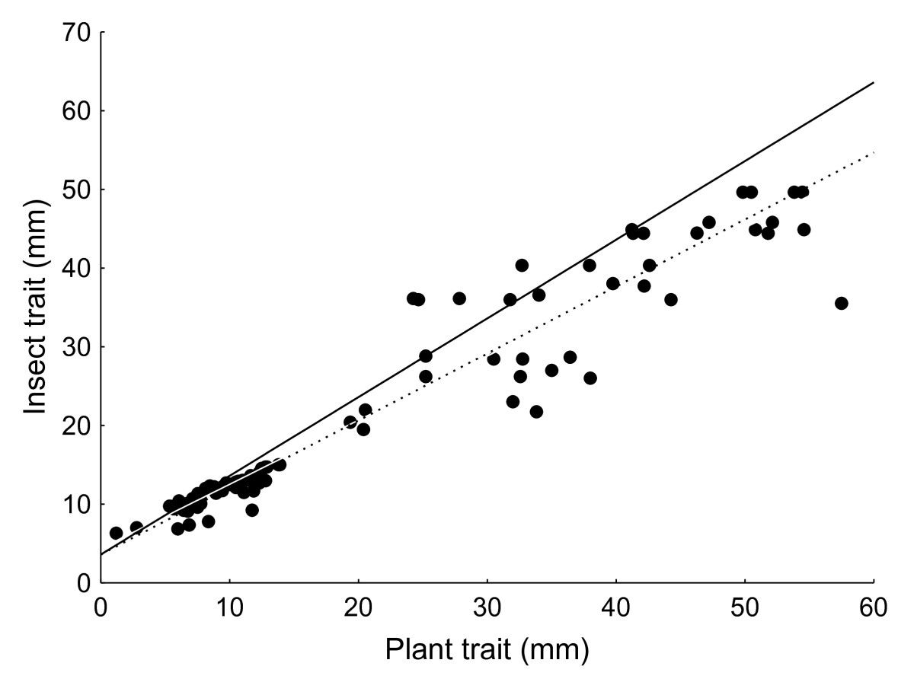{ width=42% } 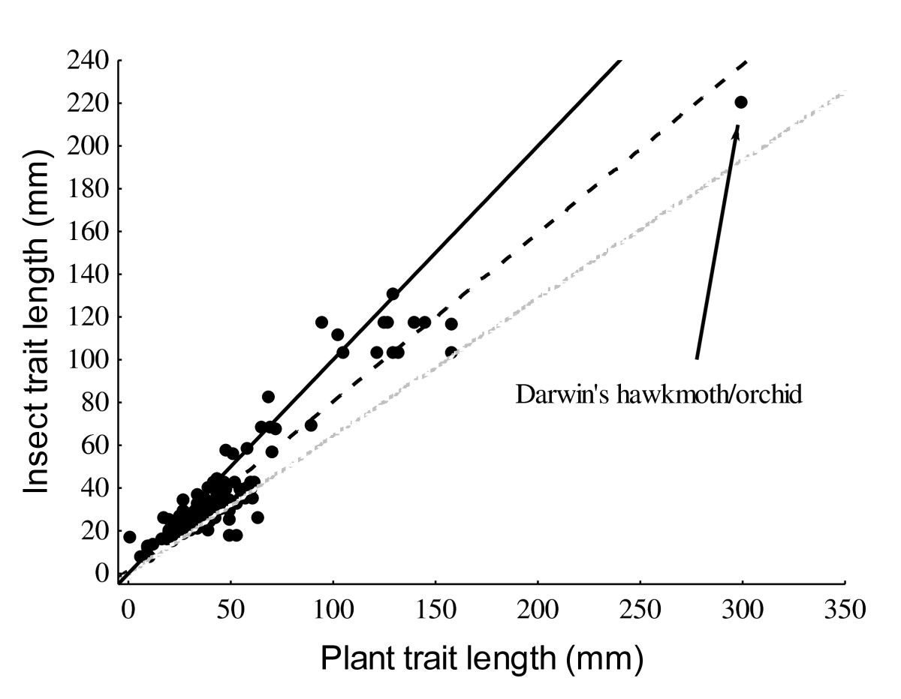{ width=40% }

Anderson et al 2010

## Explanations

- asymmetric selection pressure
  - generalization/specialization
    - generalized species will exhibit less exaggeration
  - life-dinner principle
    - plants should be winning since they have more at stake
  - alternative to these explanations
    - the anatomy of the phenotypic interface

## The phenotypic interface

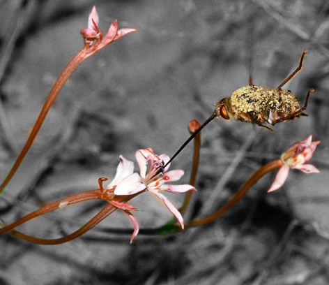{width=52%} 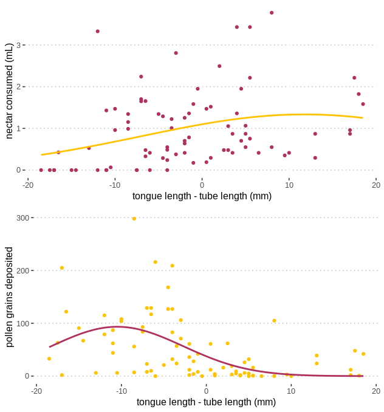{width=42%}

## What is an optimal offset?

- __Def:__ An _optimal offset_ is the difference ($\delta_1$) between the focal individuals trait value ($z_1$) and the non-focal individuals trait value ($z_2$) that maximizes fitness for the focal individual.

- A mathematically convenient fitness surface that captures this interface is $$\exp\left(-\frac{B_1}{2}(z_2+\delta_1-z_1)^2\right)$$

## Comparison to the sigmoid

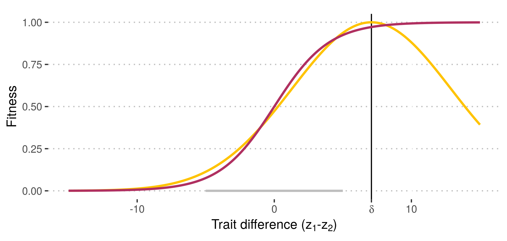{ width=60% }

## Coevolutionary dynamics

$$\frac{d\bar z_1}{dt}=\mathscr{B}_1(\bar z_2+\delta_1-\bar z_1)$$

$$\frac{d\bar z_2}{dt}=\mathscr{B}_2(\bar z_1+\delta_2-\bar z_2)$$

- $\mathscr{B}_i=G_iB_i$

## Model properties

- When $\delta_1,\delta_2$ have the same sign this leads to an indefinite arms race.

- However, $\bar z_1-\bar z_2$ converges to $\frac{\mathscr{B}_1\delta_1-\mathscr{B}_2\delta_2}{\mathscr{B}_1+\mathscr{B}_2}$.

- Thus, measuring $\mathscr{B}_i$ and $\delta_i$ enables one to predict winners of Darwinian races.

# Chapter 2: A likelihood-based method for coevolutionary inference

- basic idea:
  - data on geographical patterns of trait matching
  - models of geographical patterns of trait matching
  - tie model to data with likelihood
  
## The model

$$\frac{d\bar z_1}{dt}=\mathscr{A}_1(\theta_1-\bar z_1)+\mathscr{B}_1(\bar z_2+\delta-\bar z_1)+\sqrt\frac{G_1}{N_1}\frac{d\xi_1}{dt}$$

$$\frac{d\bar z_2}{dt}=\mathscr{A}_2(\theta_2-\bar z_2)+\mathscr{B}_2(\bar z_1+\delta-\bar z_2)+\sqrt\frac{G_2}{N_2}\frac{d\xi_2}{dt}$$

## Equilibrium

$$\left(\begin{matrix}
\bar z_1\\\bar z_2
\end{matrix}\right)\sim\mathcal{N}\left\{\left(\begin{matrix}
\mu_1\\\mu_2
\end{matrix}\right),\left(\begin{matrix}
V_1 & C \\ C & V_2
\end{matrix}\right)\right\}$$

- $\mu_i,V_i,C$... functions of $A_i,B_i,\delta$.

## Likelihood

Suppose $X_1,\dots,X_n$ iid $\mathcal{N}(\mu,\sigma^2)$.

- Denote $\hat\mu$ and $\hat\sigma^2$ the ML estimates.
- Then $\hat\mu=\frac{1}{n}\sum_iX_i$ 
- and $\hat\sigma^2=\frac{1}{n}\sum_i\left(X_i-\hat\mu\right)^2$.

- These results can be extended to $d$-dimensional Gaussian random variables.

## Inference

- $\left(\begin{smallmatrix}\bar z_1\\\bar z_2\end{smallmatrix}\right)_1,\dots,\left(\begin{smallmatrix}\bar z_1\\\bar z_2\end{smallmatrix}\right)_n$

- Calculate $\hat\mu_i,\hat V_i,\hat C$.
- Recall $\hat\mu_i,\hat V_i,\hat C$ are functions of $A_i,B_i,\delta$.
- Invert these functions to solve for $\hat A_i,\hat B_i,\hat\delta$.

## Results

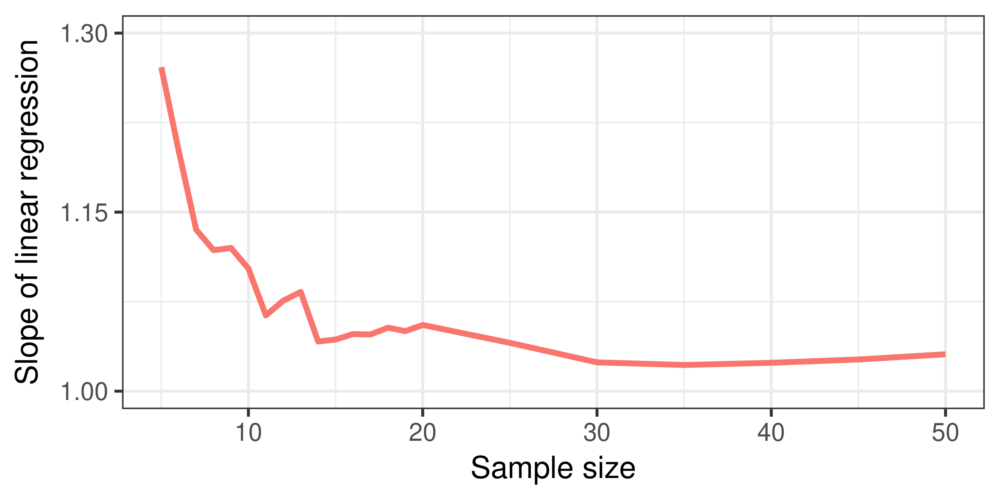{ width=50% } 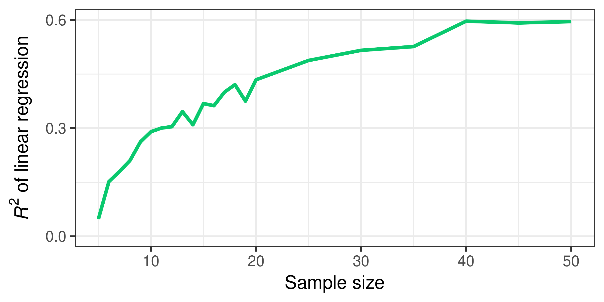{ width=50% }

## Application

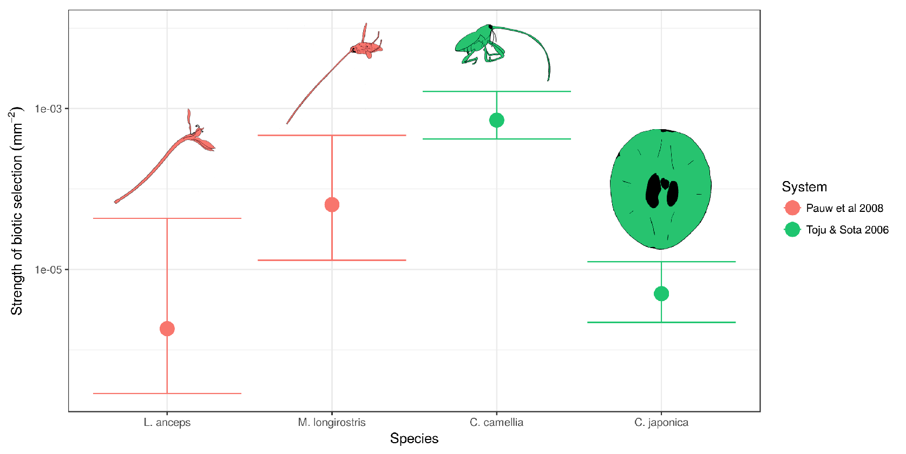{ width=75% }

## Finished!

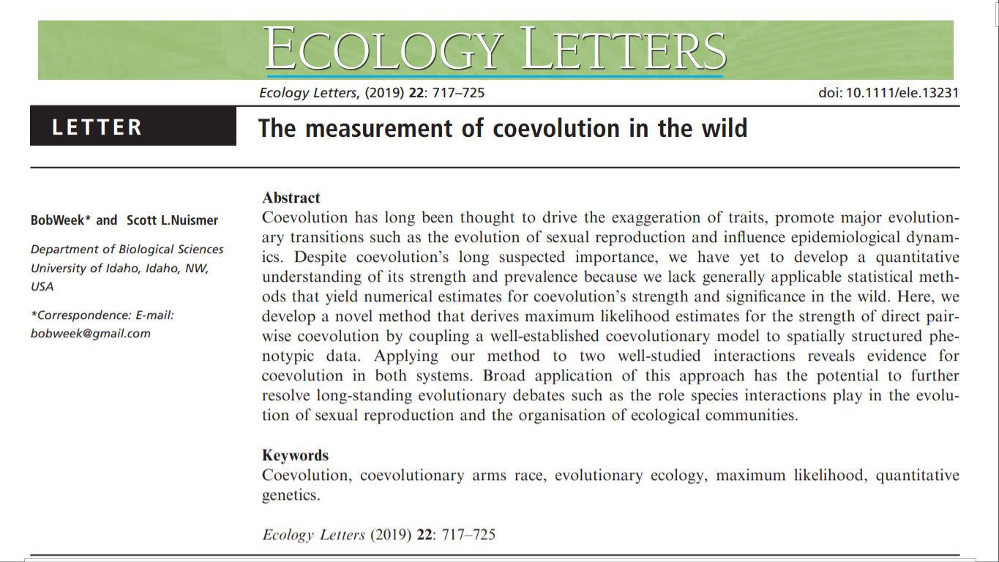

# Chapter 3: Guild-by-guild coevolution in a plant-pollinator community

## The data

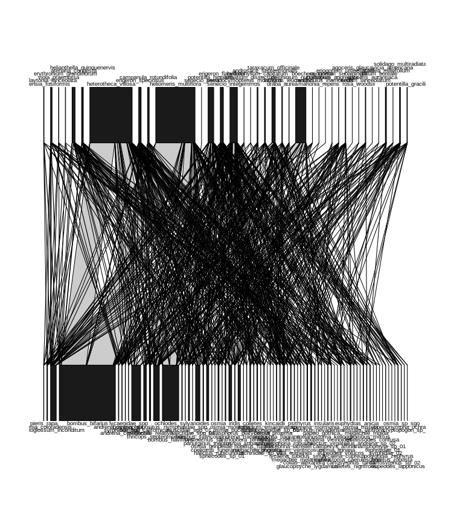{width=30%} 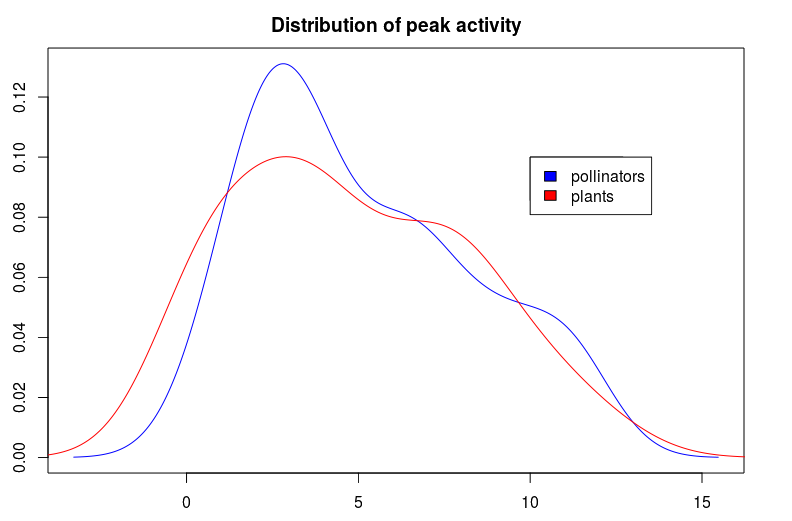{width=51%}

## Formal connection to community ecology

phenology = niche

- Classic MacArthurian calculations hold:
  
  - If $\alpha_i(t)$ is the phenology of species $i$ (ie, resource utilization curve),
  
  - then $\int\alpha_i(t)\alpha_j(t)dt$ measures the intensity of interaction.

## Structure of fitness surface

- Phenology determines whether or not an interaction occurs.
- Some suite of morphological traits determine the outcome of the interaction.
  - Potential extremes include nectar robbing and floral trickery.
  - These extremes reduce fitness, creating "variable" mutualisms.

## The simulation

- Simulate the evolution of phenology based on the above fitness surface, $W$.
- Heterogeneous representation of species in network not assumed to be due to chance.
  - This is captured by simultaneously simulating abundance dynamics.
  - Fitness is taken literally s.t. $N_{t+1}=\overline{W}N_t$.

## A sample path

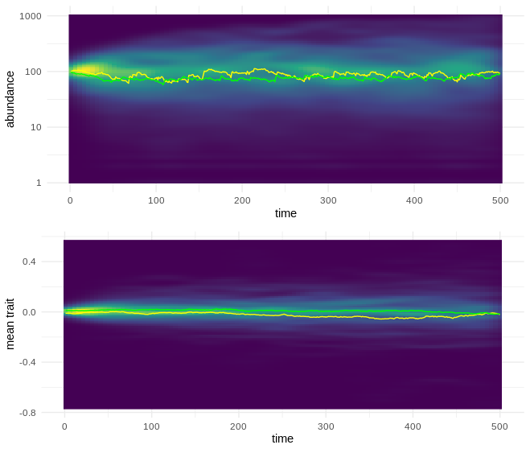

## ABC

A basic sample-rejection algorithm:

  1) Draw random selection parameters ($\psi\sim\pi$).
  2) Simulate for a fixed number of generations ($t\leq T$).
  3) Compute Euclidean norm between measured p.a.t.'s and simulated p.a.t.'s ($\nu\equiv\sqrt{\sum(x_i-\hat x_i)^2}$).
  4) If norm is less than some fixed threshold, include parameters in posterior ($\nu\overset{?}{<}\varepsilon$).
  5) Repeat until posterior is sufficiently populated ($n\leq N$).

## Hypothetical results

- Species-specific selection parameters. 
- Can calculate many things, but in particular...

## The distribution of pairwise coevolution

```{r, echo=F, fig.height=5}
Coevolution <- rexp(1000,1000)
hist(Coevolution)
```

