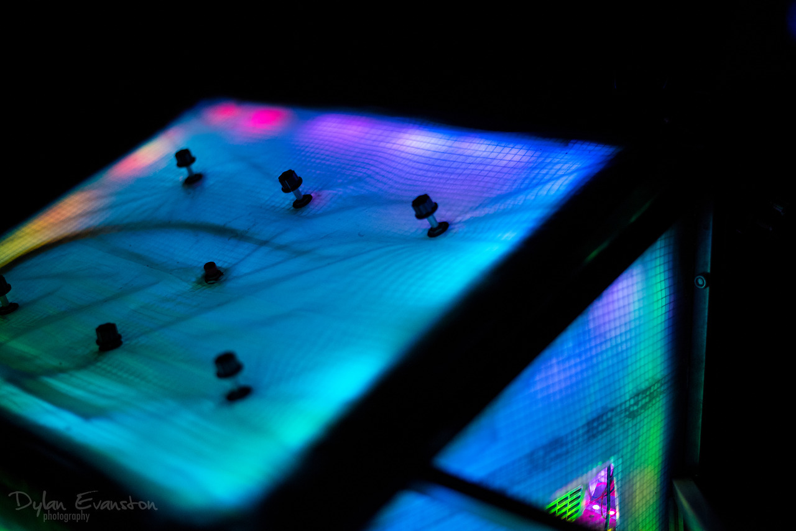
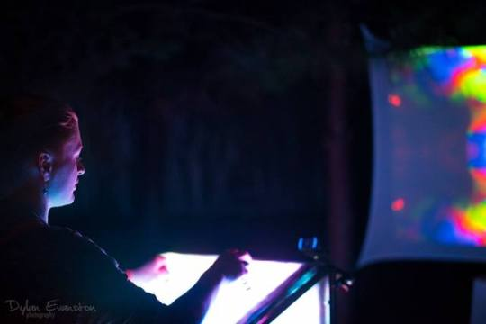
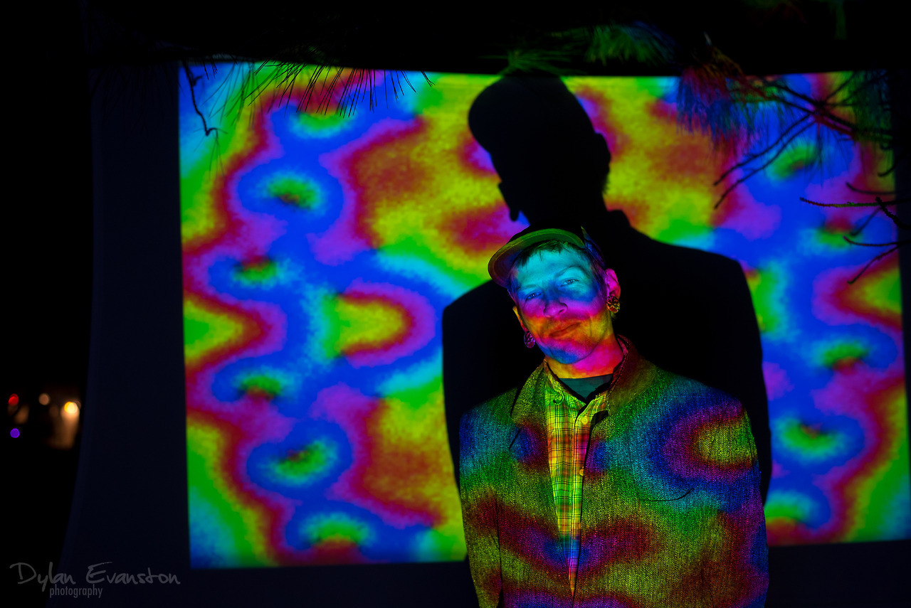

[bandcamp](http://blobbot.bandcamp.com) [instagram](https://instagram.com/blobbot)

in my spare time i use my background in electronics, computers and mathematics for diy audio and video synthesis, interactive installations, and customized soft/hardware. i am always looking for someone with expertise in frabrication to share skills with. please contact me if you are interested in collaborating.

here is a sample of some of the things i do

## music/sound

<iframe style="border: 0; width: 60%; height: 42px;" src="https://bandcamp.com/EmbeddedPlayer/track=3974532652/size=small/bgcol=333333/linkcol=fe7eaf/artwork=none/transparent=true/" seamless><a href="http://blobbot.bandcamp.com/track/thanks-for-all-the-lizards">thanks for all the lizards by bb</a></iframe>

this is a relatively recent development in my life. now that i have assembled a decent sized eurorack, i am only just beginning to explore my abilities as a musician and, more generally, as a sound designer. luckily i have several encouraging friends aiding me in this journey.

## video/projections

 - examples coming soon!
 
this is the longest running artistic theme in my life. as a child i dreamed of becoming a filmmaker. as a young adult i discovered the incredible range of dynamics and patterns exhibit by video feedback. ever since i have been exploring the technical aspects of this medium, learning to express myself through it. along the way i have set up interactive feedback loops that turn even the most hardened adults into children, and have performed alongside musicians to complement their work with some visual stimulus. since most of this work is performed live, there are few reasonable recordings of it. i am hoping that before too long i will have time to put out a video album for increased accessibility.

## the portal

the portal was an interactive projection housed in a large podium and lit by hundreds of hue shifting led's. the image being projected is a system of three stochastic partial differential equations being solved numerically in real time. six knobs allow visitors to interact with parameters of the equations as they are being solved. these parameters include diffusion rates, interaction strengths, symmetry, stochasticity and a video input. a button in the center of the podium randomizes the values of each pixel and also the led's inside the podium. this was one of my most celebrated works. one day it will come back to life...
