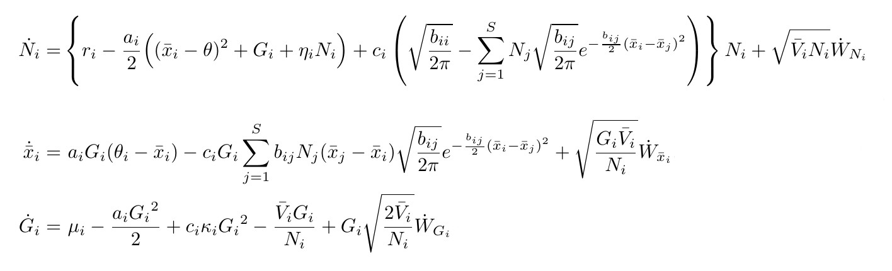

## how can we measure coevolution?

- create a model that predicts observed patterns
- use observed patterns to infer model parameters

# the model

## communities are collections of species

{ width=84% }

## these species tend to interact

{ width=84% }

## interspecific interactions have consequences

{ width=84% }

## interspecific interactions have consequences

{ width=84% }

## how do we model these consequences

{ width=84% }

## with well known relationships

{ width=84% }

## fitness is fundamental

{ width=84% }

## fitness as a function of phenotype

{ width=84% }

## theory of the niche

{ width=84% }

## mean trait as niche center

{ width=84% }

## resource utilization curves

{ width=84% }

## niche overlap

{ width=84% }

## fitness as a function of niche overlap

{ width=84% }

## competition

{ width=84% }

## mutualism

{ width=84% }

## host/parasite

{ width=84% }

## parasite/host

{ width=84% }

# the patterns

## two sample paths

{ width=90% }

## a snapshot at $t=1000.0$

{ width=90% }

## distributions of abundance and phenotype

{ width=60% }

## network of interactions

{ width=60% }

## inference

- the data = interaction frequencies, traits, abundances
- competition and niche parameters can be solved directly
- evolutionary parameters cannot
  - working on an simulation based approach (ABC)

# thanks!

# in it's full glory!

{ width=100% }
