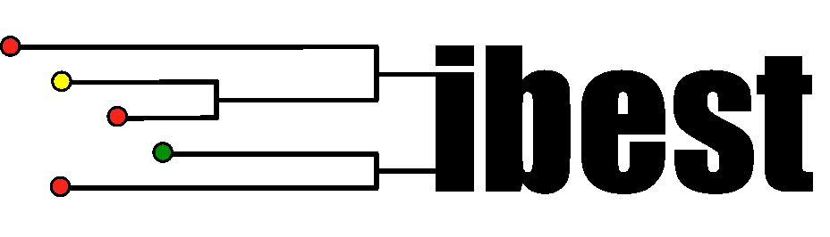

# What is coevolution and how do we measure it?

## What is coevolution?

- Two notions:
  1. Pairwise coevolution
  2. Diffuse coevolution

## Pairwise coevolution

- The reciprocal evolutionary response of a pair of species due to an ecological interaction

## Example: _Moegistorhynchus longirostris_ and _Lapeirousia anceps_

## Diffuse coevolution

- The reciprocal evolutionary response of a community of species involved in a common ecological interaction

## Example: Plant-pollinator communities

## How can we measure diffuse coevolution?

- Create a model that predicts observed patterns
- Use observed patterns to infer model parameters

# The model

## Communities are collections of species

{ width=84% }

## These species tend to interact

{ width=84% }

## Interspecific interactions have consequences

{ width=84% }

## Interspecific interactions have consequences

{ width=84% }

## How do we model these consequences?

{ width=84% }

## With well known relationships

{ width=84% }

## Fitness is fundamental

{ width=84% }

## Fitness as a function of phenotype

{ width=84% }

## Theory of the niche

{ width=84% }

## Mean trait as niche center

{ width=84% }

## Resource utilization curves

{ width=84% }

## Niche overlap

{ width=84% }

## Fitness as a function of niche overlap

{ width=84% }

## Competition

{ width=84% }

## Mutualism

{ width=84% }

## Host-Parasite/Prey-Predator

{ width=84% }

## Parasite-Host/Predator-Prey

{ width=84% }

## Other components of the model

- Abiotic stabilizing selection
- Demographic stochasticity
- Mutation
- Imperfect inheritance
- Evolution of additive genetic variance

# The patterns

## Two sample paths

{ width=90% }

## A snapshot at $t=\mathtt{1000.0}$

{ width=90% }

## Distributions of abundance and phenotype

{ width=60% }

## Network of interactions

{ width=60% }

# Inference

## Rates of interaction

$R_{ij}=\frac{N_iN_jU_iU_j}{\sqrt{2\pi(w_i+w_j+\sigma_i^2+\sigma_j^2)}}\exp\left(-\frac{(\bar x_i-\bar x_j)^2}{2(w_i+w_j+\sigma_i^2+\sigma_j^2)}\right)$

- $\left[\begin{matrix}\bar x_i\dots&\text{ mean trait } \\ \sigma_i^2\dots&\text{ phenotypic variance } \\  N_i\dots&\text{ abundance }\end{matrix}\right\}$ DATA

- $\left[\begin{matrix}U_i\dots&\text{ total niche use } \\ w_i\dots&\text{ niche breadth }\end{matrix}\right\}$ PARAMETERS

## Inferring niche use and niche breadth

- Calculate expected and observe frequencies of interaction:

  - $\rho_{ij}=\frac{R_{ij}}{\sum_{k=1}^S\sum_{l>k}R_{kl}}\dots$ theoretical expectation

  - $\hat\rho_{ij}\dots$ empirical observation

- Solve for the $U_i$ and $w_i$ that minimize the Kullback-Leibler divergence:

  - $\mathcal{D}_{\mathrm{KL}}(\hat\rho\|\rho)=\sum_{i=1}^S\sum_{j>i}\hat\rho_{ij}\ln\left(\frac{\hat\rho_{ij}}{\rho_{ij}}\right)$

## Implementation

## Inferring remaining model parameters

- What remains?
  
  - $c\dots$ strength of competition
  - $a\dots$ strength of abiotic stabilizing selection
  - $\theta\dots$ abiotic phenotypic optimum
  - $r\dots$ intrinsic rate of growth
  - $\mu\dots$ rate of mutation
  - $\eta\dots$ segregation variances
    - (imperfect inheritance)
  - $\nu\dots$ variance in reproductive output
    - (demographic stochasticity)

## How can we infer these parameters?

  - Using a Bayesian approach called a Markov chain Monte Carlo (MCMC) method

## What is a MCMC method?
  
  - A numerical method to compute posteriors of model parameters
  
  - Markov chain:
  
    - A random walk through parameter space
    
  - Montel Carlo:
  
    - Probabilistic acceptance criteria of sampled parameters
    
  - Requires calculation of likelihood

## Approximating the likelihood

## Thanks!

{width=%10}{width=%1}
