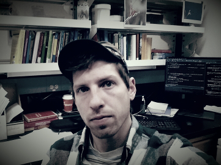

# Bob Week <!---{.tabset .tabset-fade .tabset-pills}--->

### What about Bob

<b>
I am a PhD candidate at the University of Idaho working with professor [Scott Nuismer](https://www.leeef.org). My degree program is [Bioinformatics and Computational Biology](https://www.uidaho.edu/sci/bcb) (BCB) which is housed within [The Institute for Bioinformatics and Evolutionary Studies](http://www.ibest.uidaho.edu/) (IBEST). My CV is available [here](cv.pdf).
</b>

### PhD work

<b>
My dissertation contributes to a coevolutionary theory of community ecology in the context of plant-pollinator networks. In particular, I am working on mathematical models that predict the patterns of interspecific interactions across ecological communities and developing statistical methods to measure various forms of coevolution occuring within such communities. Stochastic differential equations and simulations are my primary weapons for confronting these tasks. However, working with empiricists such as [Paul CaraDonna](https://paulcaradonna.weebly.com/) keeps me tethered to reality through fruitful conversations and excellent data.
</b>

<!---

## Long-term goals

My interests are in the patterns of traits and the interspecific interactions they mediate within ecological communities. I am currently studying how these patterns have and are evolving, but would like to know the impact of these processes for the ecosystems in which they are imbedded. That is, my long term goal as a scientist is to contribute to a unified understanding of evolutionary ecosystem ecology that transcends the scales of time, space, and biological diversity. My approach is bottom-up, starting with mechanistic mathematical models of local scale processes as the basic building blocks and deriving from them properties of larger scale systems. As a mathematician my goal is to join research communities in extending and generalizing a unified formal theory of evolution and ecology, capturing diverse sets of processes within an internally consistent mathematical language. By doing so it is my hope that the theory I contribute to will become as synthetic and interwoven as the understanding of nature I am pursuing. As a teacher, my goals are two-fold. My first is to aid in developing treatments of theoretical results using minimal mathematical prerequisites. In this way, the biological insights gleaned from theory will be available to wider audiences. Second, I intend to help increase the quality of mathematical pedagogy in the biological sciences so that advanced mathematical topics become colloquial knowledge.

--->

