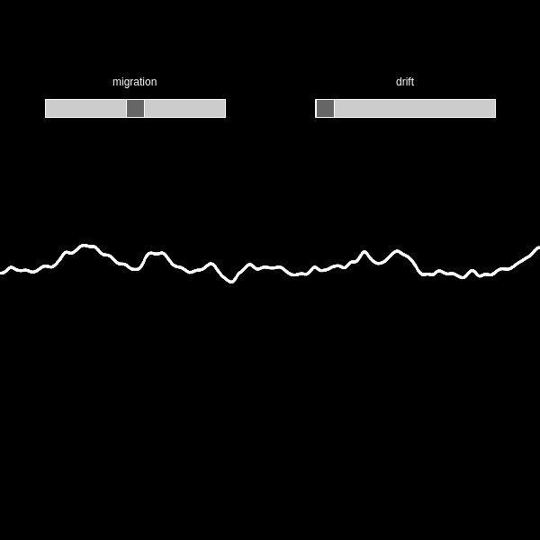
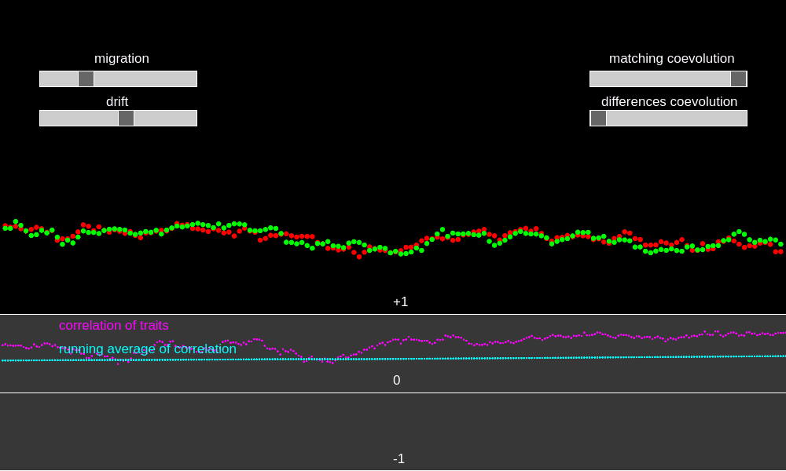
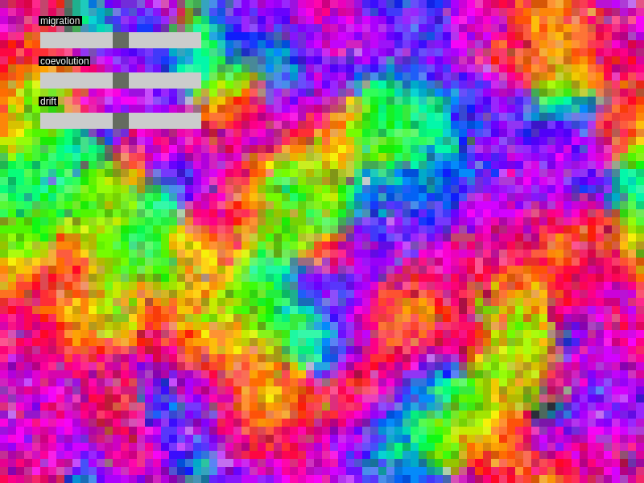

\newcommand{\para}[1]{\left( #1 \right)}
\newcommand{\W}{\mathcal{W}}
\newcommand{\R}{\mathbb{R}}
\newcommand{\C}{\mathbb{C}}
\newcommand{\Z}{\mathbb{Z}}
\newcommand{\E}{\mathbb{E}}
\newcommand{\Cov}{\mathrm{Cov}}
\newcommand{\Var}{\mathrm{Var}}
\newcommand{\n}{\mathfrak{n}}

# Interactive theory {.tabset .tabset-fade .tabset-pills}

I made some applications to visualize and interact with (co)evolutionary theory.

## 1-D Migration and Drift

This application simulates the evolution of a trait for a species on a single spatial axis, the horizontal axis. Migration is modeled with a stepping stone model where migrants can move to neighboring sites only. The vertical displacement of the white dots shown represents trait values at each site. Two sliders are provided to allow the user to manipulate the migration rate and the variance of drift. 

### Mathematical background

We write $\bar z(x,t)$ for the value of the local mean trait at the point in space $x$ and moment in time $t$. However, populations do not exist at points in space, but occupy regions. Hence, to evaluate the local mean trait on a bounded interval $I=[a,b]$, we compute the spatial average

$$\mu_t(I)\equiv\frac{1}{b-a}\int_a^b\bar z(x,t)dx.$$

Since any bounded subset $A$ of the real line can be expressed as the disjoint union of bounded intevals (that is $A=\cup_i I_i$ where $I_i\cap I_j=\emptyset$ for each $i,j$), this definition is naturally extended as

$$\mu_t(A)\equiv\frac{1}{|A|}\int_A\bar z(x,t)dx.$$

where $|A|=\sum_i|I_i|=\sum_i(b_i-a_i)$ denotes the Lebesgue measure (the sum of the lengths of component intervals). These calcualtions assume a constant abundance density across space.

Under diffusive migration with rate $m$ and random genetic drift with variance $\eta^2$ the evolution of $\bar z(x,t)$ is given by

$$\frac{d\bar z}{dt}=\frac{m}{2}\frac{\partial^2\bar z}{\partial x^2}+\eta\dot W$$

where $\dot W$ is space-time white noise (that is, for each $x$, $W(x,t)$ is a Brownian motion with respect to $t$). The interaction between diffusion via local dispersal patterns and the stochasticity of genetic drift results in an ever shifting line. Somewhat surprisingly, although $\dot W(x,t)$ is nowhere continuous with respect $x$, the infinite propogation property of diffusion implies that for every fixed $t$, the curve $\bar z(x,t)$ is smooth in $x$ even though it is still random!

## 1-D Migration, Drift and Coevolution

This application simulates the coevolution of two species on a single spatial axis as a generalization of the above application. The traits involved for each species are colored red and green.  At the bottom of the application is a time-series plot of the instantaneous spatial correlation between traits and the running average of this correlation. Spatial correlations have historically been used to determine support for a coevolutionary hypothesis, so it is an interesting quantity to track.

### Mathematical background

The model used here is a direct extension of the one developed above, except now we include biotic selection. I leave out the detailed derivation starting from the effects of interactions on the fitnesses of pairs of individuals and skip to the final system of differential equations that model the evolution of $\bar z_1(x,t)$ and $\bar z_2(x,t)$.

$$\frac{d\bar z_1}{dt}=G_1M_1(\bar z_2-\bar z_1)+G_1D_1$$
$$+\frac{m_1}{2}\frac{\partial^2\bar z_1}{\partial x^2}+\eta_1\dot W_1$$

$$\frac{d\bar z_2}{dt}=G_2M_2(\bar z_1-\bar z_2)-G_2D_2$$
$$+\frac{m_2}{2}\frac{\partial^2\bar z_2}{\partial x^2}+\eta_2\dot W_2$$

The parameter $G_i$ denotes the additive genetic variance of the focal trait in species $i$, where as $M_i$ and $D_i$ denote the strengths of matching and differences selection respectively.

The variance in local mean traits over a set $A$ can be written as

$$V_i(t)\equiv\frac{1}{|A|}\int_\R(\bar z_i(x,t)-\mu_i(t))^2dx.$$

and the covariance

$$C(t)\equiv\frac{1}{|A|}\int_\R(\bar z_1(x,t)-\mu_1(t))(\bar z_2(x,t)-\mu_2(t))dx.$$

Hence, the correlation can be tracked by computing $\rho(t)\equiv\frac{C(t)}{\sqrt{V_1(t)V_2(t)}}$ for each $t$.

## 2-D Migration, Drift and Coevolution

Here three species coevolve across a two dimensional continuum (discretized into a grid for computational purposes). One species is colored blue, one red and one green. The trait values that evolve are brightness. To summarize these properties within each pixel, a weighted average of red, blue and green is computed, weighted by the mean brightness of each species within that pixel. The result is a colorful, evolving grid. The interactions between the three species can be thought of as a circular trophic system where each level consumes the next level and is consumed by the previous level. Because the three color values are bounded above and below, this induces an oscillating coevolutionary chase.

### Mathematical background

The model invoked here builds directly upon the previously established chain of models given above. However, now $x\in\mathbb{R}^2$ and a third species is included in the interaction. The resulting spatial patterns are characteristic of classic reaction-diffusion processes. Indeed upon inspection, even with the complexity of three coevolving species and the intimidating theory of stochastic partial differential equations, the system is simply a linear set of reaction-diffusion equations. Hence, the math is about as tame as possible for the diversity of dynamics and patterns exhibited.