## Charting the evolutionary consequences of interspecific interactions {.titleslide .withmap .p2 visibility="uncounted"} 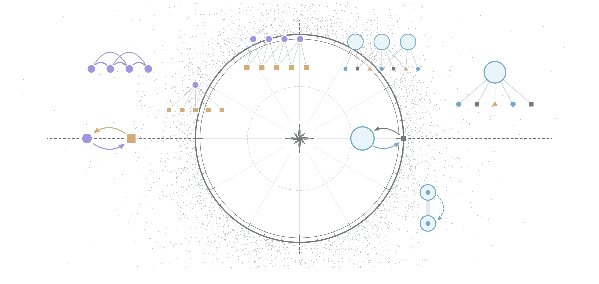{.titlebg} ::: {.sub} From theory to inference ::: ::: {.byline} Bob Week &nbsp;·&nbsp; KiTE Fellow &nbsp;·&nbsp; Kiel University ::: ::: {.notes} Title. The faint chart behind the words is the map of slide 3. ::: ## The question {.p2} ::: {.eyebrow} Opening [schematic]{.badge .con} ::: :::: {.body} ::: {.fig} 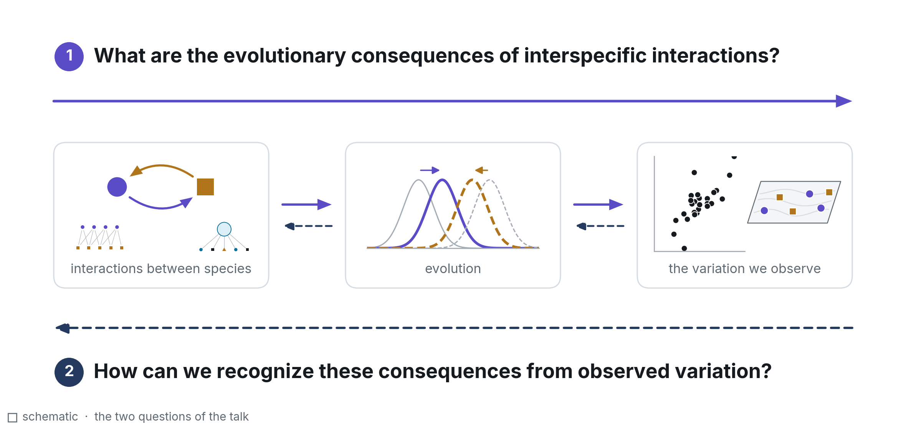 ::: :::: ::: {.notes} 0:45. What are the evolutionary consequences of interspecific interactions, and how can we recognize those consequences from observed variation? One question runs forward, from interactions through evolution to the variation we see; the other runs back. That is why the talk has both theory and inference. ::: ## How I approach these questions {.p2} ::: {.eyebrow} Opening [schematic]{.badge .con} ::: :::: {.body} ::: {.fig} 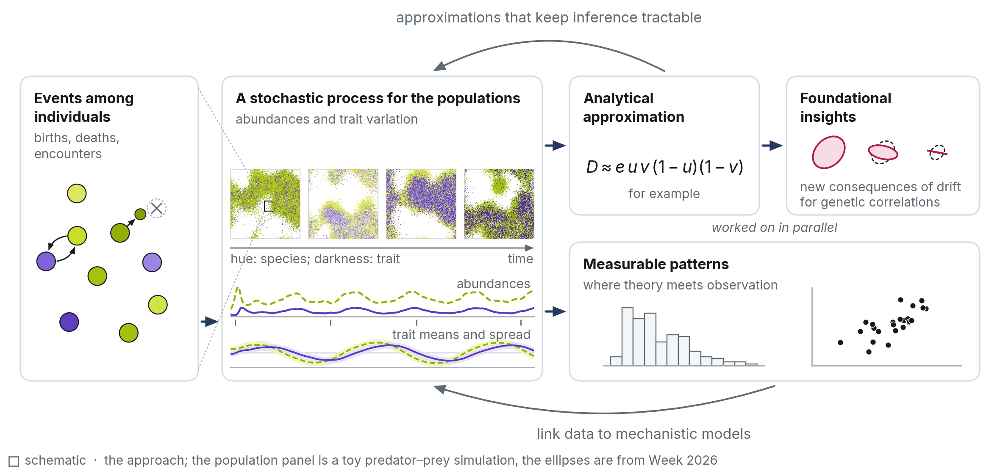 ::: :::: ::: {.notes} 2:15. These two questions organise most of my work, and this is how I go at them. Start from events among individuals (the close-up on the left); take the limit of many individuals to get a stochastic process for the populations: abundances and trait variation together. The snapshots are a toy predator and prey on a plane whose habitat keeps shifting; abundances cycle, and with trait matching the two mean traits chase each other (Red Queen). From the process, two things in parallel: analytical approximations that give foundational insights, and descriptions of measurable patterns. And already the two ways back: both point at the process, because what we infer is the evolutionary process, not individual outcomes. ::: ## A landscape of interaction systems {.p2} ::: {.eyebrow} Opening [schematic]{.badge .con} ::: :::: {.body} ::: {.fig} 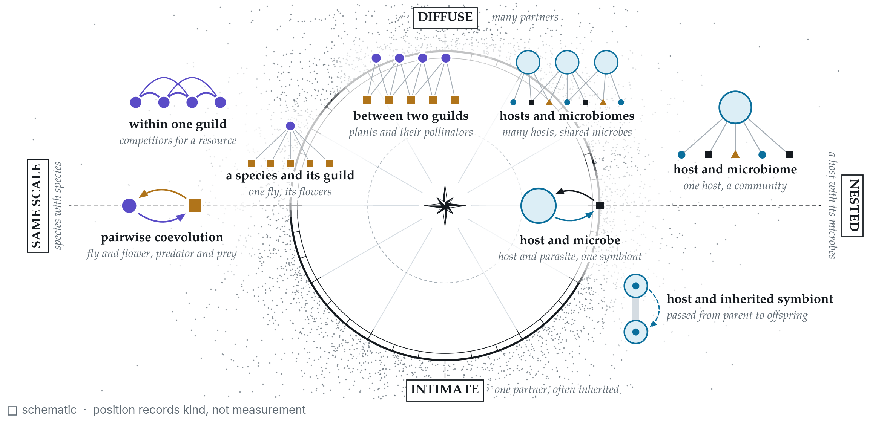 ::: :::: ::: {.notes} 3:30. I apply this approach to a variety of interaction systems. Sixty to ninety seconds, not a taxonomy lecture. Across: partners at the same scale, or one living in the other. Up: more partners. Down: a tighter, inherited partnership. The talk moves from the pair on the left to the systems on the right. ::: ## Where we are going {.p2} ::: {.eyebrow} Opening [schematic]{.badge .con} ::: :::: {.body} ::: {.fig} 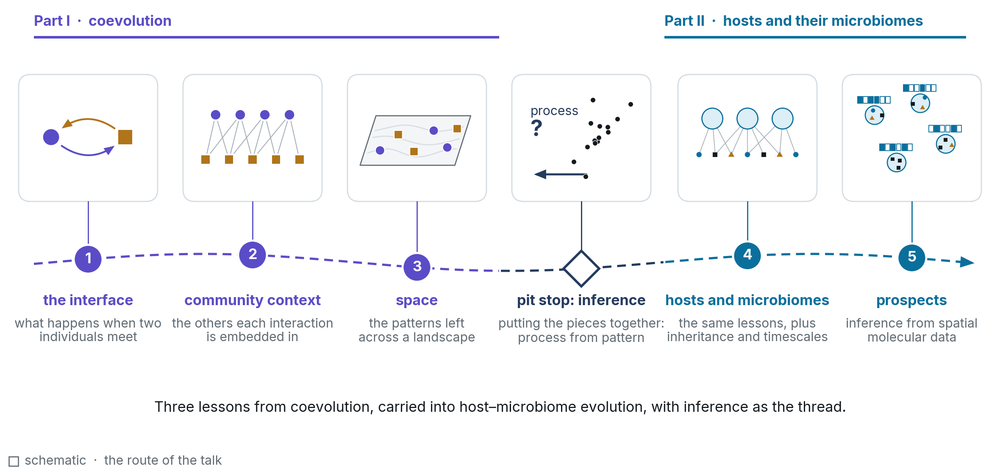 ::: :::: ::: {.notes} 4:30. The route. Start with classical pairwise coevolution and the interface that decides what happens when two individuals meet. Then the community such interactions are embedded in. Then the spatial patterns that result. A pit stop to put those pieces together for inference. Then carry the lessons into host–microbiome evolution, and end with prospects for inference. ::: ## Part I: Coevolution {.p2} ::: {.eyebrow} Part I [schematic]{.badge .con} ::: :::: {.body} ::: {.fig} 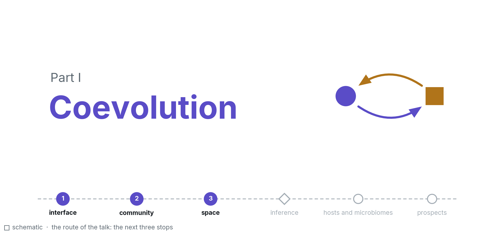 ::: :::: ::: {.notes} A pause. Part I: coevolution. Interface, then community, then space. ::: ## What is the interface between interacting species? {.p2} ::: {.eyebrow} Part I · the interface [published]{.badge .pub} ::: :::: {.body} ::: {.fig} 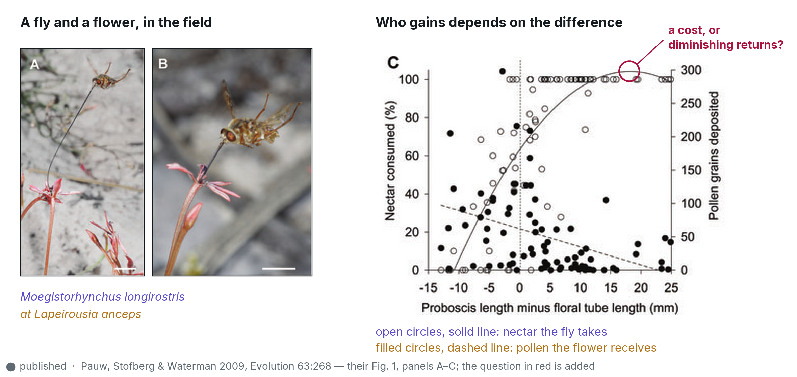 ::: :::: ::: {.notes} 5:15. The long-proboscid fly and the long-tubed iris. Describe the field experiment of Pauw and colleagues: for each visit, how much nectar the fly took and how much pollen the flower received, against proboscis length minus tube length. Evidence for ongoing selection for elongation in both: the fly does better the longer its proboscis relative to the tube, the flower the other way round. Then look closer at the quadratic fit for nectar: it levels off and turns down. Are there costs, or diminishing returns, to so unbalanced an armament? ::: ## Different interfaces imply different selection {.p2} ::: {.eyebrow} Part I · the interface [published]{.badge .pub} ::: :::: {.body} ::: {.fig} 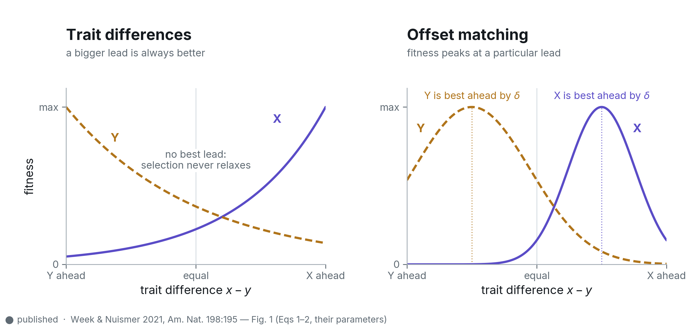 ::: :::: ::: {.notes} 6:45. Two ways to write that down. Trait differences: bigger is always better. Offset matching: best at a particular lead. ::: ## Same arms race, different ecological fate {.p2} ::: {.eyebrow} Part I · the interface [published]{.badge .pub} ::: :::: {.body} ::: {.fig} 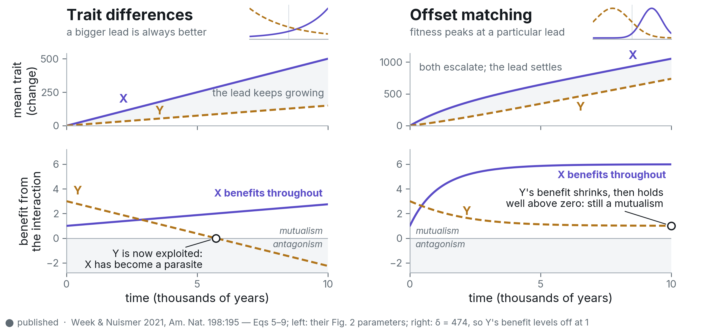 ::: :::: ::: {.notes} 8:45. Both escalate. X benefits throughout in both cases. Under trait differences Y's benefit falls through zero, so the interaction turns parasitic; under offset matching Y's benefit shrinks to a third and holds there, well above zero, so it stays a mutualism. Coevolution is not itself a mechanism; the interface decides. ::: ## But the fly and the flower are not alone {.p2} ::: {.eyebrow} Part I · community [schematic]{.badge .con} ::: :::: {.body} ::: {.fig} 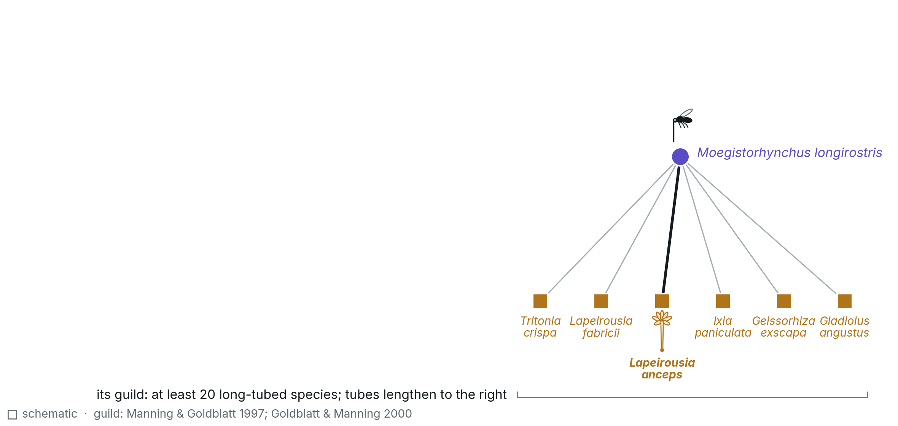 ::: :::: ::: {.notes} 10:00. The fly is a keystone pollinator: it visits a guild of at least twenty long-tubed species. From here to the resource axis the nodes never move; each slide adds to or redraws the same picture. ::: ## But the fly and the flower are not alone {.p2} ::: {.eyebrow} Part I · community [schematic]{.badge .con} ::: :::: {.body} ::: {.fig} 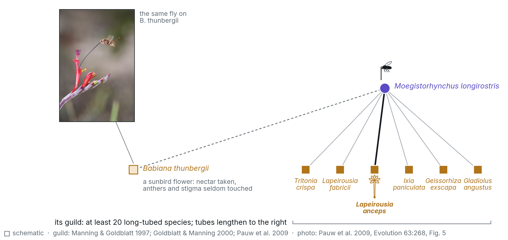 ::: :::: ::: {.notes} 10:45. It is also a nectar thief: it drains Babiana thunbergii, a sunbird flower, almost never touching anthers or stigma. A partner outside the arms race is exploited. ::: ## From pairwise interfaces to network architecture {.p2} ::: {.eyebrow} Part I · community [schematic]{.badge .con} ::: :::: {.body} ::: {.fig} 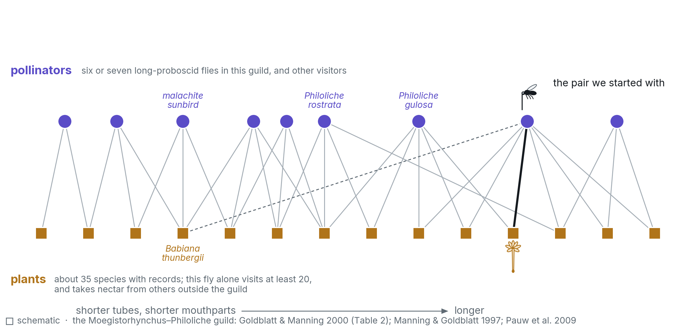 ::: :::: ::: {.notes} 12:00. A segue, not a result. I have worked at this scale too (Week & Nuismer 2021; Nuismer, Week & Aizen 2018). The pair sits in a web of two guilds. ::: ## Now change perspective: interactions within a guild {.p2} ::: {.eyebrow} Part I · community [schematic]{.badge .con} ::: :::: {.body} ::: {.fig} 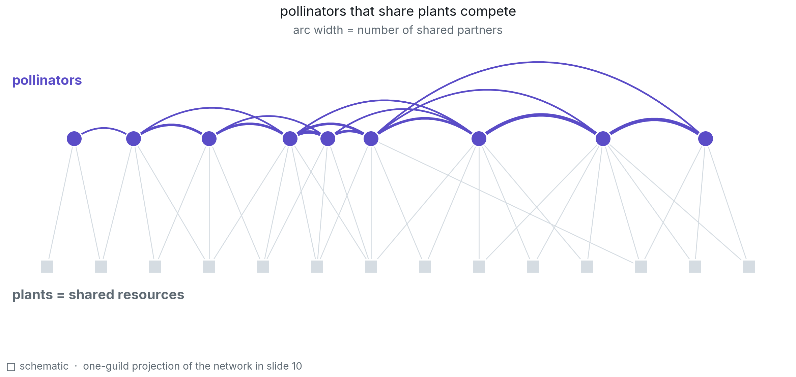 ::: :::: ::: {.notes} 13:30. Look from one side. Pollinators that share plants compete for them. ::: ## Diffuse coevolution through competition {.p2} ::: {.eyebrow} Part I · community [schematic]{.badge .con} ::: :::: {.body} ::: {.fig} 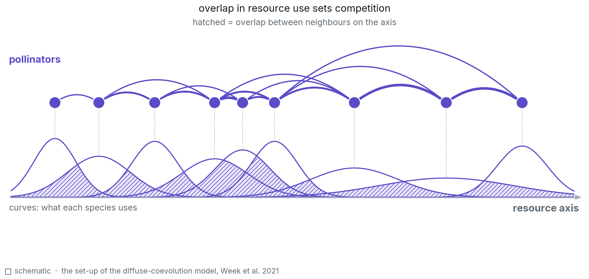 ::: :::: ::: {.notes} 15:00. The plant row becomes a resource axis; each species has a utilisation curve; overlap is competition. And competition is selection, of two kinds. Linear selection, beta, shifts where a niche sits; quadratic selection, gamma, changes how broad it is. Two pairs of this guild up close: both are pushed apart; the partly overlapping pair is selected to narrow, the nearly coincident pair to broaden. This is the set-up of the many-species model. ::: ## What can we learn without tracking every interaction? {.p2} ::: {.eyebrow} Part I · community [schematic]{.badge .con} ::: :::: {.body} ::: {.fig} 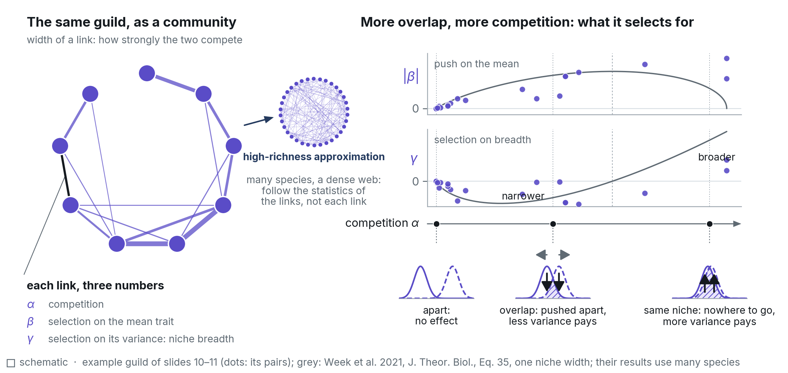 ::: :::: ::: {.notes} 17:00. Every link carries a competition coefficient and two selection gradients. I do not track each link: with a high-richness approximation (many species, a dense web of interactions) I derive the statistical relationships between competition and selection across the community. For intuition, read the right side as niche overlap increasing from left to right. Far apart: no effect on each other. Partly overlapping: each is pushed away from the other, and a narrower niche pays, because it reduces the overlap: selection on variance is negative (arrows down). Nearly the same niche: there is nowhere to move to, so it becomes a race for breadth to outcompete the other, and selection on variance turns positive (arrows up). ::: ## Communities are distributed across landscapes {.p2} ::: {.eyebrow} Part I · space [schematic]{.badge .con} ::: :::: {.body} ::: {.fig} 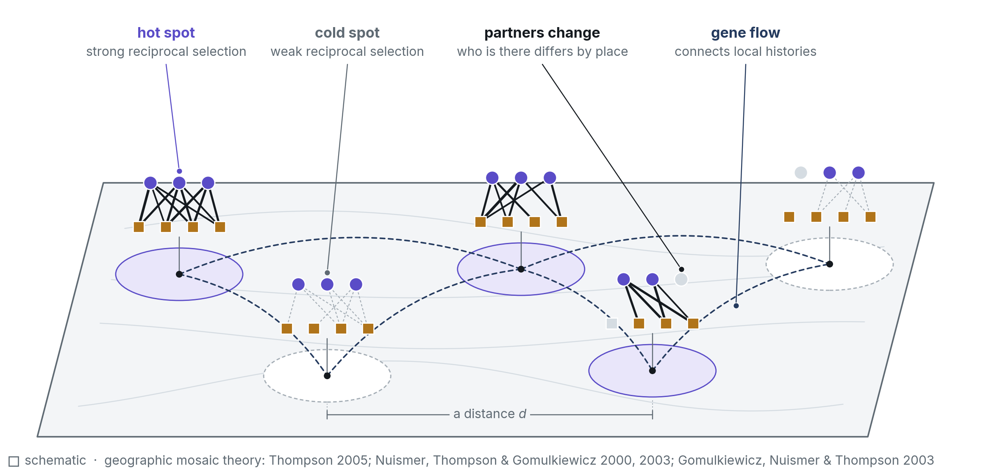 ::: :::: ::: {.notes} 19:00. The geographic mosaic (Thompson; Nuismer, Thompson & Gomulkiewicz): reciprocal selection is strong in some places and weak in others, who is there differs by place, and gene flow connects the local histories. Note the distance d marked between two places: that is where we go next. ::: ## One complication at a time: space, with two species {.p2} ::: {.eyebrow} Part I · space [schematic]{.badge .con} ::: :::: {.body} ::: {.fig} 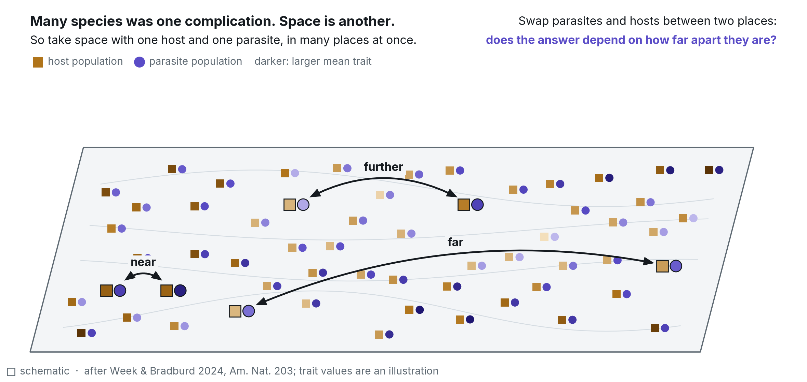 ::: :::: ::: {.notes} 20:30. Going beyond a pair was one complicating direction. Spatial structure is another, so take them one at a time: one host and one parasite, in many places at once. Their mean traits differ from place to place, more alike nearby. Now imagine reciprocal transplants between two places near each other, further apart, far apart. Would local adaptation look the same each time? Empirically it is often weak nearby and strong far away. ::: ## A model of coevolution in continuous space {.p2} ::: {.eyebrow} Part I · space [published]{.badge .pub} ::: :::: {.body} ::: {.fig} 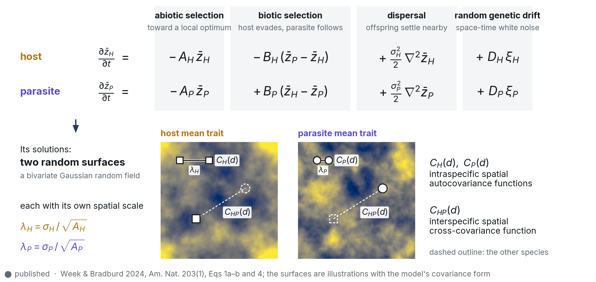 ::: :::: ::: {.notes} 21:30. The model, in one slide. The local mean trait of each species changes by abiotic selection toward an optimum, by biotic selection (the host evades, the parasite follows), by dispersal, which is diffusion, and by random genetic drift, which is space-time white noise. The solution is a pair of random surfaces, a bivariate Gaussian random field. Each has a characteristic length, dispersal distance over the root of abiotic selection: the scale over which that species' traits turn over. On the maps: C_H and C_P are the intraspecific spatial autocovariance functions (the filled pairs), and C_HP is the interspecific spatial cross-covariance function (a host here, a parasite a distance d away). ::: ## Local adaptation as a function of distance {.p2} ::: {.eyebrow} Part I · space [published]{.badge .pub} ::: :::: {.body} ::: {.fig} 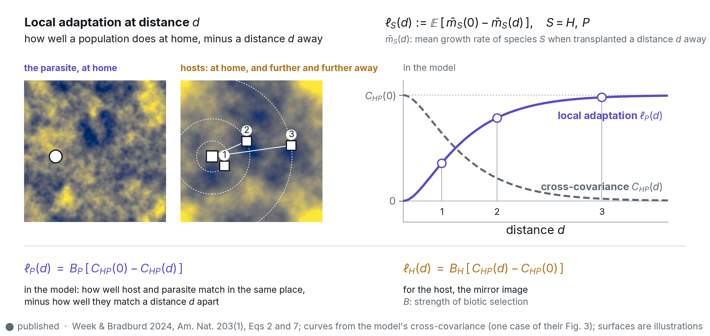 ::: :::: ::: {.notes} 22:45. Our index, for either species: the expected growth rate at home minus the expected growth rate when transplanted a distance d away. In the model it is the cross-covariance at the same place minus the cross-covariance at distance d, times the strength of biotic selection; the host's is the mirror image. Hosts 1, 2, 3 on the map are the three points on the curve: as d grows the cross-covariance decays and local adaptation rises to a plateau. ::: ## Local adaptation depends on the scale at which we ask {.p2} ::: {.eyebrow} Part I · space [published]{.badge .pub} ::: :::: {.body} ::: {.fig} 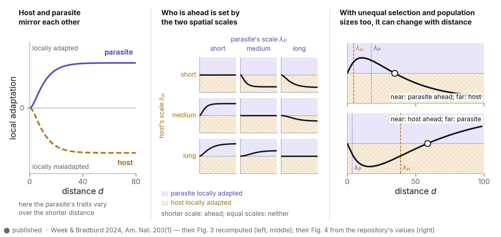 ::: :::: ::: {.notes} 24:00. Three statements. Host and parasite local adaptation mirror each other. Which one is ahead is set by the two spatial scales: the species whose traits vary over the shorter distance; equal scales, neither. And with unequal abiotic selection and population sizes as well, which one is ahead can change with the distance at which we ask. ::: ## Next: abiotic optima that vary across the landscape {.p2} ::: {.eyebrow} Part I · space [planned]{.badge .hyp} ::: :::: {.body} ::: {.fig} 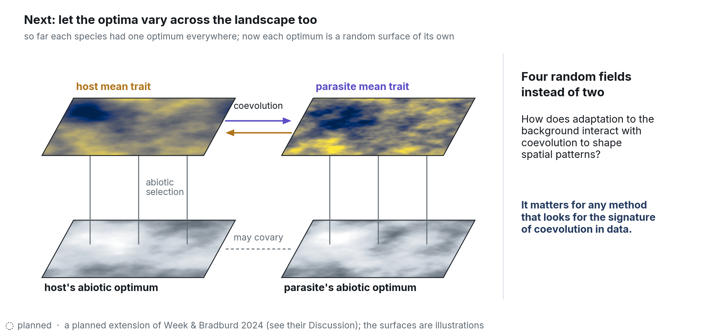 ::: :::: ::: {.notes} 24:30. A direction for this model. So far each species had one abiotic optimum everywhere. Let the optima vary across the landscape as Gaussian random fields of their own: four layers instead of two. Then we can ask how adaptation to the background interacts with coevolution to shape spatial patterns, which matters for any method that tries to pick out the signature of coevolution in data. ::: ## Pit stop: from patterns back to process? {.p2} ::: {.eyebrow} Inference [schematic]{.badge .con} ::: :::: {.body} ::: {.fig} 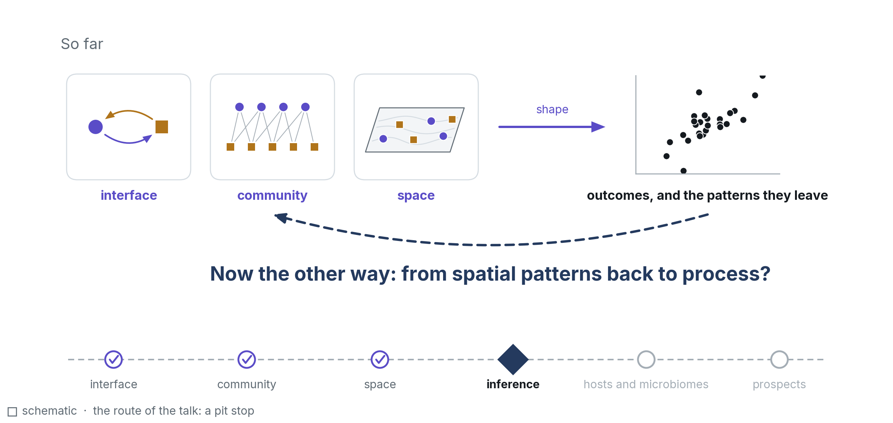 ::: :::: ::: {.notes} 25:00. A pause. We have covered a lot: how the interface, the community and space each shape coevolutionary outcomes and the patterns they leave. Now turn around: how might we move in the opposite direction, using spatial patterns in particular to infer coevolutionary processes? ::: ## Can we run the map backward? {.p2} ::: {.eyebrow} Inference [schematic]{.badge .con} ::: :::: {.body} ::: {.fig} 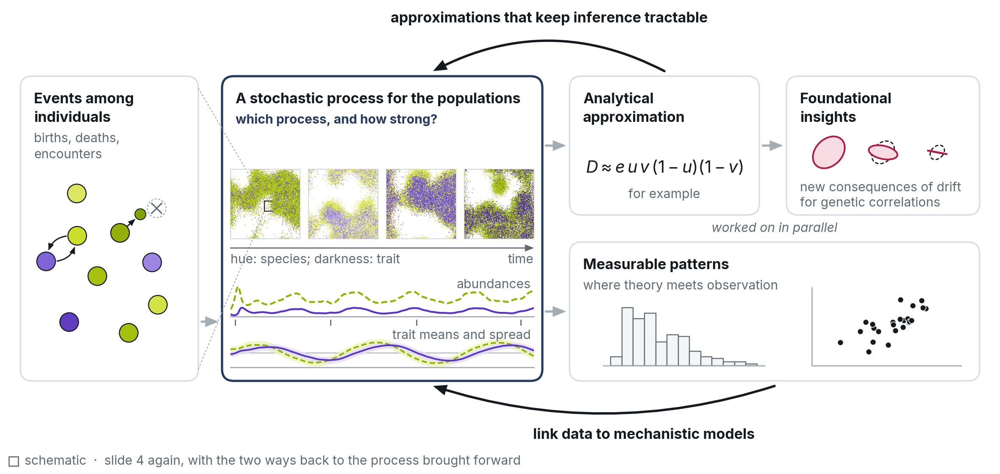 ::: :::: ::: {.notes} 26:00. The approach slide again, with the two ways back brought forward. From the patterns: link data to mechanistic models, by likelihood or by simulation. From the insights: biologically motivated approximations that keep that inference tractable. Both aim at the process. ::: ## Does a correlation mean coevolution? {.p2} ::: {.eyebrow} Inference [published]{.badge .pub} ::: :::: {.body} ::: {.fig} 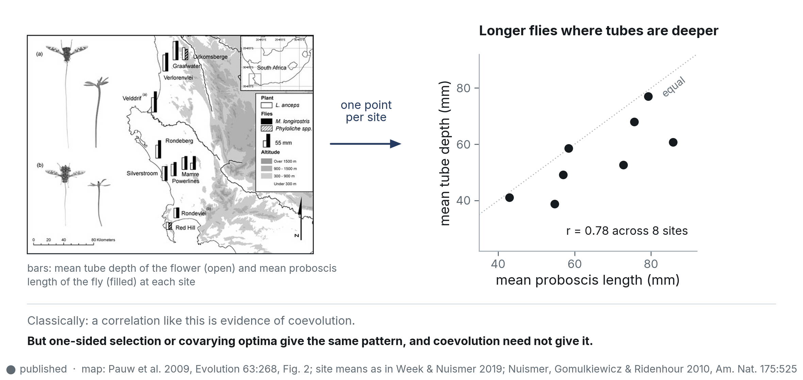 ::: :::: ::: {.notes} 27:30. The same fly and flower. Each site on Pauw's map gives one pair of means, and they are correlated. That was long read as evidence of coevolution. But Nuismer, Gomulkiewicz and Ridenhour (2010) showed that coevolution is neither necessary nor sufficient for such a correlation: one-sided selection or correlated abiotic optima produce it too. So the data have to be tied to a mechanistic model. ::: ## A mechanistic likelihood for coevolution {.p2} ::: {.eyebrow} Inference [published]{.badge .pub} ::: :::: {.body} ::: {.fig} 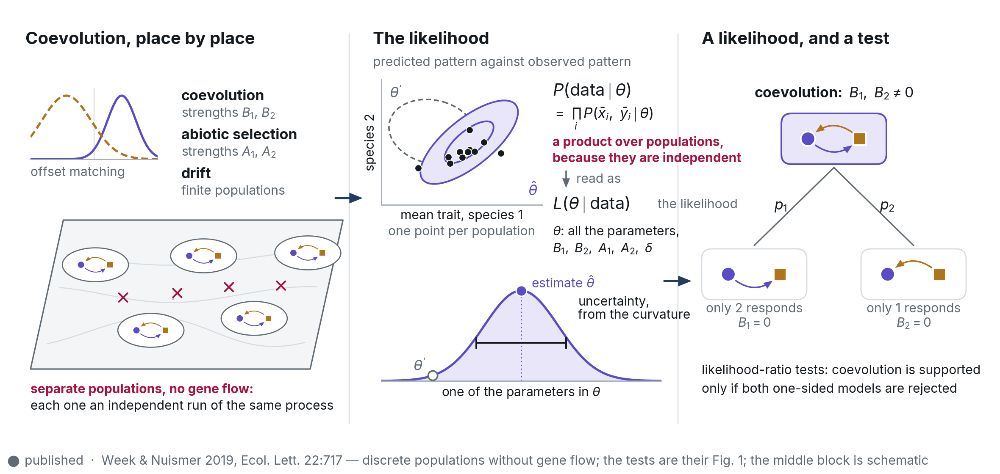 ::: :::: ::: {.notes} 29:00. Under the hood is the offset-matching model from before. Put that pairwise coevolution at many locations, each also under abiotic selection and drift, and the model predicts the spatial pattern of mean-trait pairs. That prediction, P(data | parameters), read as a function of the parameters is the likelihood (theta is the whole set of parameters): its peak is the estimate, its curvature the uncertainty. The populations are discrete and exchange no genes, so each is an independent run of the same process and the likelihood is a simple product over populations: that is what makes it tractable. Coevolution is supported only if both one-sided models are rejected. ::: ## Coevolutionary selection in the fly and the flower {.p2} ::: {.eyebrow} Inference [published]{.badge .pub} ::: :::: {.body} ::: {.fig} 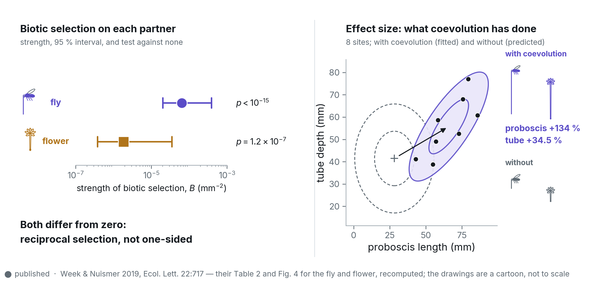 ::: :::: ::: {.notes} 30:30. Left: the strength of biotic selection on each partner. Both differ from zero, so selection is reciprocal. Right: the effect size. The dashed ellipses are where the traits would sit without coevolution, the purple ones where they sit with it: the proboscis more than twice as long, the tube a third longer. ::: ## When the likelihood is unavailable {.p2} ::: {.eyebrow} Inference [published]{.badge .pub} ::: :::: {.body} ::: {.fig} 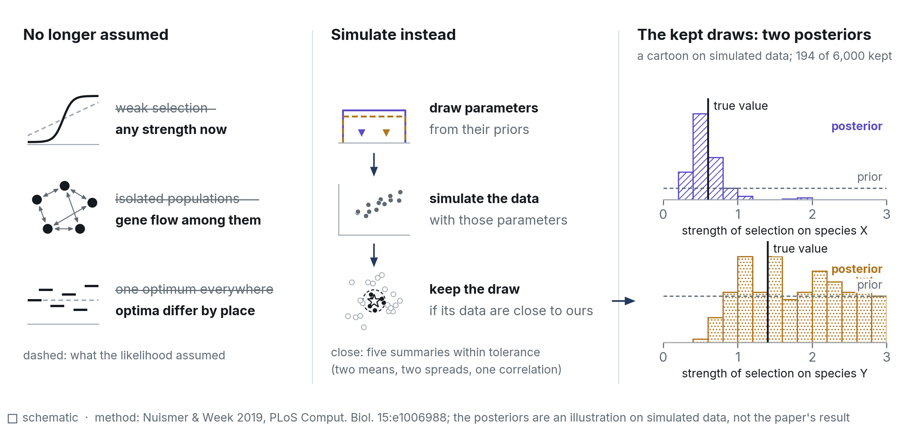 ::: :::: ::: {.notes} 32:00. Strong selection, gene flow and varying optima break the likelihood. So simulate, with approximate Bayesian computation: draw parameters from priors, simulate data, keep the draws whose data are close to ours. Applied to the Japanese camellia and its weevil, which bores through the fruit wall with its rostrum to reach the seeds: selection on the weevil is clearly above zero, selection on the camellia piles up toward zero. Support for coevolution, but one-sided evolution cannot be ruled out. ::: ## If we simulate, what should the simulator contain? {.p2} ::: {.eyebrow} Inference [schematic]{.badge .con} ::: :::: {.body} ::: {.fig} 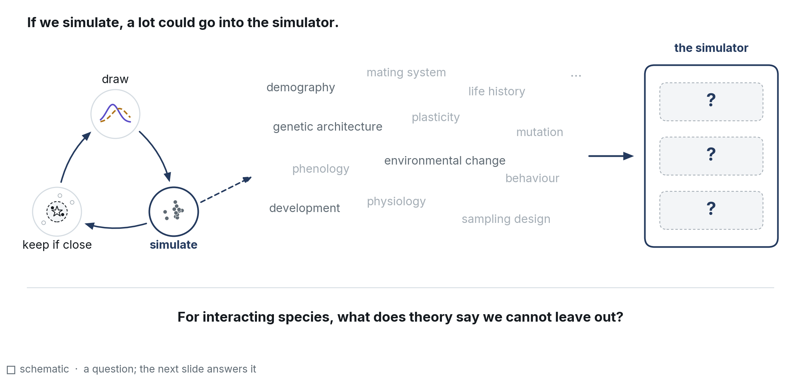 ::: :::: ::: {.notes} 33:00. If we build simulation-based approaches to inference, there is a lot we could include. For interspecific interactions in particular, we can look to theory for the key ingredients. (Do not name them; the next slide does.) ::: ## Three things keep appearing {.p2} ::: {.eyebrow} Midpoint [schematic]{.badge .con} ::: :::: {.body} ::: {.fig} 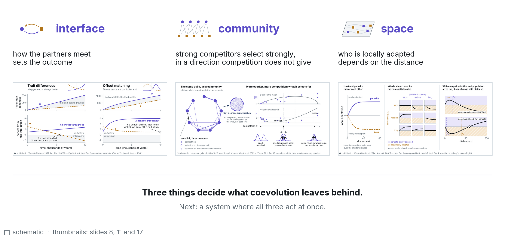 ::: :::: ::: {.notes} 34:00. Interface, community, space. Not three projects: three recurring determinants of coevolved variation. ::: ## Part II: Hosts and their microbiomes {.p1} ::: {.eyebrow} Part II [schematic]{.badge .con} ::: :::: {.body} ::: {.fig} 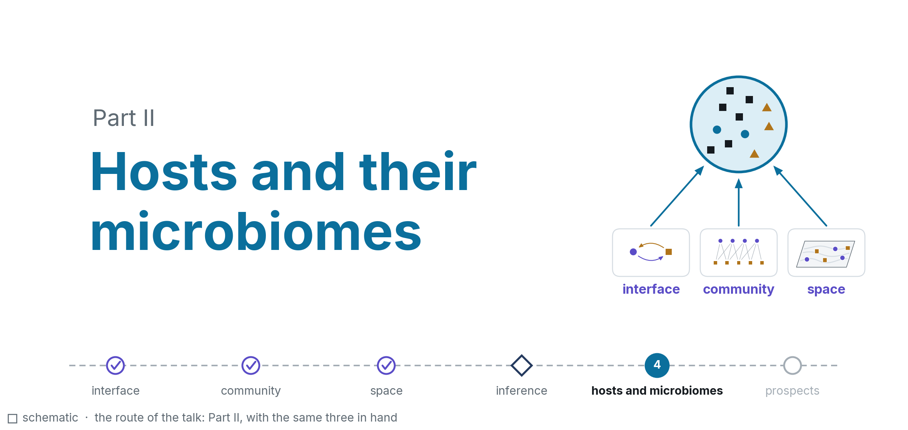 ::: :::: ::: {.notes} A pause. Part II: hosts and their microbiomes. The same three, interface, community and space, stay central; this is where they meet. ::: ## Host–microbiome evolution combines all three {.p1} ::: {.eyebrow} Midpoint [schematic]{.badge .con} ::: :::: {.body} ::: {.fig} 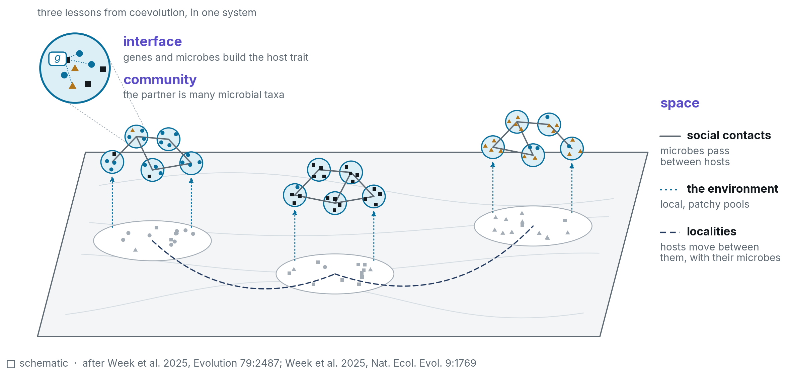 ::: :::: ::: {.notes} 35:30. The same landscape as before, but now nested: localities; at each, a social network of hosts; in each host, a microbial community; underneath, a patchy environmental pool. The interface is genes with microbes; the partner is a community; and space comes three ways: social contacts, local pools, and hosts moving between localities. For one microbe this is a metapopulation; for many, a metacommunity. ::: ## …and adds inheritance and timescales {.p1} ::: {.eyebrow} Midpoint [schematic]{.badge .con} ::: :::: {.body} ::: {.fig} 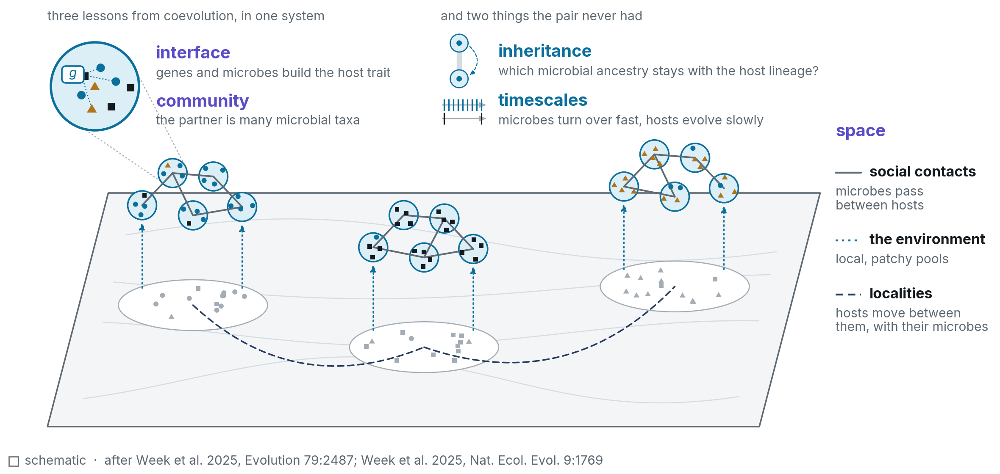 ::: :::: ::: {.notes} Two things the pair never had: which microbial ancestry stays coupled to host ancestry, and the gap between microbial turnover and host genetic change. ::: ## What is the evolutionary interface now? {.p1} ::: {.eyebrow} Part II · the interface [published]{.badge .pub} ::: :::: {.body} ::: {.fig} 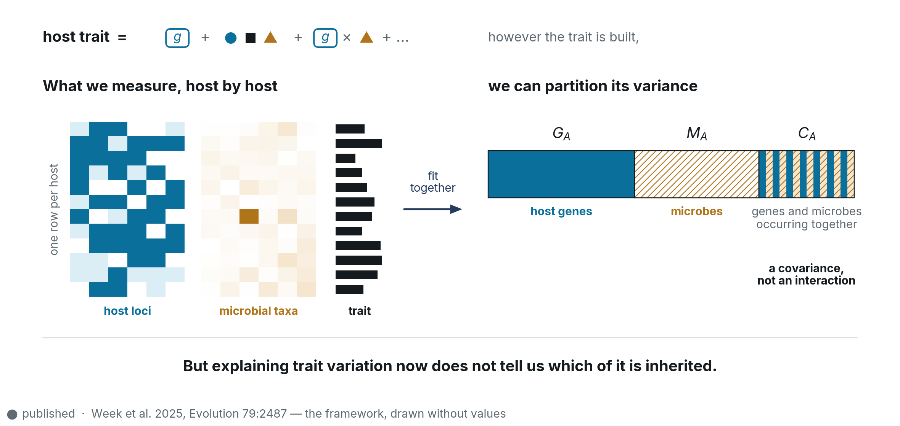 ::: :::: ::: {.notes} 37:00. However the trait is built from genes and microbes, what we measure is host genomes, microbiomes and the trait, host by host. Fitting them together partitions the variance: host genes, microbes, and their covariance. The covariance is genes and microbes occurring together, not a gene-by-microbe interaction. But explaining variation now does not tell us which of it is inherited. ::: ## Where does microbial ancestry run? {.p1} ::: {.eyebrow} Part II · inheritance [published]{.badge .pub} ::: :::: {.body} ::: {.fig} 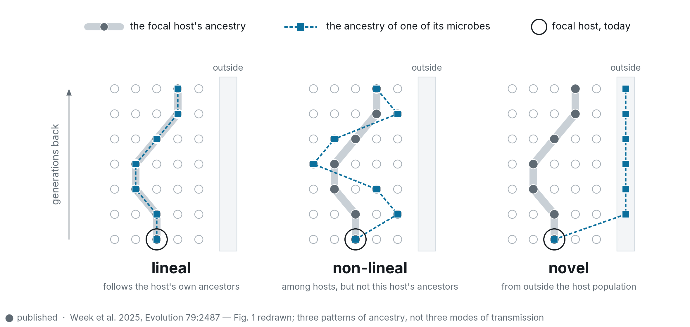 ::: :::: ::: {.notes} 38:30. Ancestral concordance: three patterns read backwards from a realised history. Lineal: follows this host's ancestors. Non-lineal: stays among hosts, but not these ancestors. Novel: from outside the host population. These are not transmission modes. ::: ## Which microbes can carry a response to selection on hosts? {.p1} ::: {.eyebrow} Part II · inheritance [published]{.badge .pub} ::: :::: {.body} ::: {.fig} 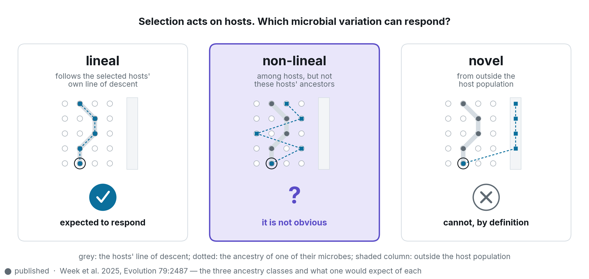 ::: :::: ::: {.notes} 39:30. What we would expect. Lineal microbes travel with the selected hosts' line of descent, so they should respond. Novel microbes cannot, by definition. For non-lineal microbes it is not obvious. ::: ## Non-lineal microbes: passed on before selection, or after? {.p1} ::: {.eyebrow} Part II · inheritance [published]{.badge .pub} ::: :::: {.body} ::: {.fig} 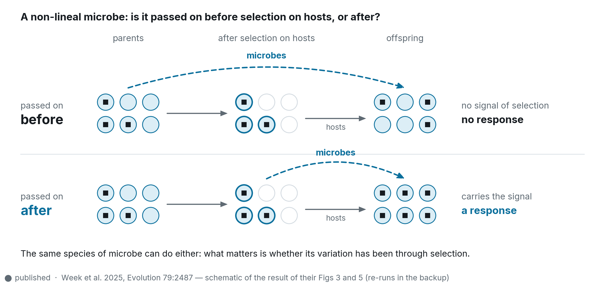 ::: :::: ::: {.notes} 40:30. Whether non-lineal microbes help the response depends on how they are inherited relative to how selection works. Simplest case: are they passed to the next generation before selection on hosts, or after? Before: their variation carries no signal of selection, no response. After: it does. ::: ## From describing variation to explaining it {.p1} ::: {.eyebrow} Part II · dynamics [schematic]{.badge .con} ::: :::: {.body} ::: {.fig} 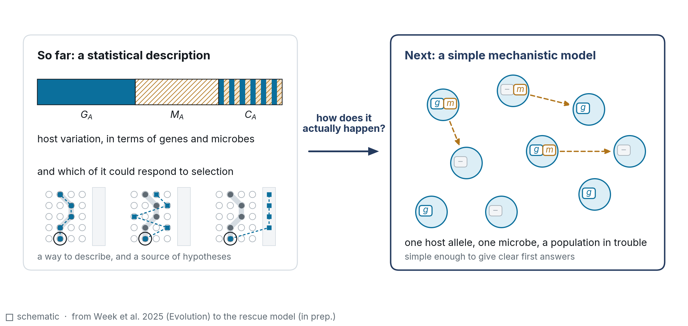 ::: :::: ::: {.notes} 41:30. So far a statistical framework: it describes host variation in terms of genetic and microbiome variation and generates hypotheses about microbiome-mediated adaptation. To understand how that adaptation works, we need mechanistic models, starting simple enough to give clear first answers. ::: ## A simple model of microbially-assisted rescue of host populations {.p1} ::: {.eyebrow} Part II · dynamics [in prep.]{.badge .res} ::: :::: {.body} ::: {.fig} 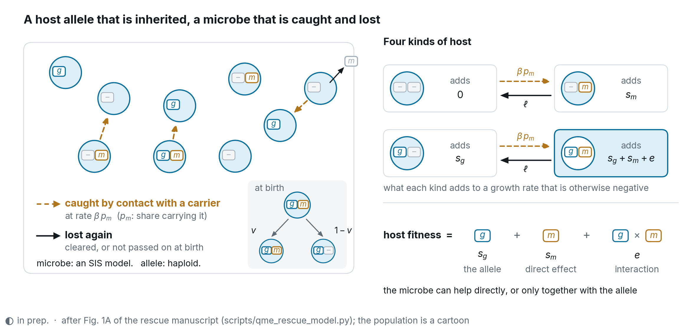 ::: :::: ::: {.notes} 42:30. One host allele, inherited (haploid); one microbe, caught by contact with carriers and lost again. Loss is clearance plus failed inheritance: at birth an offspring receives the microbe with probability v. Four kinds of host. Fitness in the same picture as the trait: the allele, the microbe's direct effect, and their interaction. ::: ## Two routes to rescue {.p1} ::: {.eyebrow} Part II · dynamics [in prep.]{.badge .res} ::: :::: {.body} ::: {.fig} 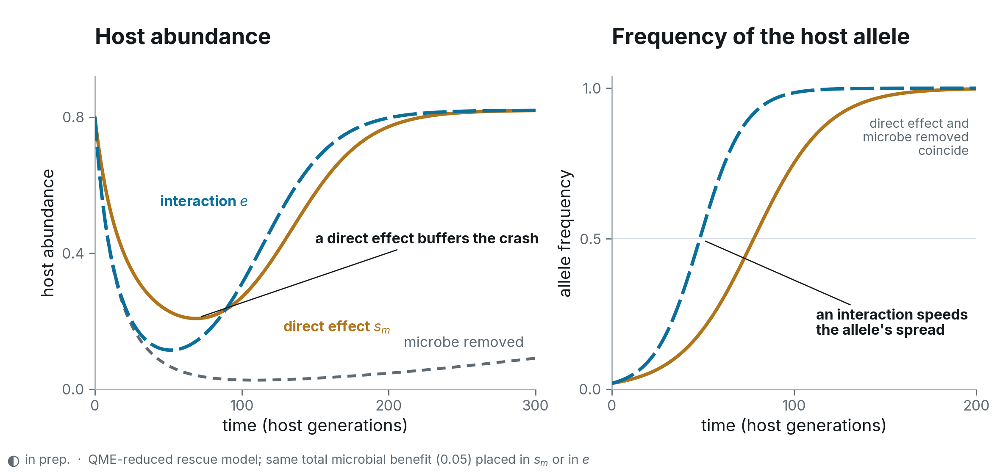 ::: :::: ::: {.notes} 43:30. Same total microbial benefit. A direct effect buffers the demographic crash; an interaction speeds the spread of the host allele. ::: ## Quasi-microbial equilibrium {.p1} ::: {.eyebrow} Part II · dynamics [in prep.]{.badge .res} ::: :::: {.body} ::: {.fig} 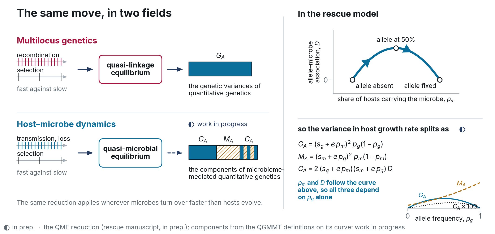 ::: :::: ::: {.notes} 45:00. How a clean result came out of a messy process. In multilocus genetics, recombination is fast and selection slow; quasi-linkage equilibrium uses that to connect population genetics to the genetic variances of quantitative genetics. Here transmission and loss are fast: quasi-microbial equilibrium, and the hope is the same connection for microbiome-mediated quantitative genetics. In the rescue model: prevalence and association follow one curve as the allele spreads, so the three components of variance in host growth rate, written with the model's own selection coefficients, become functions of the allele frequency alone. And the reduction is not tied to this model: it applies wherever microbes turn over faster than hosts evolve. ::: ## How do we find the signature of host–microbiome interactions? {.p1} ::: {.eyebrow} Looking forward [planned]{.badge .hyp} ::: :::: {.body} ::: {.fig} 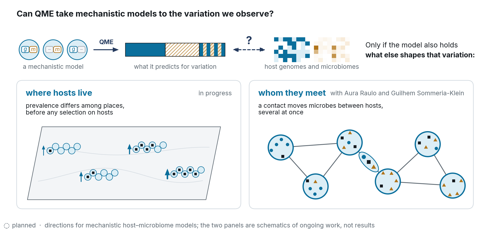 ::: :::: ::: {.notes} 46:00. How can we combine these ingredients (a description of variation, what is inherited, a mechanistic model, a reduction that scales) to identify the signatures of host–microbiome interactions? We will need models that account for spurious associations and background processes: where hosts live, and host social structure (with Aura Raulo and Guilhem Sommeria-Klein). Social transmission and geography together determine how microbiomes are inherited. And similarly for coevolution: how do we account for background selection and shared dispersal history while searching for its signature? Two species that spread from one refuge along the same routes: each founding step shifts allele frequencies, so places on the same branch end up alike in both species. Their genetic structure matches with no selection between them: movement alone can look like coevolution in genetic data. ::: ## Can we read interaction history from spatial molecular data? {.p1} ::: {.eyebrow} Looking forward [planned]{.badge .hyp} ::: :::: {.body} ::: {.fig} 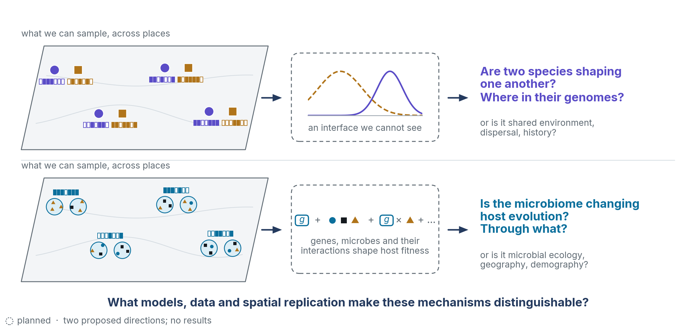 ::: :::: ::: {.notes} 47:00. Two open questions rather than a method. Are two species shaping one another, and where in their genomes? Is the microbiome changing host evolution, and through what? Both lean on spatial replication. What models and data make these mechanisms distinguishable? An invitation. ::: ## Charting interactions {.p1} ::: {.eyebrow} Close [schematic]{.badge .con} ::: :::: {.body} ::: {.fig} 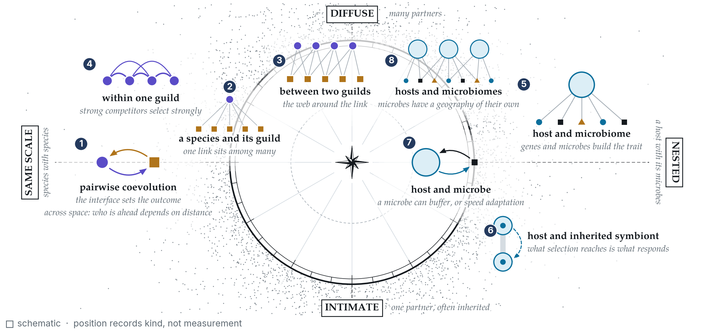 ::: :::: ::: {.notes} 48:00. Two ways to close. (1) The map as a summary: we started with a pair and an interface, added a community, then space; the same three reappeared inside a host with its microbes, joined by inheritance and timescale. Wherever we stood on this map, the question was the same: which structure decides what an interaction leaves behind, and can we read it back from data? (2) The map as an invitation: most of this chart is still coastline. The systems studied here in Lyon sit at particular places on it; I would like to know which of these coordinates matter in yours. ::: ## Thanks {.p1 visibility="uncounted"} :::: {.body .top} ::: {.w50} ::: {.thanks} ::: {.tgroup} [Coevolution and space]{.lbl} ::: {.faces} 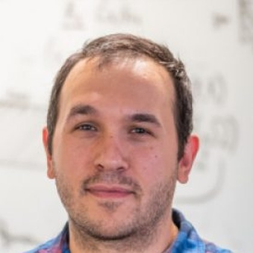[Scott Nuismer · Gideon Bradburd · Stephen Krone]{.nm} ::: ::: ::: {.tgroup} [Microbiome-mediated quantitative genetics]{.lbl} ::: {.faces} 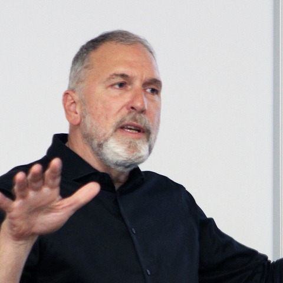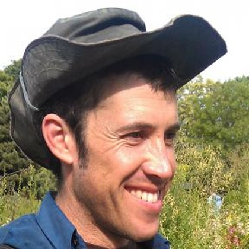[Brendan Bohannan · Peter Ralph · Hannah Tavalire · William Cresko]{.nm} ::: ::: ::: {.tgroup} [Microbial rescue and QME]{.lbl} ::: {.faces} [Hildegard Uecker · Hinrich Schulenburg]{.nm} ::: ::: ::: {.tgroup} [Social and spatial microbiomes]{.lbl} ::: {.faces} 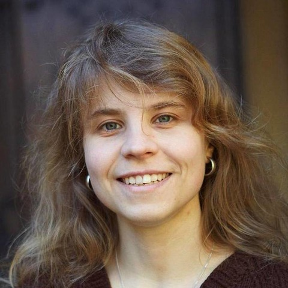[Aura Raulo · Guilhem Sommeria-Klein · Brendan Bohannan]{.nm} ::: ::: ::: ::: ::: {.w50} ::: {.kiel-lbl} The Schulenburg group for Evolutionary Ecology and Genetics, Kiel ::: ::: {.family} 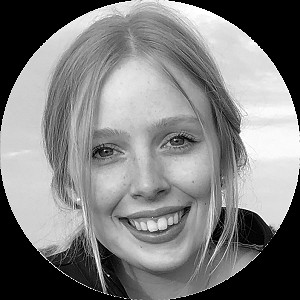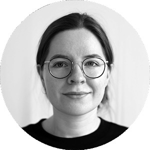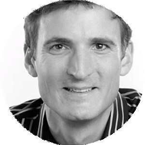 ::: ::: :::: ::: {.logos}    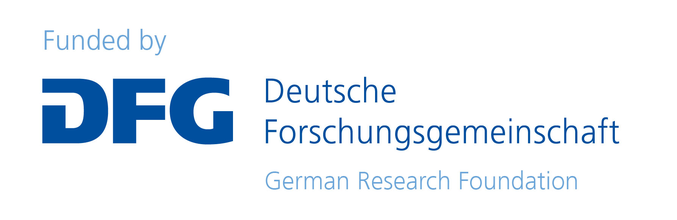 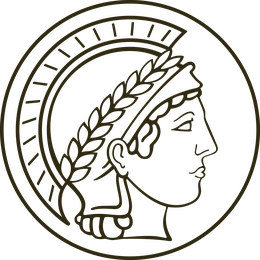 []{.gap} {.past} {.past} {.past} ::: ::: {.cite} KiTE is co-funded by the European Union (Marie Skłodowska-Curie 101081480) ::: ::: {.notes} Collaborators grouped by the story just told. ::: ## Backup: drift reorients G {.p3 visibility="uncounted"} ::: {.eyebrow} Backup [published]{.badge .pub} ::: :::: {.body} ::: {.fig} 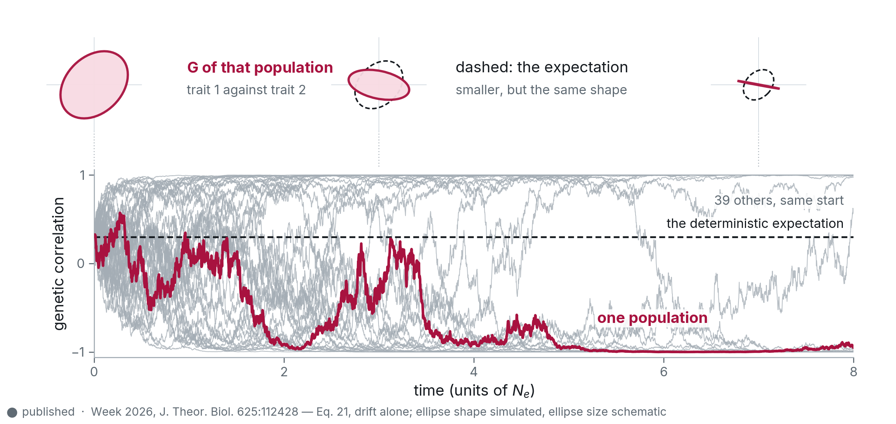 ::: :::: ::: {.notes} The single-species aside in full (Week 2026). Deterministic theory says drift only shrinks G; along a single path it drives the correlation to an extreme. ::: ## Backup: the fly and flower, to scale {.p2 visibility="uncounted"} ::: {.eyebrow} Backup [schematic]{.badge .con} ::: :::: {.body} ::: {.fig} 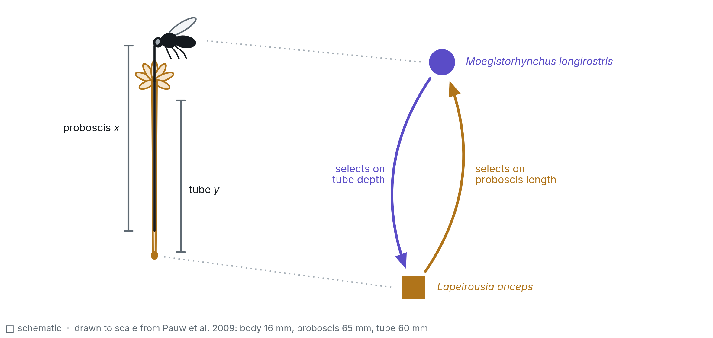 ::: :::: ::: {.notes} Body 16 mm, proboscis 65 mm, tube 60 mm (Pauw et al. 2009). ::: ## Backup: each species has its own spatial scale {.p2 visibility="uncounted"} ::: {.eyebrow} Backup [schematic]{.badge .con} ::: :::: {.body} ::: {.fig} 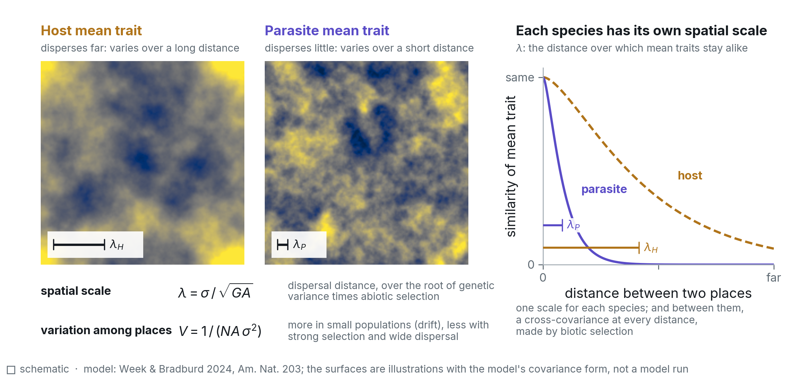 ::: :::: ::: {.notes} The earlier slide: the two surfaces, their autocovariance curves and how the model's parameters set the scale and the amount of variation. ::: ## Backup: local adaptation, all nine cases {.p2 visibility="uncounted"} ::: {.eyebrow} Backup [published]{.badge .pub} ::: :::: {.body} ::: {.fig} 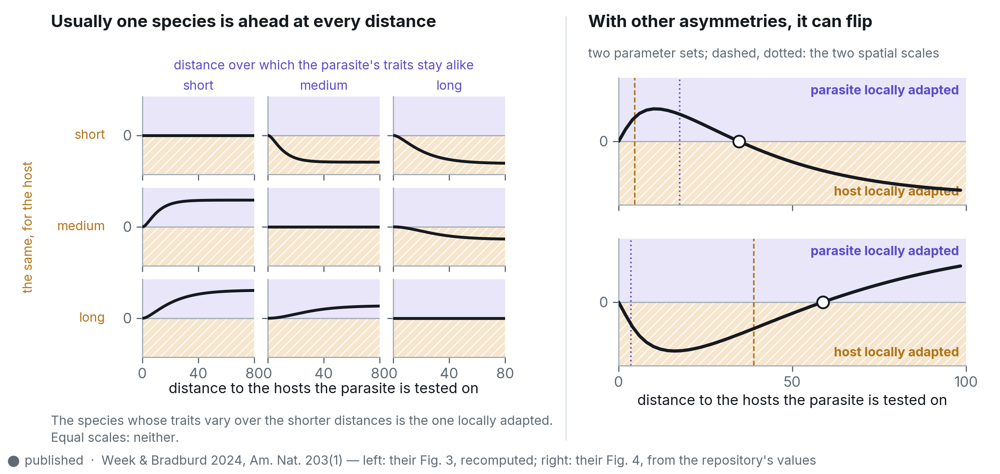 ::: :::: ::: {.notes} Week & Bradburd 2024, Fig. 3, recomputed, beside their Fig. 4. ::: ## Backup: both systems {.p2 visibility="uncounted"} ::: {.eyebrow} Backup [published]{.badge .pub} ::: :::: {.body} ::: {.fig} 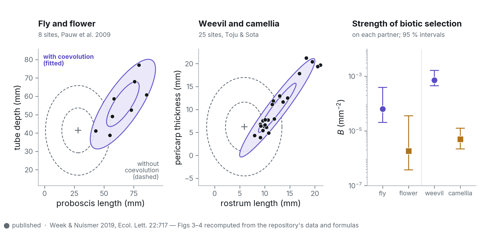 ::: :::: ::: {.notes} Week & Nuismer 2019, Figs 3 and 4, with the camellia and its weevil. ::: ## Backup: the response over generations {.p1 visibility="uncounted"} ::: {.eyebrow} Backup [published]{.badge .pub} ::: :::: {.body} ::: {.fig} 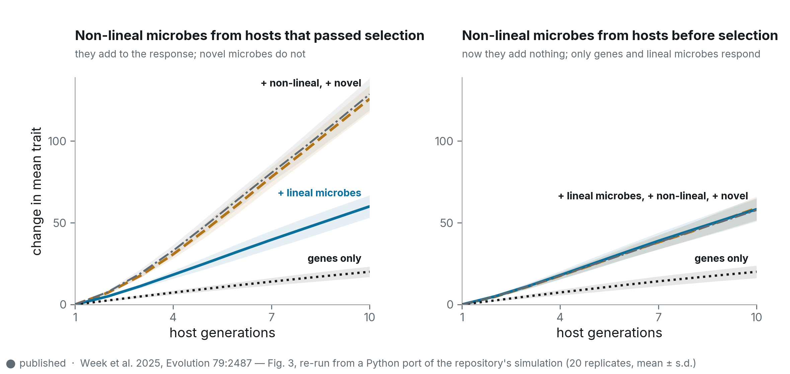 ::: :::: ::: {.notes} Week et al. 2025, Fig. 3, re-run: the response with more and more kinds of factor, non-lineal microbes taken from hosts after or before selection. ::: ## Backup: predicting the response {.p1 visibility="uncounted"} ::: {.eyebrow} Backup [published]{.badge .pub} ::: :::: {.body} ::: {.fig} 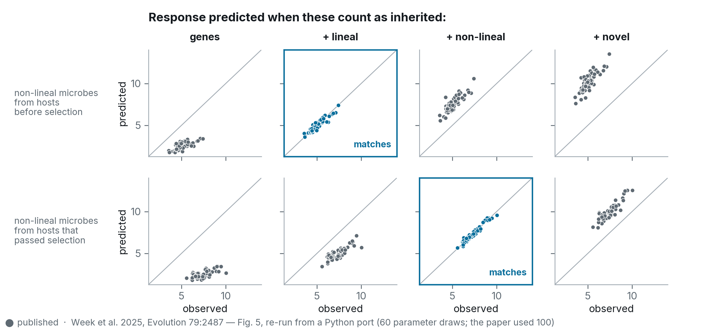 ::: :::: ::: {.notes} Week et al. 2025, Fig. 5. Predictions match when exactly the transmitted factors are counted. ::: ## Backup: microbial geography before host selection {.p1 visibility="uncounted"} ::: {.eyebrow} Backup [planned]{.badge .hyp} ::: :::: {.body} ::: {.fig} 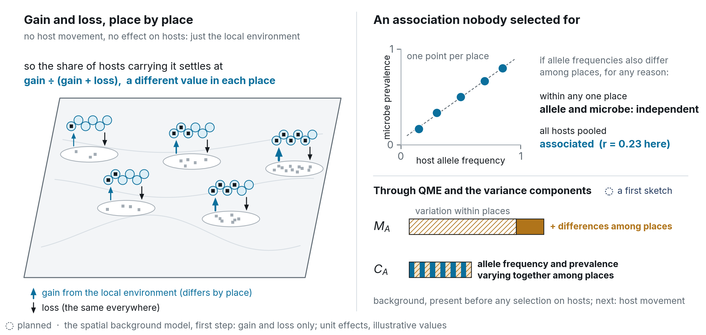 ::: :::: ::: {.notes} Gain and loss place by place; an association nobody selected for; a first sketch of what that does to the variance components. ::: ## Backup: social contact is microbial dispersal {.p1 visibility="uncounted"} ::: {.eyebrow} Backup [schematic]{.badge .con} ::: :::: {.body} ::: {.fig} 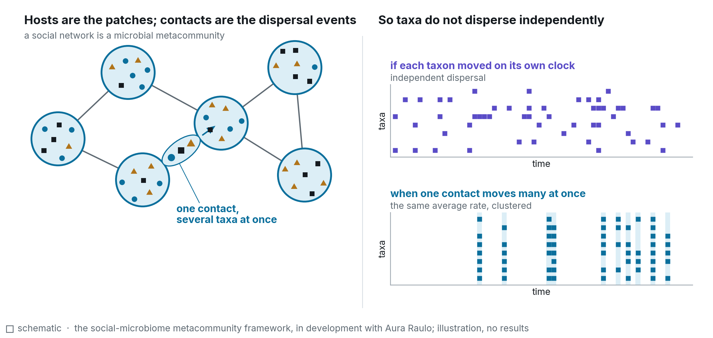 ::: :::: ::: {.notes} With Aura Raulo and Guilhem Sommeria-Klein. One contact moves several taxa, so taxa do not disperse independently. ::: ## Backup: the systems as a grid {.p2 visibility="uncounted"} ::: {.eyebrow} Backup [schematic]{.badge .con} ::: :::: {.body} ::: {.fig} 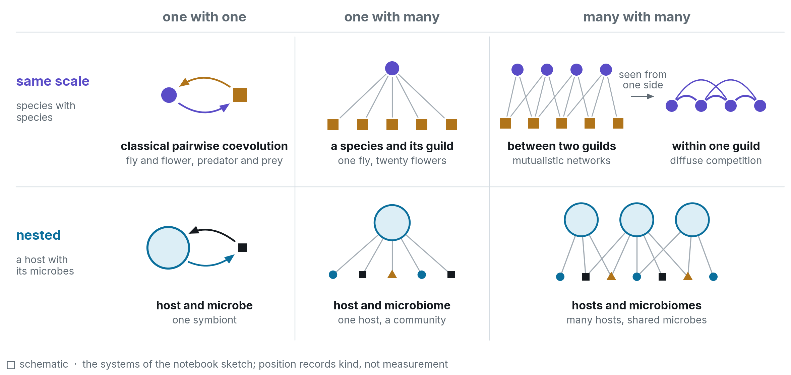 ::: :::: ::: {.notes} The earlier typology: scale by number of partners. :::