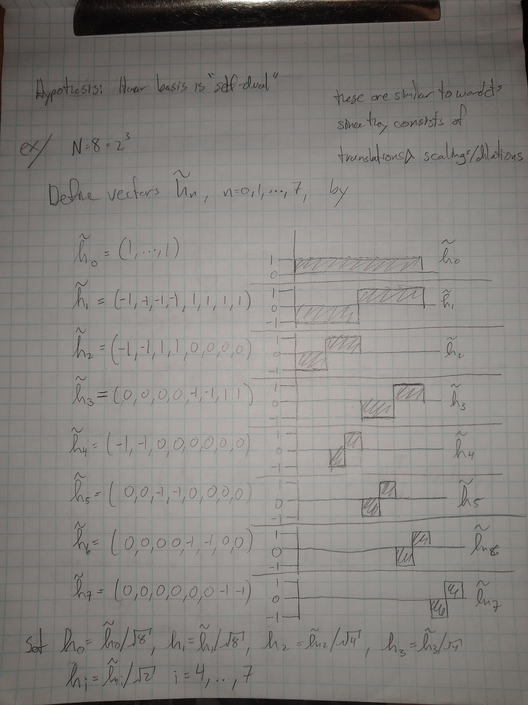

\newcommand{\C}{\mathbb{C}}
\newcommand{\Z}{\mathbb{Z}}
\newcommand{\N}{\mathbb{N}}
\newcommand{\R}{\mathbb{R}}
\newcommand{\<}{\left<}
\newcommand{\>}{\right>}
\newcommand{\ra}{\rightarrow}
\newcommand{\sinc}{\mathrm{sinc}}
\newcommand{\supp}{\mathrm{supp}}

# Discrete Haar Basis ($\in\C^N$)

Recall the Fourier basis $\{e_n\}_{n=0}^{N-1}$ given by

$$e_n(k)\equiv\frac{1}{\sqrt N}e^{\frac{2\pi ikn}{N}}\equiv\frac{1}{\sqrt N}\omega^{kn}$$

$$e_n\equiv\frac{1}{\sqrt N}\left(\begin{matrix}1\\\omega^n\\\omega^{2n}\\\vdots\\\omega^{(N-1)n}\end{matrix}\right).$$

  - Observation: $e_n$ has stictly non-zero entries. The Fourier basis vectors are not _localized_

The standard basis:

$$\{S_n\}\equiv\left\{\left(\begin{matrix}1\\0\\\vdots\\0\end{matrix}\right),\cdots,\left(\begin{matrix}0\\\vdots\\0\\1\end{matrix}\right)\right\}$$
  
is as localized as possible.

  - Observation: $\hat e_j=S_j$ & $\hat S_j=e_j$. This is another manifestation of the uncertainty principle ($f$ & $\hat f$ cannot both have cmpct sppt).
  
### The Haar Basis

  - __ex:__ $N=2^3=8$

The $N$th Haar basis for $\C^N$ is given by:

$$N=2^i, \ 0\leq k<i, \ 0\leq m<2^k$$

$$\tilde h_n(l)\equiv\left\{\begin{matrix}
-1 &  m             N2^{-k}\leq l<(m+\frac{1}{2})N2^{-k} \\
1  & (m+\frac{1}{2})N2^{-k}\leq l<(m+      1    )N2^{-k} \\
0  & \text{otherwise}
\end{matrix}\right.$$

$k,m$ uniquely defined by $n=2^k+m, \ 1\leq n<N$.

$$h_n=2^{k/2}N^{-1/2}\tilde h_n, \ 0\leq n=2^k+m\leq N-1, \ 0\leq m\leq 2^k$$

### Haar transform

$$H_N\equiv\left(\begin{matrix}\vdots & \vdots & \vdots \\ h_0 & \cdots & h_{N-1} \\ \vdots & \vdots & \vdots\end{matrix}\right)$$

$${H_N}^{-1}={H_N}^\top$$

so its unitary

  - can make FHT just like FFT. ex:

$${H_4}^\top=\left(\begin{matrix}
 \frac{1}{\sqrt 2} & 0 & \frac{1}{\sqrt 2} & 0 \\
-\frac{1}{\sqrt 2} & 0 & \frac{1}{\sqrt 2} & 0 \\
                0  & 1 &                0  & 0 \\
                0  & 0 &                0  & 1
\end{matrix}\right)\left(\begin{matrix}
{H_2}^\top & 0         \\
         0 & {H_2}^\top
\end{matrix}\right)$$