## Who am I

- **Background:** Mathematical evolution and ecology
- **Was a** postdoc with *Brendan Bohannan* 2022-2024
- **Now a** postdoc with *Hinrich Schulenburg* at Kiel University

## Overview (two parts)

1. **ACROSS** HOST GENERATION DYNAMICS (host-microbiome feedback)
  - *Modelling host-microbiome evolution*
  - Extended inheritance frameworks
  - ~~Microbiome-mediated rescue~~
  - Microbiome-extended quantitative genetics
    - *A gap*: microbiome inheritance ??
    - motivates...
2. **WITHIN** HOST GENERATION DYNAMICS (microbiomes structured by fixed hosts)
  - *Modelling microbiome community dynamics and transmission*
  - Metacommunity Framework
  - Viscocity hypothesis

## We live in a microbial world

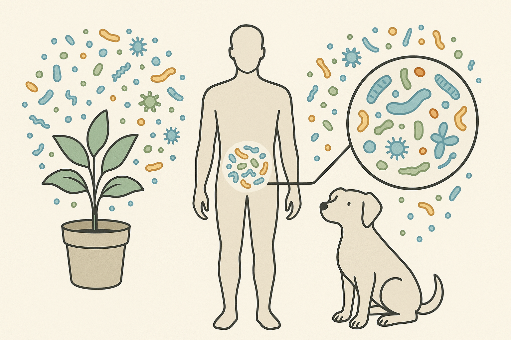{width=800}

## Microbiomes mediate host trait variation

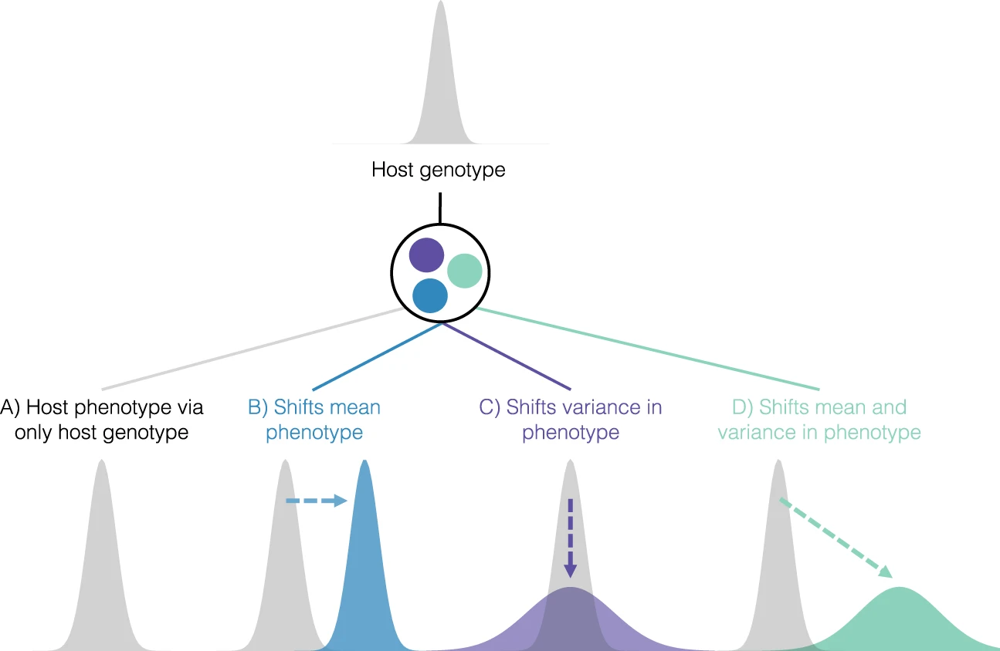{width=800}

## Microbiomes can be inherited

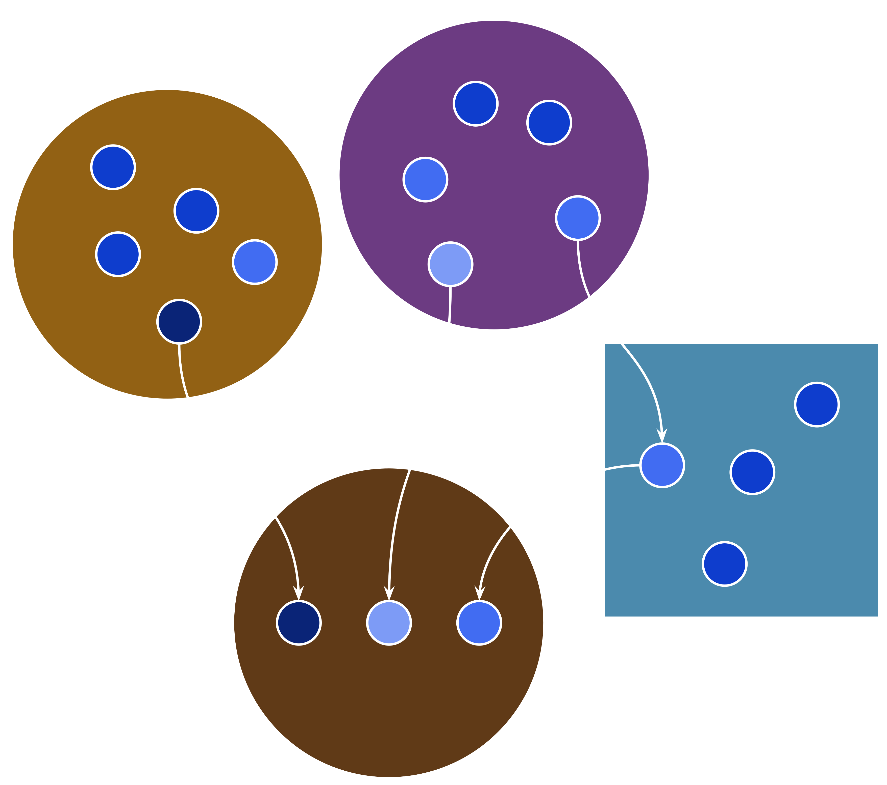{width=600}

## Can Microbiomes facilitate adaptation?

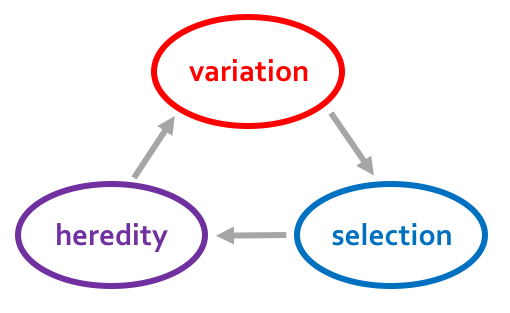{width=800}

- **Lewontins Conditions** $\uparrow$ for evolutionary adaptation

## **But** microbiomes *not* like nuclear genes...

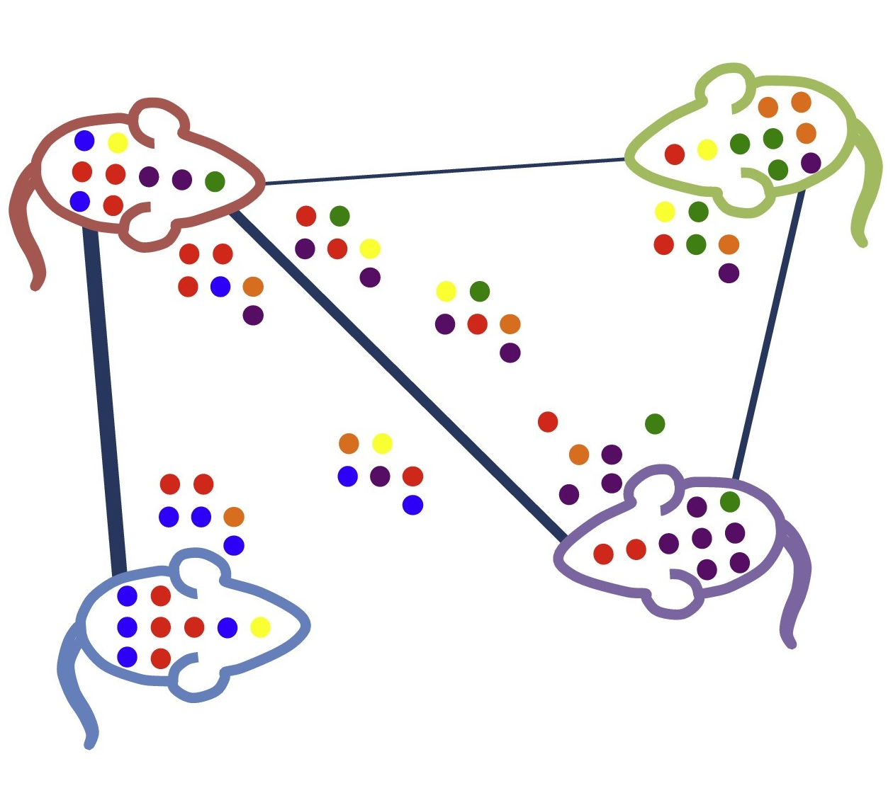{width=500}

- **Community assembly** (microbial dispersal, within-host selection, etc ...)

## Extended inheritance account for microbiomes?

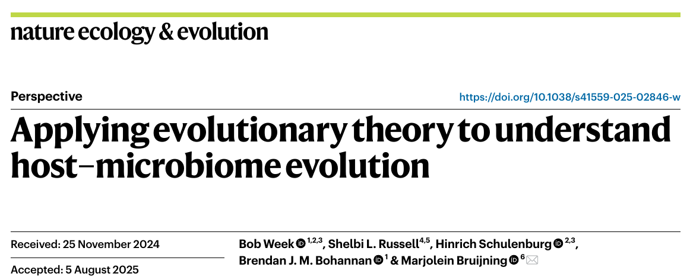{width=900}

- Maternal Effects
- Indirect Genetic Effects
- Niche Construction
- ~~Multilevel Selection~~

## Maternal Effects

::: columns
::: {.column width="50%"}

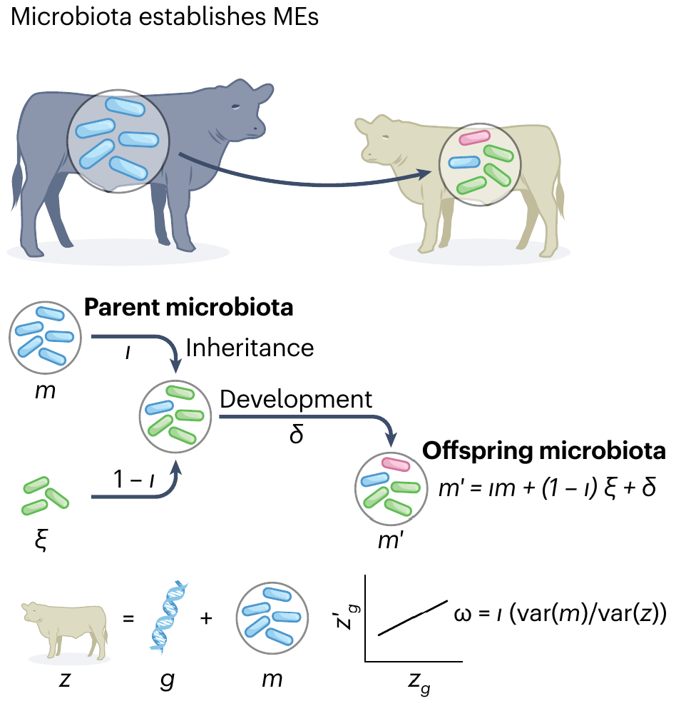{width=600}

:::

::: {.column width="50%"}

> *Definition:* 
> 
> influence of parent trait on offspring trait
  
:::
:::

## Indirect Genetic Effects

::: columns
::: {.column width="40%"}

> *Definition:*
> 
> genotype of one individual influences trait of another individual

:::

::: {.column width="60%"}

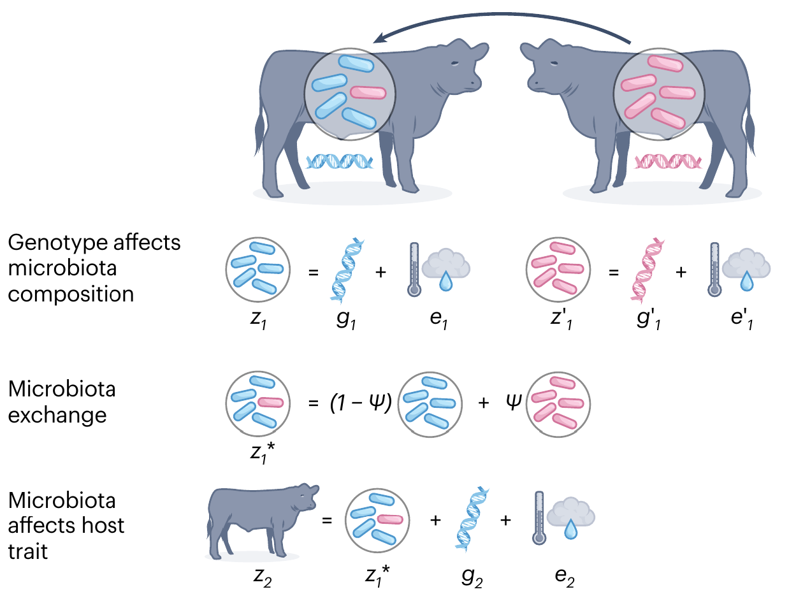{width=750}

  
:::
:::

## Niche Construction

::: columns
::: {.column width="60%"}

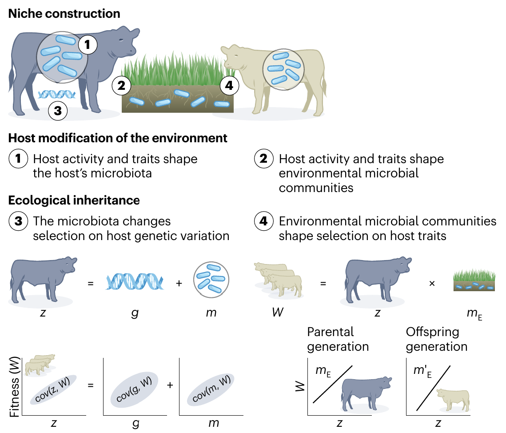{width=700}

:::

::: {.column width="40%"}

> *Definition 1:* 
> 
> organism activity alters environment

> *Definition 2:* 
> 
> organism activity alters selection pressures

> *Two perspectives:*
>
> 1. microbiome as environment
>
> 2. microbiome modifying environment

:::
:::

## Multilevel Selection (*remove mls stuff!*) (or put in post-slides)

- **MLS1:** Selection on *"individuals"* in groups (host-associated microbes)
  - within group selection for individuals
  - among group selection for individuals
- **MLS2:** Selection on *"groups"* (hosts)

## Multilevel Selection 1 (*on microbes*)

::: {.columns}

::: {.column width="60%"}

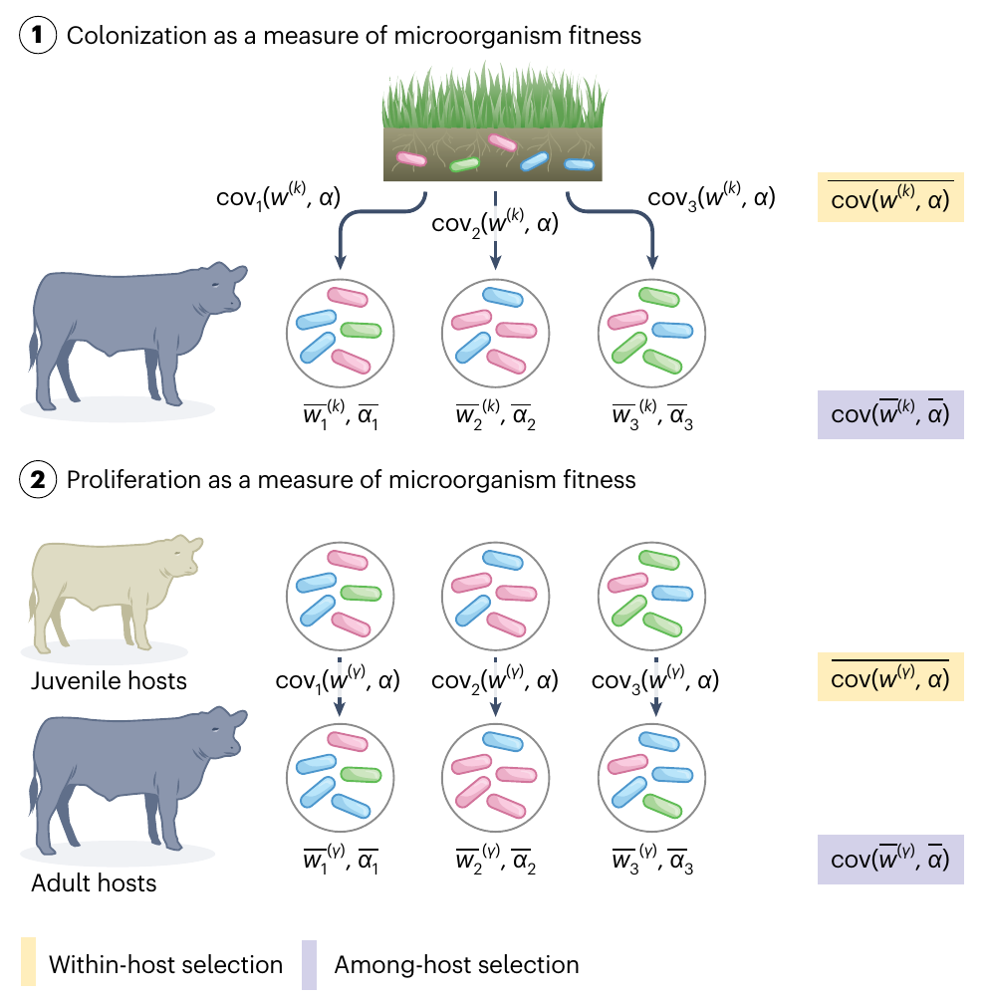{width=600}

:::

::: {.column width="40%"}

> *Colonization-based selection:* 
> 
> covariance of microbe trait **α** with occurance within host relative to prevalence in environment (colonization **w**)

> *Proliferation-based selection:* 
> 
> covariance of microbe trait **α** with difference in abundance across host development stages (proliferation **w**)

:::

:::

## Multilevel Selection 2 (*on hosts*)

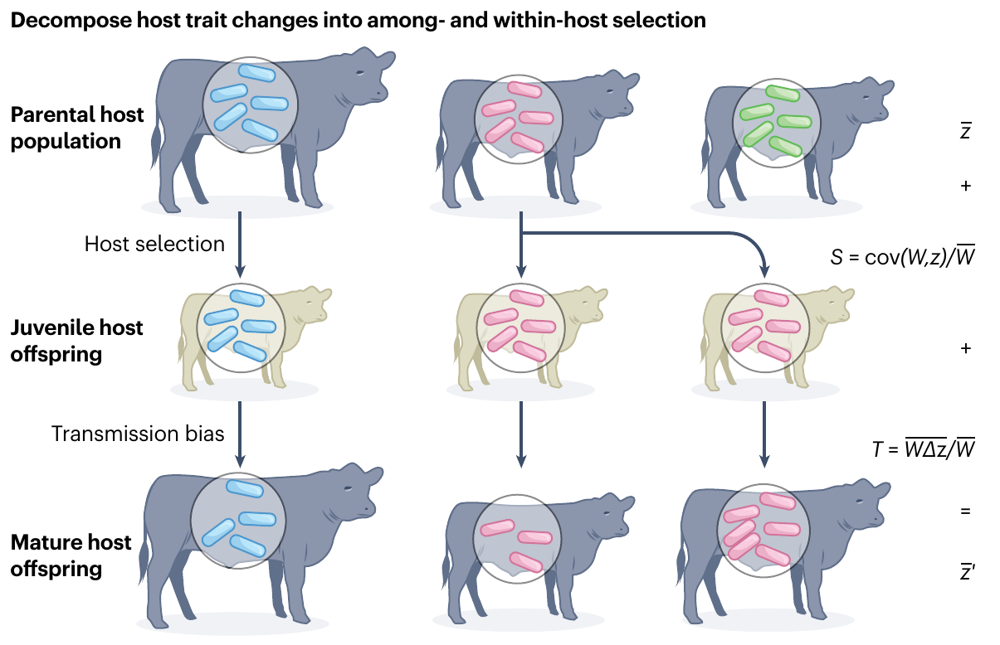{width=850}

## Conclusion

PROS

- **Maternal Effects** ~ vertical *parent-offspring* inheritance
- **Indirect Genetic Effects** ~ horizontal *social* inheritance
- **Niche Construction** ~ horizontal *environmental* inheritance
- **Multilevel Selection** ~ quantify *alignment of evolutionary interests*

CONS

- Lack realism, *need testing*
- Assessment of microbiome-mediated adaptation requires **synthesis**
  - Designed for *unique biology* of host-microbiome systems

## Working on it! (remove this slide! focus on qgmmt instead as response to needing synthesis)

- Microbiome Mediated Rescue of Host Populations
- Quantitative Genetics of Microbiome Mediated Traits
- Multilevel Selection and Maintenance of Costly Mutualists
- Evolution of Microbiome Mediated Traits
  - Niche Construction

## Working on it!

- *Microbiome Mediated Rescue of Host Populations*
- *Quantitative Genetics of Microbiome Mediated Traits*
- ~~Multilevel Selection and Maintenance of Costly Mutualists~~
- ~~Evolution of Microbiome Mediated Traits~~
  - ~~Niche Construction~~

## Microbiome Mediated Rescue of Host Populations

::: columns
::: {.column width=50%"}

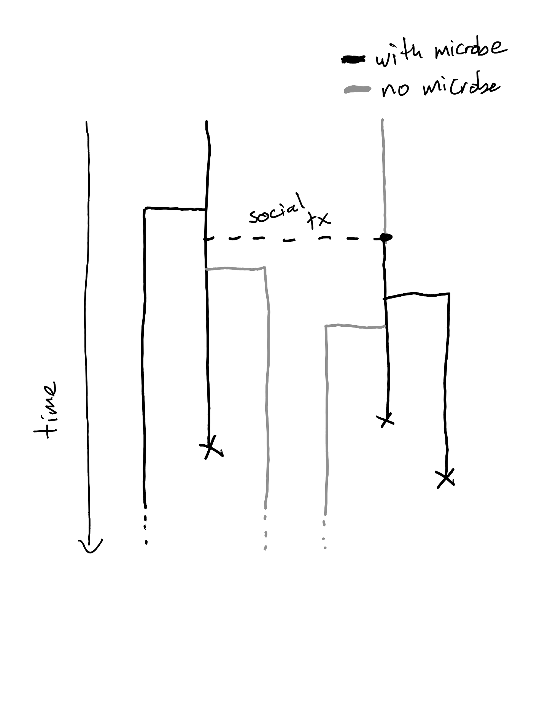{width=450}

:::
::: {.column width="50%"}

{width=325}

{width=325}

  
:::
:::

## Quantitative Genetics of Microbiome Mediated Traits

::: {.columns}

::: {.column width="33%"}

*Host Trait Variance Partitioning*

$$P=G+M+E$$

- $P$ ... phenotypic variation
- $G$ ... explained by **genetic** var
- $M$ ... explained by **microbiome** var
- $E$ ... explained by **other** stuff
:::

::: {.column width="33%"}

*Microbiome Partitioning*

$$M=M_L+M_N+M_V$$

- $M_L$ ... **lineal** microbes
- $M_N$ ... **non-lineal** microbes
- $M_V$ ... **novel** microbes
:::

::: {.column width="33%"}

*Predictions*

- $M_L$ ~ **most** adaptive potential
- $M_N$ ~ **less** adaptive potential
- $M_V$ ~ **least** adaptive potential
:::

:::

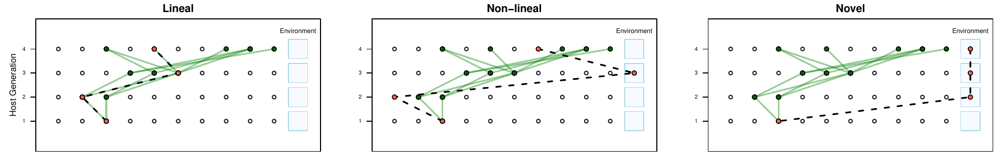{width=1200}

## Limits of Current Quantitative Genetic Approach

- Variance partitioning general ✔️
- Classical **adaptation predictions** assume:
  - Mendelian inheritance
  - Many loci small effect
  - Random mating
  - etc ...
- Need to understand **microbiome inheritance** process:
  - Transmission
  - Dynamics
  - Patterns

# Part2: *A Metacommunity Ecology Approach*

## Metacommunity Idea

::: columns
::: {.column width=50%"}

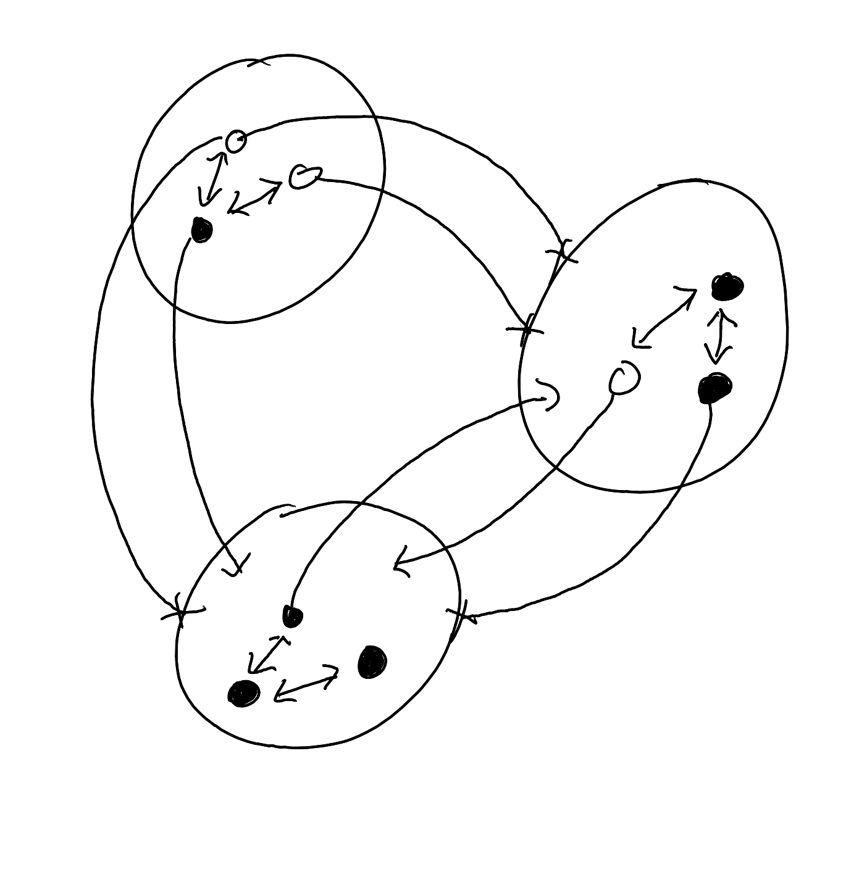{width=500}

:::
::: {.column width="50%"}

- **Dispersal** among discrete patches
- Local interspecific **interactions**
- Habitat **filtering**
  
:::
:::

## Host-Associated Microbiome Metacommunity

::: columns
::: {.column width=50%"}

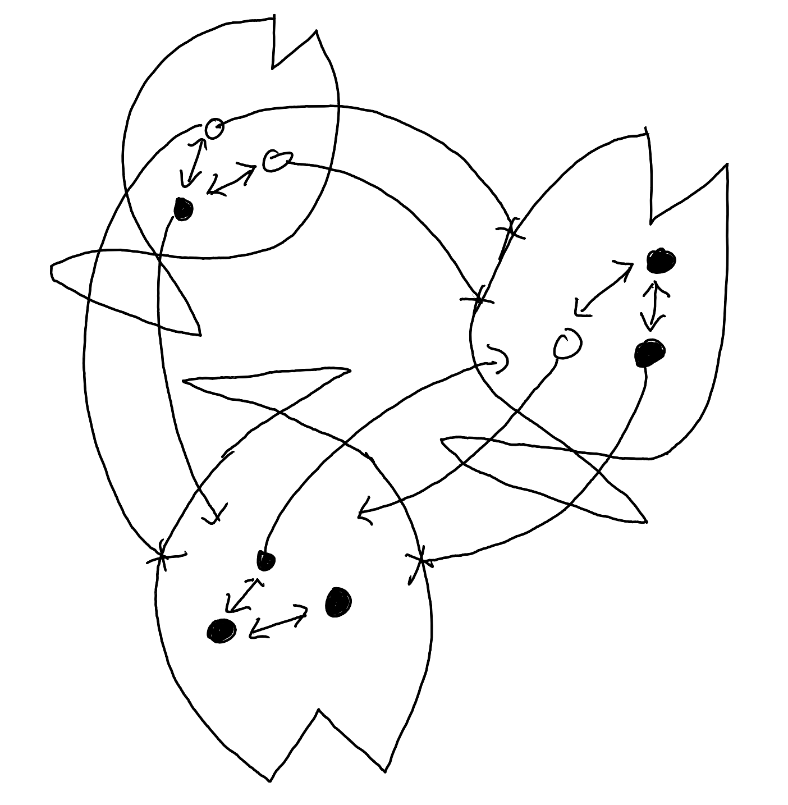{width=500}

:::
::: {.column width="50%"}

- **Transmission** between hosts
- Within host **interactions**
- Host **control**
  
:::
:::

## Why we need new theory (*a matter of scale*)

- **Extreme abundance asymmetry**
  - local abundances astronomical compared to number of dispersers
- **Transmission mediated by host structure**
  - constrained by social contact and environmental proximity
- **Discretely packaged transmission events**
  - concentrated pulses instead of continuous flow
- **Strong demographic buffering locally**
  - transmission alters composition, not abundance
- **Implications:**
  - different dynamics ~ different patterns
  - microbiome diversity likely linked to *host sociality*...

## A Model

$$dN_i^k=\left({\color{yellow}{r_i^k}}-{\color{red}{\sum_{j=1}^S\alpha_{ij}^kN_j^k}}\right)N_i^k\,dt + 
    \sum_{\ell=1}^K{\color{magenta}{T_{\ell\leftrightarrow k}(dt,dN)}}% + 
    %{\color{green}{\varepsilon_{\ell k}e_i}})N_{i\ell} 
    % - \sum_{\ell=1}^K({\color{purple}{\psi_{k\ell}s_{k\ell}^i}} +
    % {\color{olive}{\varepsilon_{k\ell}e_{k\ell}^i}})N_{ik}
    +{\color{lime}{e_i^k\,N_i^k\,dE_i^k}}
    +{\color{skyblue}{\beta_i^k\sqrt{N_i^k}\,dD_i^k}}$$

::: {.columns}

::: {.column width="50%"}

- $i=$ microbe species 1,...,S
- $k=$ host individual 1,...,K
- $N_i^k=$ abundance microbe $i$ in host $k$

$\color{yellow}{\circ}$ $=$ habitat filtering / host selection

$\color{red}{\circ}$ $=$ competition / ecological network

$\color{magenta}{\circ}$ $=$ social contact

$\color{lime}{\circ}$ = environmental stochasticity

$\color{skyblue}{\circ}$ $=$ demographic stochasticity

${\color{lime}{E_i^k}},\,{\color{skyblue}{D_i^k}}\,=$ Brownian motions

:::

::: {.column width="50%"}

Transmission

- ${\color{magenta}{T_{\ell\leftrightarrow k}}}\,=$ jump process
  - $\Psi_{\ell k}\,=$ jump rate btwn hosts $\ell,\,k$
    - (*social contact network*)
  - size of jumps for $N_i^\ell,\,N_i^k$ :
  	- $B_i^kC_i^k$
  	- $B_i^k\sim\mathrm{Bern}(L(N_i^k))$
  	- $C_i^k\sim\mathrm{Exp}(c)$
  	- $c\,=$ chonk size parameter

:::

:::

## Viscocity Hypothesis

::: {.columns}

::: {.column width="60%"}

- **Idea:** 
  - mutulists move freely
    - *lower viscocity*
    - colonization is easier
  - pathogens face more resistance
    - *higher viscocity*
    - need more attempts to colonize
- **Prediction:**
  - *pathogen* diversity accumulates in *clusters*
  - *mutualist* diversity accumulates in *bridges*
:::

::: {.column width="40%"}

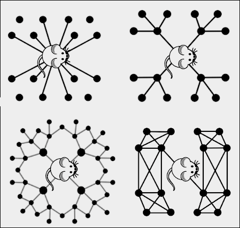{width=400}

:::

:::

## (*Extremely*) Preliminary Results

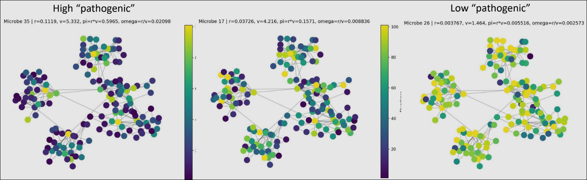{width=1200}

## Conclusion