## Who am I ::: {.incremental} - **Background:** Mathematical evolution and ecology - **PhD:** BCB, UI, Scott Nuismer ~ *Coevolutionary Theory* - **Postdoc 1:** MSU, Gideon Bradburd ~ *Host-Parasite Coevolution* - **Postdoc 2:** UO, Brendan Bohannan ~ *Host-Microbiome Evolution* - **Current:** KiTE postdoctoral fellow with Schulenburg Group at Kiel University - *Host-Microbiome Evolution* - Two Secondments: - Regional *non-academic* (industry) - International *academic* - Hosted by Brendan Bohannan at UO - Purpose: travel to share science and meet scientists ::: ## We live in a microbial world <div class="r-stack" style="text-align:center;"> ](images/microbial-world.jpg){width=800} </div> ## Microbes interact with hosts <style>.grid-2x2{display:grid;grid-template-columns:1fr 1fr;gap:3rem;row-gap:1rem;width:100%}.grid-2x2>div{text-align:center}.grid-2x2 img{width:40%;height:auto;max-height:20vh;object-fit:contain}.grid-2x2 p{margin:-0.5em 0 0 0;font-size:.7em}</style> <div class="grid-2x2"> <div> 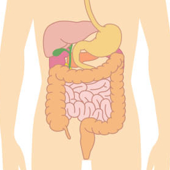 <p>metabolism / digestion / nutrition</p> </div> <div> 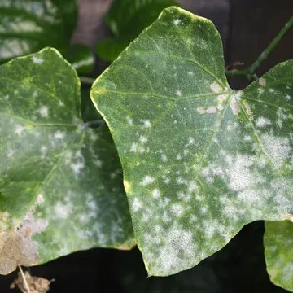 <p>immune response / pathogen defense</p> </div> <div> 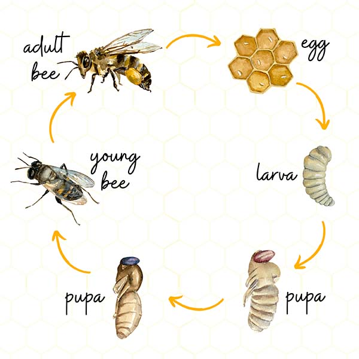 <p>development / life-history / phenology</p> </div> <div> 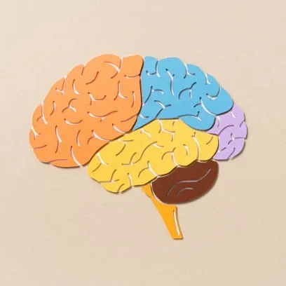 <p>behavior / neurophysiology</p> </div> </div> ## Microbiomes mediate host trait variation <div class="r-stack" style="text-align:center;"> {width=800} </div> ## Microbiomes are heritable - **Fraction of attributes heritable:** *~5–40%* - relative abundance, alpha diversity, etc ... - **Broad sense heritability:** *H² ≈ 0.01 - 0.5* - perfect heritability = 1.0 <div class="r-stack" style="text-align:center;"> 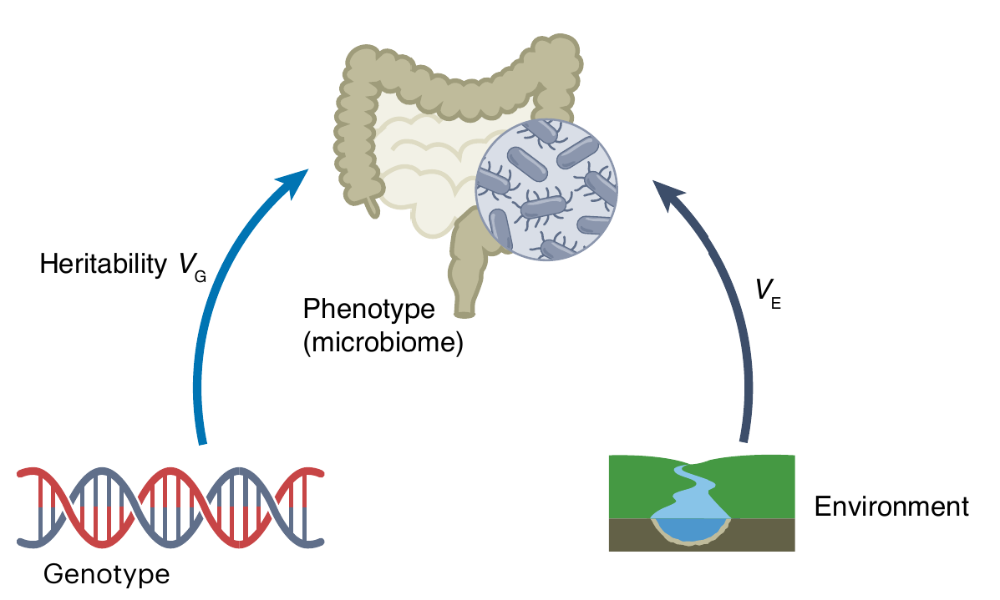{width=500} </div> ## Microbiome inheritance modes ::: {.columns} ::: {.column} <div class="r-stack" style="text-align:center;"> 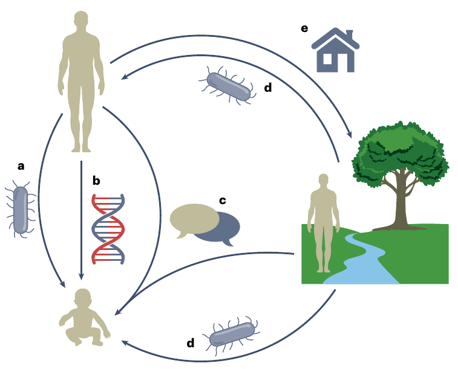{width=600} </div> ::: ::: {.column} <br><br> a. Direct parent-offspring transmission <br><br> b. Host genes associated with microbes <br><br> c. Social transmission <br><br> d. Shared environment <br><br> e. Habitat modification ::: ::: ## Can Microbiomes facilitate adaptation? <div class="r-stack" style="text-align:center;"> {width=800} </div> ## **But** Microbial Inheritance *not* Mendelian ... ::: {.columns} ::: {.column width="40%"} <br> <div class="r-stack" style="text-align:center;"> {width=400} </div> ::: ::: {.column width="60%"} <br><br> - **Community assembly** (microbial dispersal, within-host selection, etc ...) <br><br> - *Problem:* Complicated! <br><br> - *Need:* **Simple** general frameworks <br><br> - *Q:* Can we apply **existing** frameworks? ::: ::: ## Extended inheritance frameworks ::: {.columns} ::: {.column} <div class="r-stack" style="text-align:center;"> 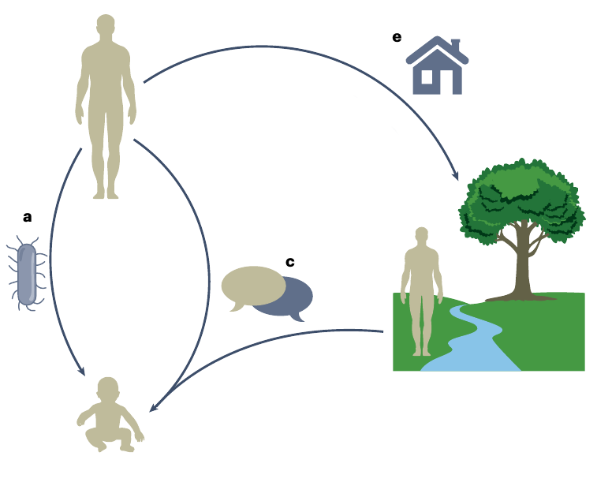{width=600} </div> ::: ::: {.column} <br><br> <ol type="a"> <li value="1">Maternal effect</li><br><br> <li value="3">Indirect genetic effect</li><br><br> <li value="5">Niche construction</li> </ol> ::: ::: ## Maternal Effect ::: columns ::: {.column width="50%"} <div class="r-stack" style="text-align:center;"> {width=500} </div> ::: ::: {.column width="50%"} > *Definition:* Parent trait explains offspring trait > > (controlling for genetic variation) ::: ::: ## Indirect Genetic Effect ::: columns ::: {.column width="40%"} > *Definition:* Genotype of one individual influences trait of another individual ::: ::: {.column width="60%"} <div class="r-stack" style="text-align:center;"> {width=750} </div> ::: ::: ## Niche Construction ::: columns ::: {.column width="50%"} <div class="r-stack" style="text-align:center;"> {width=700} </div> ::: ::: {.column width="50%"} > *Definition 1:* > > Organism activity alters environment > *Definition 2:* > > Organism activity alters selection pressures > *Two perspectives:* > > 1. Microbiome as environment > > 2. Microbiome modifying environment ::: ::: ## Conclusion <br> PROS - **Maternal Effects** ~ vertical *parent-offspring* inheritance - **Indirect Genetic Effects** ~ horizontal *social* inheritance - **Niche Construction** ~ interaction of microbiomes and *selection* <br> CONS - Each only cover one aspect - Microbiome inheritance follows several modes - **Need:** unified/sythetic framework ## Unified Framework for Extended Inheritance <div class="r-stack" style="text-align:center;"> 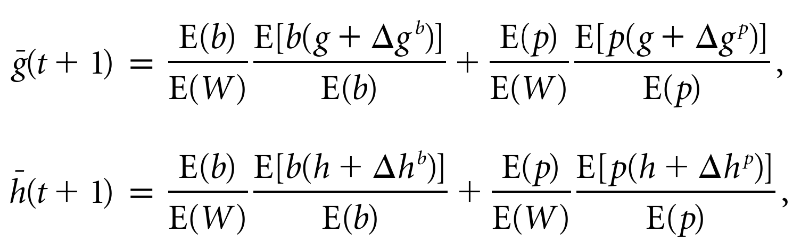{width=50%} </div> <br> ::: {.incremental} - *Models:* ME's, IGE's, etc. - *Limitation:* requires assumptions on - transmission - fidelity - mutability ::: ## Framework for Microbiome Inheritance <div class="r-stack" style="text-align:center;"> 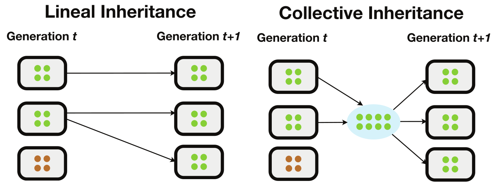{width=1200} </div> - Collective inheritance facilitates adaptation - *Advantage:* Potential to explain adaptation without transmission details ## A Gap > **Done:** *Collective inheritance* applied to gene-centric perspective 🦠 🚚 🧬 > **Gap:** Connect concepts of *microbiome inheritance* and *host trait variance* to predict *microbiome-mediated adaptation* <br> ::: {.columns} ::: {.column width="50%"} <div class="r-stack" style="text-align:center;"> <span style="font-size: 0.7em;">*microbiome inheritance*</span> </div> <div class="r-stack" style="text-align:center;"> 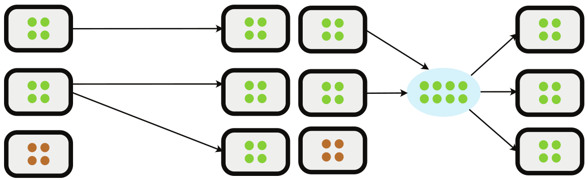{width=800} </div> ::: ::: {.column width="50%"} <div class="r-stack" style="text-align:center;"> <span style="font-size: 0.7em;">*host trait adaptation*</span> </div> ```{r} #| fig-align: center #| out-width: 95% #| fig-width: 8 #| fig-height: 3.5 library(ggplot2) # phenotype axis x <- seq(-4, 4, length.out = 700) dx <- x[2] - x[1] # original population mu0 <- -1.75 sd0 <- 0.9 p0 <- dnorm(x, mu0, sd0) # directional fitness (straight line) a <- 0.2 b <- 0.05 f_raw <- a + b * x # viability weights (keep straight-line shape) w <- f_raw - min(f_raw) + 1e-6 # post-selection distribution p_sel_unnorm <- p0 * w Z <- sum(p_sel_unnorm) * dx p_sel <- p_sel_unnorm / Z # evolutionary response (Breeder) h2 <- 0.4 mean0 <- sum(x * p0) * dx mean_sel <- sum(x * p_sel) * dx S <- mean_sel - mean0 R <- h2 * S # --- VISUAL SEPARATION (purely illustrative) --- # enforce the correct ordering: mean0 < response < selected shift_sel <- 0.55 # push selected right for visibility t_resp <- 0.55 # fraction of the (visual) selection shift inherited (0<h2-ish) mu_sel_vis <-1.5 mu_resp_vis <- 0 # guaranteed between mu0 and mu_sel_vis p_sel_vis <- dnorm(x, mu_sel_vis, sd0) p_resp_vis <- dnorm(x, mu_resp_vis, sd0) # scale fitness line to overlay on density axis (visual overlay only) ymax <- max(c(p0, p_sel_vis, p_resp_vis)) f_scaled <- (f_raw - min(f_raw)) / (max(f_raw) - min(f_raw)) * (0.85 * ymax) # arrow height belly_frac <- 0.65 y_arrow <- dnorm(mu0, mu0, sd0) * belly_frac # styling cols <- c( pink = "#c2185b", acid = "#1b8c98", cyan = "#007c91", lime = "#1ea633" ) bg <- "#ffffffff" grid_x <- "#ffffff" txt <- "#1b1f24" lw <- 2.2 arrow_len <- 0.22 # data df_dist <- rbind( data.frame(x = x, y = p0, curve = "Original population"), data.frame(x = x, y = p_sel_vis, curve = "Post-selection"), data.frame(x = x, y = p_resp_vis, curve = "Inherited response") ) df_fit <- data.frame( x = x, y = f_scaled, curve = "Fitness function" ) # force legend order legend_levels <- c( "Original population", "Post-selection", "Inherited response", "Fitness function" ) df_dist$curve <- factor(df_dist$curve, levels = legend_levels) df_fit$curve <- factor(df_fit$curve, levels=legend_levels) ggplot() + # distributions geom_line( data=df_dist, aes(x, y, linetype=curve, color=curve), linewidth=lw, linecap="round" ) + # fitness overlay geom_line( data=df_fit, aes(x, y, color=curve), linewidth=lw, linecap="round" ) + # evolutionary response arrow: original -> response annotate( "segment", x = mu0, y = y_arrow, xend = mu_resp_vis, yend = y_arrow, linewidth = lw, lineend = "round", color = cols[["lime"]], arrow = arrow( length = grid::unit(arrow_len, "in"), type = "closed" ) ) + scale_linetype_manual( breaks = legend_levels, values = c( "Original population" = "solid", "Post-selection" = "dotted", "Inherited response" = "dashed", "Fitness function" = "solid" ) ) + scale_color_manual( breaks = legend_levels, values = c( "Original population" = cols[["pink"]], "Post-selection" = cols[["pink"]], "Inherited response" = cols[["pink"]], "Fitness function" = cols[["acid"]] ) ) + guides( color = guide_legend( override.aes = list( linetype = c("solid", "dotted", "dashed", "solid") ) ), linetype = "none" ) + labs(x = NULL, y = NULL) + theme_minimal(base_size = 18) + scale_x_continuous(breaks = NULL, labels = NULL) + scale_y_continuous(breaks = NULL, labels = NULL) + theme( legend.title = element_blank(), legend.position = "right", legend.direction = "vertical", legend.background = element_rect(fill = bg, color = NA), legend.key = element_rect(fill = bg, color = NA), legend.text = element_text(size = 11, color = txt), legend.key.width = grid::unit(2.2, "cm"), legend.key.height = grid::unit(0.6, "cm"), plot.background = element_rect(fill = bg, color = NA), panel.background = element_rect(fill = bg, color = NA), text = element_text(color = txt), axis.text = element_text(color = txt), axis.title = element_text(color = txt), panel.grid.minor = element_blank(), panel.grid.major.y = element_blank(), panel.grid.major.x = element_line(color = grid_x) ) ``` ::: ::: ## Is a Quantitative Genetic Approach Useful? <br><br><br><br> ::: {.incremental} - Explains *genetic adaptation* of complex traits ✅ - Can account for *trait variation* explained by microbiomes ✅ - Adaptation predictions assume *Mendelian* inheritance ❌ - Interface with *microbiome* inheritance to close gap ✅ ::: ## Classical Partitioning of Trait Variation <div class="r-stack" style="text-align:center;"> mini review of quantitative genetics </div> ::: {.columns} ::: {.column width="50%"} <br><br><br> ::: {.fragment data-fragment-index="1"} - $P = G + E$ - $G = G_A + R$ ::: ::: {.fragment data-fragment-index="4"} - **Adaptation Prediction:** - *Resp. to Sel.* = $G_A$ × *Sel. Grad.* ::: ::: ::: {.column width="50%"} <br><br><br> ::: {.fragment data-fragment-index="3"} <div class="r-stack" style="text-align:center;"> Additive Genetic Variance $G_A$ </div> ```{r} #| fig-align: center #| out-width: 95% #| fig-width: 8 #| fig-height: 4.5 library(ggplot2) # observed genotype-specific marginal phenotypes df_pts <- data.frame( genotype = c(0, 1, 2), y_obs = c(-0.125, 0.075, 0.05) ) # additive fit line: y = -0.1 + 0.1 * x df_pts$y_fit <- -0.1 + 0.1 * df_pts$genotype df_line <- data.frame( x = seq(0, 2, length.out = 300) ) df_line$y <- -0.1 + 0.1 * df_line$x # dotted horizontal guides from left margin to fitted values df_guides <- data.frame( x = c(-0.2, -0.2, -0.2), xend = c(0, 1, 2), y = c(-0.1, 0.0, 0.1), yend = c(-0.1, 0.0, 0.1) ) # residual segments df_resid <- data.frame( x = df_pts$genotype, xend = df_pts$genotype, y = df_pts$y_fit, yend = df_pts$y_obs ) bg <- "#ffffffff" txt <- "#1b1f24" ggplot() + # dotted horizontal guides geom_segment( data = df_guides, aes(x = x, y = y, xend = xend, yend = yend), linetype = "dotted", linewidth = 0.4, color = "gray55" ) + # dashed additive fit geom_line( data = df_line, aes(x = x, y = y), linetype = "dashed", linewidth = 0.8, color = txt ) + # residuals geom_segment( data = df_resid, aes(x = x, y = y, xend = xend, yend = yend), linewidth = 0.9, color = txt ) + # observed points geom_point( data = df_pts, aes(x = genotype, y = y_obs), size = 2.5, color = txt ) + coord_cartesian( xlim = c(-0.2, 2.2), ylim = c(-0.15, 0.15), expand = FALSE ) + scale_x_continuous( breaks = c(0, 1, 2), labels = c("", "", "") ) + scale_y_continuous( breaks = c(-0.1, 0.0, 0.1), labels = c("", "", "") ) + labs( x = "Genotype", y = "Marginal Phenotype" ) + theme_minimal(base_size = 18) + theme( plot.background = element_rect(fill = bg, color = NA), panel.background = element_rect(fill = bg, color = NA), panel.grid = element_blank(), axis.line.x.top = element_blank(), axis.line.y.right = element_blank(), axis.line.x.bottom = element_line(color = txt, linewidth = 0.7), axis.line.y.left = element_line(color = txt, linewidth = 0.7), axis.ticks.x = element_line(color = txt, linewidth = 0.5), axis.ticks.y = element_line(color = txt, linewidth = 0.5), axis.text = element_text(color = txt), axis.title = element_text(color = txt), text = element_text(color = txt) ) ``` ::: ::: ::: ## Partitioning of Variation including Microbiome ::: {.columns} ::: {.column width="55%"} <br><br><br> ::: {.incremental} - $P_A = G_A + M_A + C_A$ - $M_A=$ microbial variation - $C_A=$ gene-microbe covariance ::: ::: {.fragment} - **Adaptation Prediction:** - *Resp. to Sel.* = $P_A$ × *Sel. Grad.* **?** ::: ::: ::: {.column width="45%"} <div class="r-stack" style="text-align:center;"> 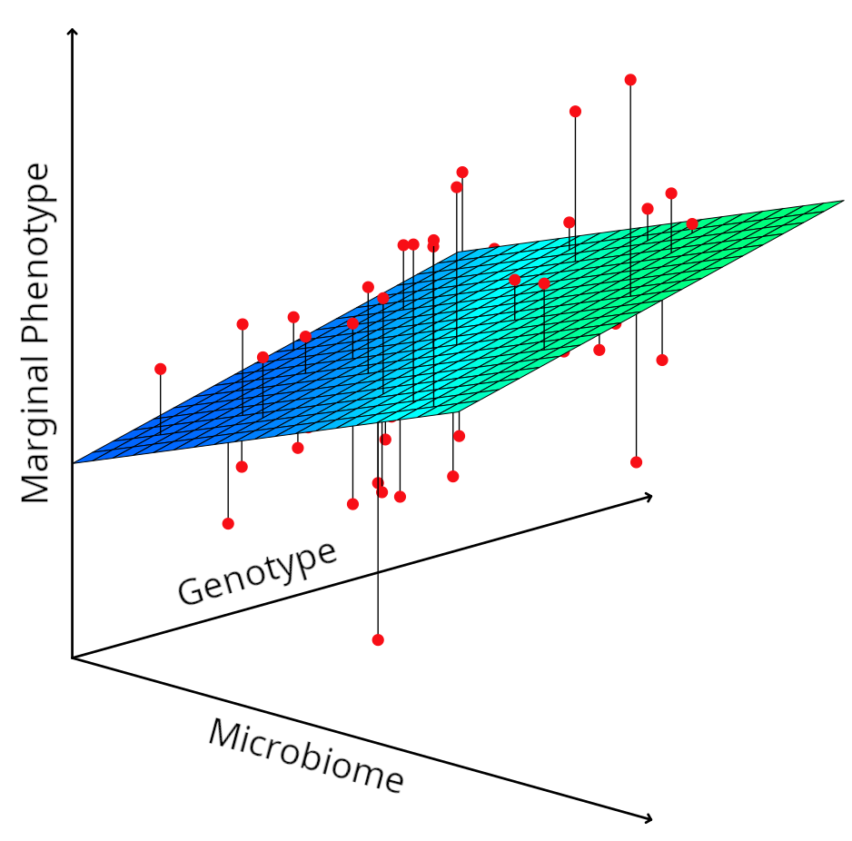{width=450} </div> ::: ::: ## Not all microbes contribute to adaptation <div class="r-stack" style="text-align:center;"> 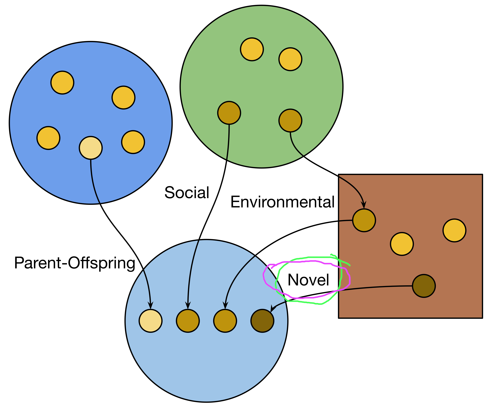{width=700} </div> ## Ancestral Concordance Classification {style="max-width:100%;height:auto;"} ::: {.columns} ::: {.column width="33%"} > **Lineal Microbes:** > > Ancestry overlaps with *host ancestry* ::: ::: {.column width="33%"} > **Non-lineal Microbes:** > > Ancestry in *host population* ::: ::: {.column width="33%"} > **Novel Microbes:** > > *No previous ancestry* with host population ::: ::: <br> <div class="r-stack" style="text-align:center;"> classifies individual microbial cells </div> ## Partitioning Var. by Ancestral Concordance {style="max-width:100%;height:auto;"} ::: {.columns} ::: {.column width="32%"} > <span style="font-size: 0.7em;"> $M_L=$ </span> *lineal variance* ::: ::: {.column width="37%"} > <span style="font-size: 0.7em;"> $M_N=$ </span>*non-lineal variance* ::: ::: {.column width="31%"} > <span style="font-size: 0.7em;"> $M_V=$ </span>*noVel variance* ::: ::: ::: {.incremental} - (**Additive Phenotypic Variation**) $P_A = G_A + {\color{magenta}{M_A}} + C_A$ - (**Additive Microbial Variation**) ${\color{magenta}{M_A}} = M_L + M_N + M_V + {\color{gray}{C_{LNV}} }$ ::: ## Hypothesis ::: {.incremental} - **Adaptation:** - Lineal: <span style="font-size: 0.8em;">$M_L$</span> *most* likely - Non-Lineal: <span style="font-size: 0.8em;">$M_N$</span> *less* likely - NoVel: <span style="font-size: 0.8em;">$M_V$</span> *no* contribution - **How to test:** - Host *Pedigree* - *Metagenomic Data* for Microbiomes of Hosts in Pedigree - Strain Resolved - Classify Microbes by *Ancestral Concordance* - *Partition* host trait variance - Selection *Experiment* - Predict response including *different combinations* of <span style="font-size: 0.8em;">$M_L,M_N,M_V$</span> - *Measure response* to selection and assess predictions ::: ## Simulations ::: {.columns} ::: {.column width="60%"} <div class="r-stack" style="text-align:center;"> 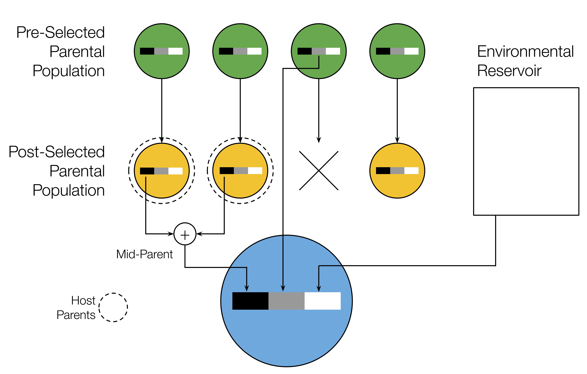 </div> [ 🖤 lineal | 🩶 non-lineal | 🤍 novel ] ::: ::: {.column width="40%"} **Simple inheritance model:** - Lineal abundances - sampled from *parents* - Non-lineal abundances - sampled from *random host* - *before* or *after* selection - Novel abundances - drawn *independently* **Additive host trait:** - $z=\sum_i\alpha_i\,n_i$ ::: ::: ## Simulations ::: {.columns} ::: {.column width="60%"} <div class="r-stack" style="text-align:center;">  </div> [ 🖤 lineal | 🩶 non-lineal | 🤍 novel ] ::: ::: {.column width="40%"} **Simple inheritance model:** - Lineal abundances - sampled from *parents* - Non-lineal abundances - sampled from *random host* - *before* or *after* selection - Novel abundances - drawn *independently* **Additive host trait:** - $z=\sum_i\alpha_i\,n_i$ ::: ::: ## Results <div class="r-stack" style="text-align:center;"> 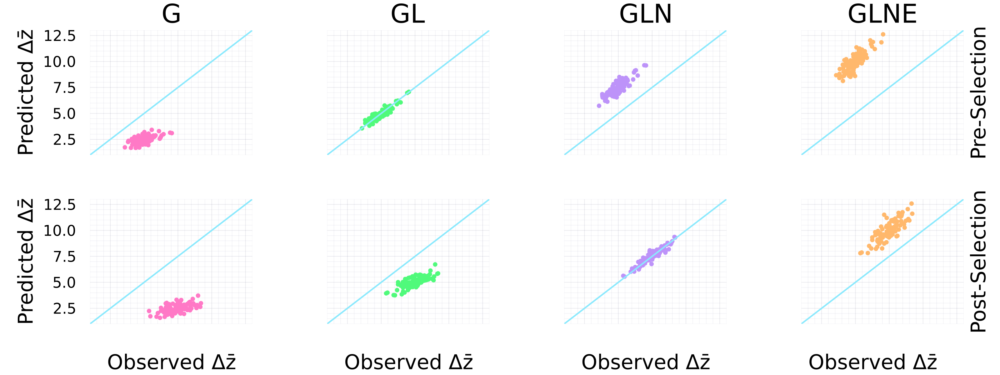 </div> <span style="font-size: 0.8em;"> **$\pmb\Delta\mathbf{\bar z}$** </span> = Resp. to Selection, **G** = Gen. var, **L** = Lineal, **N** = Non-lineal, **V** = NoVel <div class="r-stack" style="text-align:center;"> *Conclusion:* include only microbe variation shaped by selection </div> ## The *Selective Microbes* and Heritability ::: {.fragment} > **Definition:** Subset of microbes that contribute to host adaptation > > - *<span style="font-size: 0.8em;">$M_A^\psi$</span>* = trait variance explained by variance of *selectives* > - *<span style="font-size: 0.8em;">$C_A^\psi$</span>* = trait variance explained by covariance of *selectives* and genes ::: ::: {.fragment} > **By definition:** (*Resp. to Sel.*) = (<span style="font-size: 0.8em;">$G_A+M_A^\psi+C_A^\psi$</span>) × (*Sel. Grad.*) ::: ::: {.fragment} > **Without microbe fx:** (*Resp. to Sel.*) = (<span style="font-size: 0.8em;">$G_A$</span>) × (*Sel. Grad.*) ::: ::: {.fragment} > **Narrow-sense heritability:** <span style="font-size: 0.8em;">*$h^2$* $=$</span>$\frac{G_A}{P}$, **Resp. to Sel.:** <span style="font-size: 0.8em;">$R=$ *$h^2$* $S$</span> ::: ## Extending Heritability <br><br><br> ::: {.columns} ::: {.column width="50%"} ::: {.fragment} Narrow-sense **heritability:** $$h^2=\frac{G_A}{P}$$ $R=h^2\,S$ (*w/o micr. fx*) ::: ::: ::: {.column width="50%"} ::: {.fragment} Narrow-sense **total transmissibility:** $$t^2=\frac{M_A^\psi+C_A^\psi}{P}$$ $R=t^2\,S$ (*w micr. fx*) ::: ::: ::: ## Read all about it! <br><br><br> <div class="r-stack" style="text-align:center;">  </div> ## Thanks Co-Authors <br><br><br> ::: {.columns} ::: {.column width="25%"} <div class="r-stack" style="text-align:center;">  </div> ::: ::: {.column width="25%"} <div class="r-stack" style="text-align:center;">  </div> ::: ::: {.column width="25%"} <div class="r-stack" style="text-align:center;"> 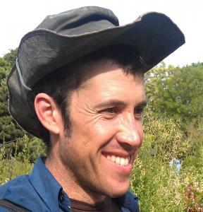 </div> ::: ::: {.column width="25%"} <div class="r-stack" style="text-align:center;">  </div> ::: ::: ## What about Theory? ::: {.incremental} - **Quant. Gen. approach:** - *Statistical* framework - Aimed at *empirical* studies - Still very complicated - **Initial theoretical insights:** - *Simple* models - Motivates some *current* projects... ::: ## Microbe-Mediated Host Rescue ::: {.columns} ::: {.column width="30%"} <div class="r-stack" style="text-align:center;"> {width=300} </div> ::: ::: {.column width="70%"} - **Scenario:** *Doomed* host population - **Microbiome:** Presence/absence *single* microbe - Probability of *lineal inheritance* - Rate of *social transmission* - **Fitness:** Host *gene* determines microbe *benefit* - **Results:** Delayed host *extinction time* analysis - *Birth-Death Diffusion* <span style="font-size: 0.8em;">$dn=[(r+m)\,n+\psi]\,dt+\sqrt{n}\,dB$</span> 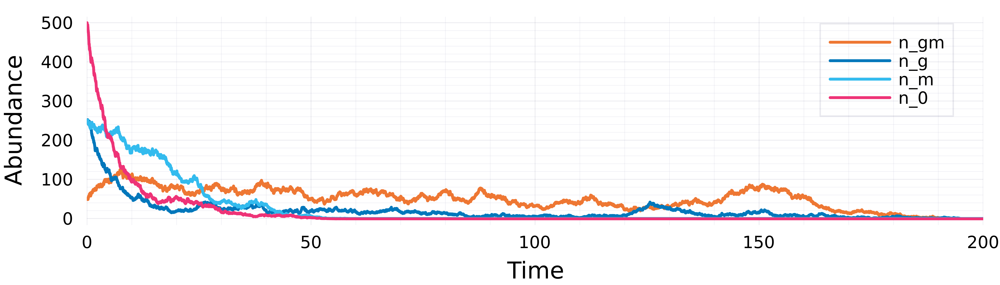 ::: ::: ## Microbiome-Mediated Niche Construction ::: {.columns} ::: {.column width="30%"} <div class="r-stack" style="text-align:center;">  </div> ::: ::: {.column width="70%"} - **Mesocosm experiments:** - *C. elegans* shape microbiome in compost - Compost conditions *degrade* - Microbiome manipulation *buffers* against <span style="font-size: 0.8em;">$\Delta E$</span> - **Quant. Gen. Theory** - Modify <span style="font-size: 0.8em;">*$\Delta\bar z=G\beta$*</span> - Modelling framework (instead of statistical) - Microbiome *community dynamics* ~ mutation - *Feedback* with external microbiome - External microbiome changes effect of env. **Q:** *What eco-evo processes and what host-microbiome attributes shape adaptation via niche construction?* ::: ::: ## Multilevel Selection Framework ::: {.columns} ::: {.column width="30%"} <div class="r-stack" style="text-align:center;">  </div> ::: ::: {.column width="70%"} - **Mesocosm experiments:** - *C. elegans* shape microbiome in compost - Compost conditions *degrade* - Microbiome manipulation *buffers* against <span style="font-size: 0.8em;">$\Delta E$</span> - **MLS Model** - Modify <span style="font-size: 0.8em;">*$\Delta\bar z=G\beta$*</span> - Modelling framework (instead of statistical) - Microbiome transmission + dynamics ~ *mutation* - *Feedback* with external microbiome - External microbiome changes effect of env. **Q:** *What eco-evo processes and what host-microbiome attributes shape adaptation via niche construction?* ::: ::: ## Social Microbiome Metacommunity Framework ::: {.columns} ::: {.column width="30%"} <div class="r-stack" style="text-align:center;">  </div> ::: ::: {.column width="70%"} - **Unique Biological Scales:** - *Asymmetry:* astronomical local abundances - *Constrained Dispersal:* social ntwk, discr. pulses - *Transmission effect:* composition, not abundance - *Implications:* unique biology, distinct diversity - *Math:* jump-diffusion processes - **Viscocity Hypothesis:** <div style="margin-top:-20px;"> ::: {.columns} ::: {.column width="49%"} <div class="r-stack" style="text-align:center;"> 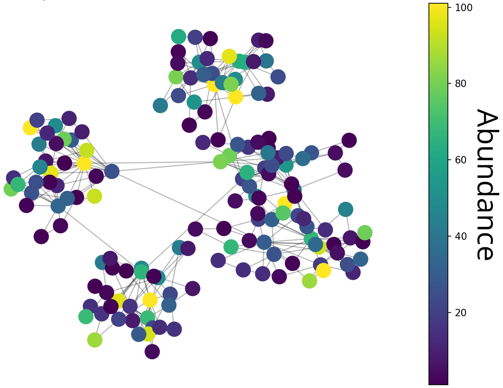{width=300} </div> ::: ::: {.column width="49%"} <div class="r-stack" style="text-align:center;"> 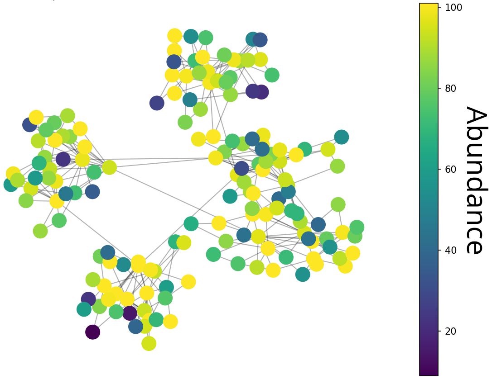{width=300} </div> ::: ::: ::: ::: ## Entangled Banks <div class="r-stack" style="text-align:center;"> 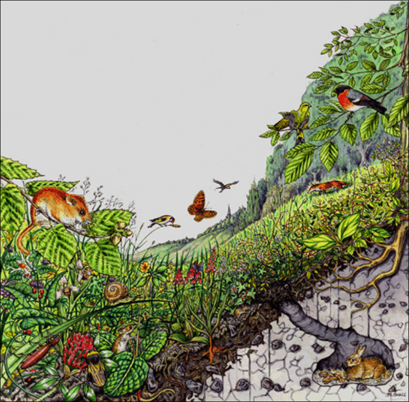{width=70%} </div> ## Entangled Host-Microbiome Systems <div class="r-stack" style="text-align:center;"> ](images/microbial-world.jpg){width=800} </div>