## Host-Microbiome Evolution 🪱🦠 :::: {.columns .cols2} ::: {.column width="48%"} 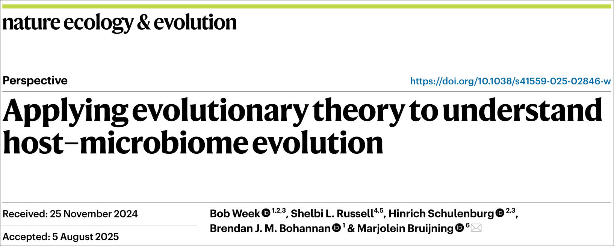 ::: ::: {.column width="48%"} - Rescue: 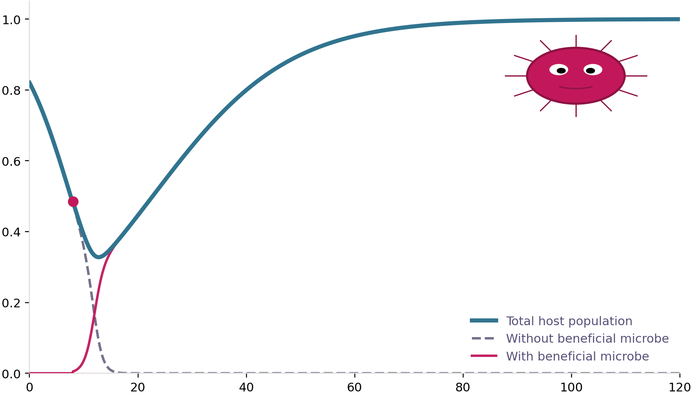{.inline-img width=55%} - MLS: {.inline-img width=25%}{.inline-img width=25%}{.inline-img width=25%} ::: :::: ## Response of Genetic Correlations to Drift :::: {.columns .cols2} ::: {.column .fragment width="48%"} **What are genetic correlations?** ::: {.incremental} - Between loci: 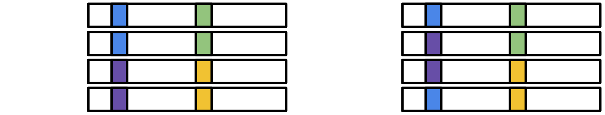{.inline-img width=55%} - Between traits: 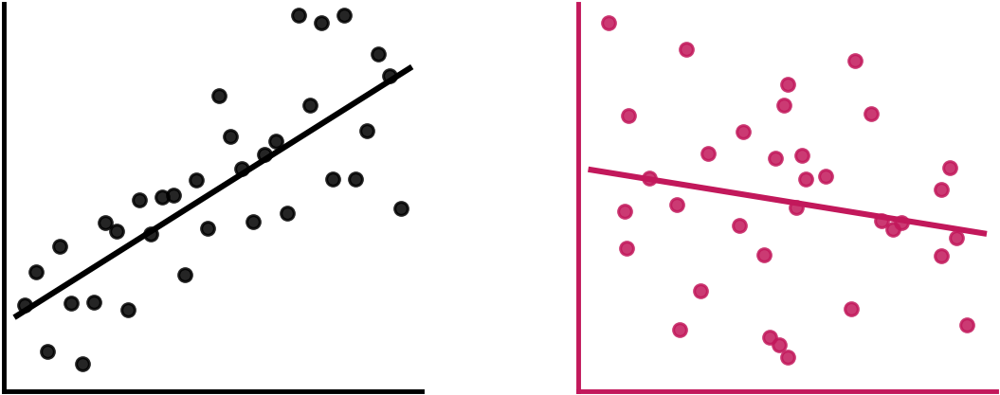{.inline-img width=50%} ::: ::: ::: {.column .fragment width="48%"} **Why do genetic correlations matter?** ::: {.incremental} - Alter patterns of variation - Constrain adaptation ::: ::: :::: ## How do genetic correlations respond to drift? 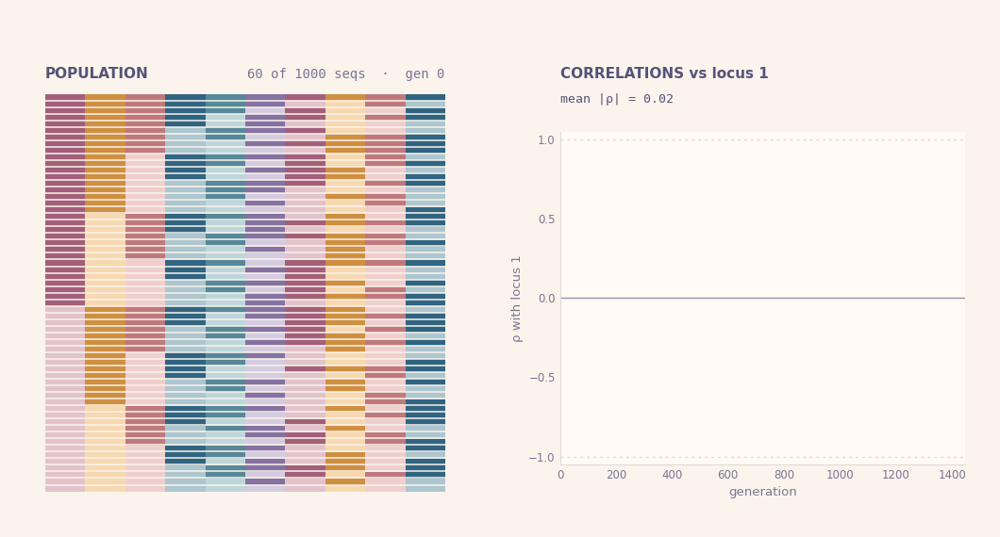{fig-align="center"} - Genetic correlations among loci become more extreme ## What about quantitative characters? ::: {.incremental} - Multivariate trait vector: ${\bf z}=\bigl(\begin{smallmatrix} z_1 \\ z_2 \end{smallmatrix}\bigr)$ - Genetic covariance structure ~ ${\bf G}$-matrix: $\bigl(\begin{smallmatrix} G_{11} & G_{12} \\ G_{12} & G_{22} \end{smallmatrix}\bigr)$ 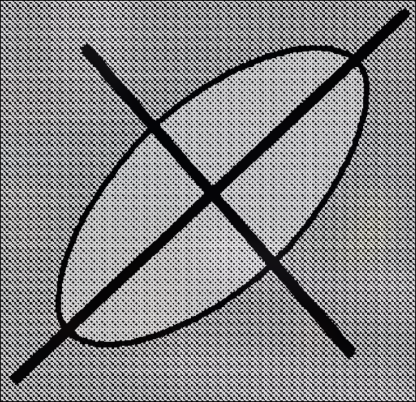{.inline-img width=9%} - Genetic correlation: $\rho({\bf G})=G_{12}/\sqrt{G_{11}\,G_{22}}$    - How does $\bf G$ respond to drift? - $\mathbb E[{\bf G}_t]={\bf G}_0e^{-t/N_e}$, (Lande, 1979, 1980) 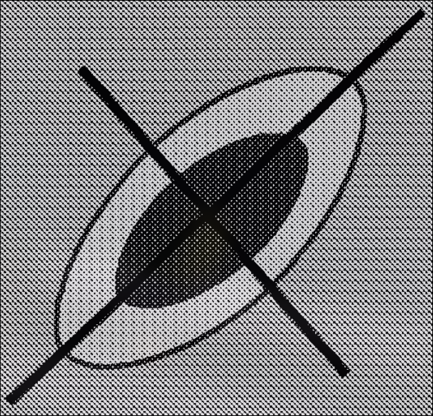{.inline-img width=10% fig-align="center"} - $\rho(\mathbb E[{\bf G}_t])=\rho({\bf G}_0)$, constant correlation ::: ## The conventional view ::: {.incremental} - Drift "shrinks" $\bf G$-matrices {.inline-img width=10% fig-align="center"} (Roff 2000) - No effect on genetic correlations between traits - Differences in orientation ~ selection, mutation, migration 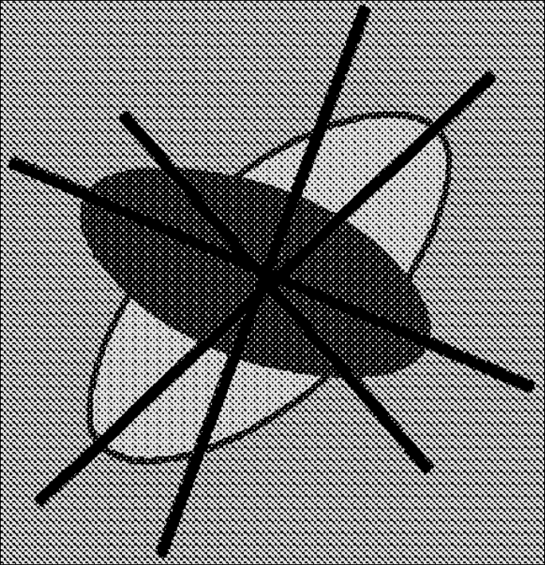{.inline-img width=10% fig-align="center"} - ... but variation around $\mathbb{E}[{\bf G}_t]$ (Phillips et al, 2001; Steppan et al, 2002)    - ... still lacking neutral model (Mallard et al, 2024; Blomberg et al, 2025) ::: ## A Diffusion Approximation Approach <iframe src="branching/index.html" width="820" height="550" style="border:0; display:block; margin:0 auto;" title="Branching diffusion"></iframe> ## A new model of $\bf G$-matrix evolution $$\frac{d{\bf G}}{dt}={\color{#c2185b} -\frac{v}{N_e}{\bf G}} + {\color{#5a4cc7}\sqrt{\frac{v}{N_e}}\sqrt:\frac{d{\bf B}}{dt}}$$ ::: {.incremental} :::: {.columns .cols2} ::: {.column width="48%"} - $v=$ reproductive variance (~Gillespie) - $N_e=$ effective population size - ${\bf Γ}={\bf G}\underline\otimes{\bf G}+{\bf G}\overline\otimes{\bf G}$ - ${\bf B}=$ matrix-valued Brownian motion ::: ::: {.column width="48%"} - <pink>Deterministic part</pink> ~ shrinks $\bf G$ - Agrees with Lande's $\mathbb E[{\bf G}_t]$ - <violet>Stochastic part</violet> ~ complicated ... - study $\rho$ to gain insights ::: ::: :::: ## Genetic correlations tend towards ±1 ::: {.incremental .fragment} - $d\rho/dt$ from $d{\bf G}/dt$ using chain rule: $\frac {d\rho}{dt}=-\frac{v}{2N_e}\,\rho\,(1-\rho^2)+\sqrt{\frac{v}{N_e}\,(1-\rho^2)}\,\frac {dB}{dt}$ ::: :::: {.columns .cols2} ::: {.column .fragment width="58%"} 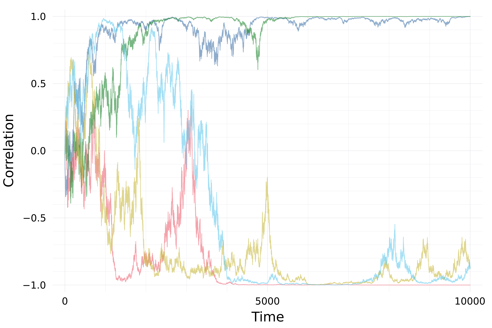{fig-align="center" width=80%} ::: ::: {.column .fragment width="38%"} 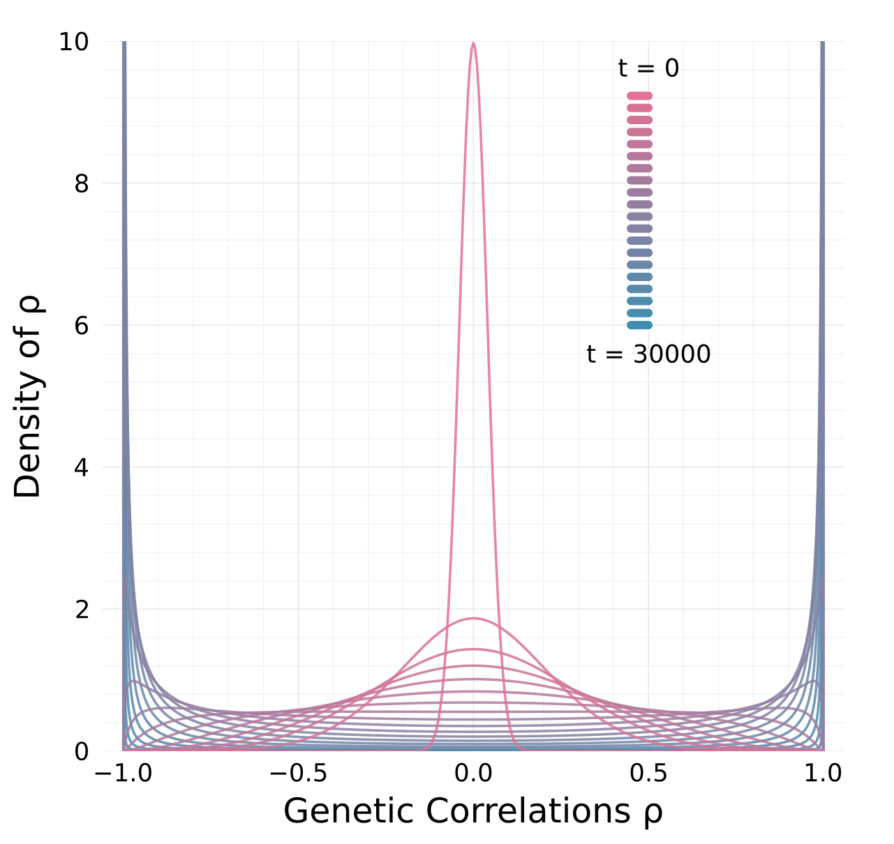{fig-align="center" width=90%} ::: :::: ## Rate of attraction to ±1 set by $v/N_e$ :::: {.columns .cols2} ::: {.column width="58%"} 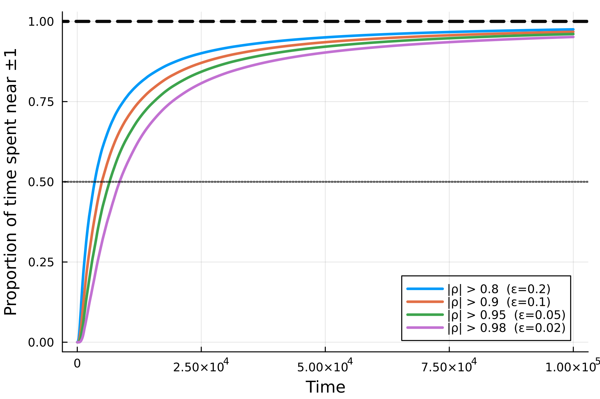{#lt fig-alt="alt"} ::: ::: {.column width="38%"} - Interesting it does not depend on genetic vars $G_{11},G_{22}$ - Evolution always depends on amount of genetic variation - How to test result? - replicated mesocosms of clonal populations controlling for mutation ::: :::: ## Revised view :::: {.columns .cols2} ::: {.column width="58%"} ::: {.incremental} - Drift alters orientation of $\bf G$-matrices - while also eroding variation - Stability of $\bf G$-matrix structure due to - mutation, migration, selection ::: ::: ::: {.column width="38%"} 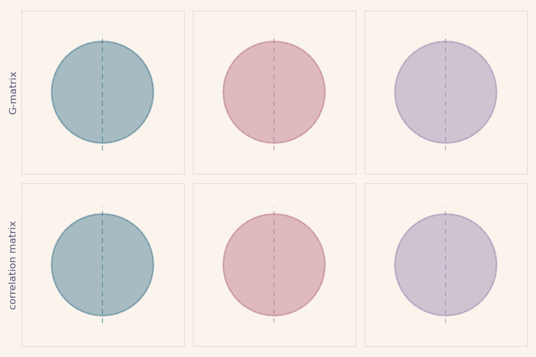{fig-align="center"} ::: ::::