## What is a $\bf G$-matrix? ::: {.incremental} - Multivariate trait vector: ${\bf z}=\left(\begin{smallmatrix} z_1 \\ \vdots \\ z_d \end{smallmatrix}\right)$ - Trait decomposition: ${\bf z}={\bf g}+{\bf e}$ - $\bf g=$ genetic component - $\bf e=$ "environmental" component (error, everything else) - Genetic covariance structure: ${\bf G}=\mathrm{Cov}({\bf g})=\left(\begin{smallmatrix} G_{11} & \cdots & G_{1d} \\ \vdots & \ddots & \vdots \\ G_{d1} & \cdots & G_{dd} \end{smallmatrix}\right)$ - First two principle components: 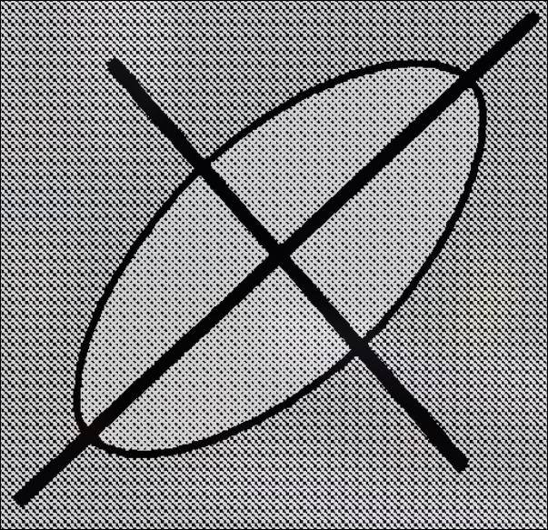{.inline-img width=5%} - Heritable component of variation - Predicts response to selection $\Delta\bar{\bf z}={\bf G}\,\nabla_{\bar{\bf z}}\ln\bar W$ - $\bar W=$ mean fitness ::: ## What is random genetic drift? ::: {.fragment} 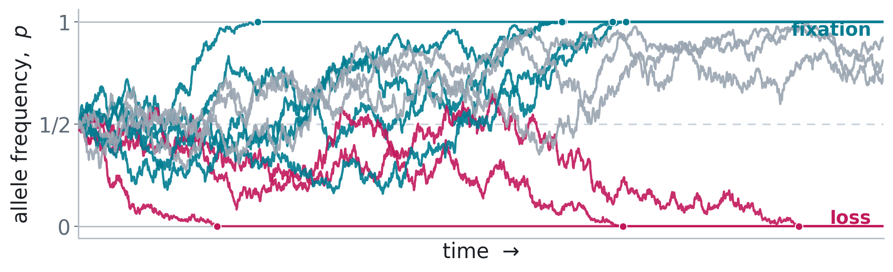{fig-align="center" width="80%"} ::: ## Response of ${\mathbb E}[{\bf G}]$ to drift ::: {.incremental} - $\tfrac{\mathrm d}{\mathrm dt}\mathbb E[{\bf G}]\approx-\tfrac{1}{N_e}\mathbb E[{\bf G}]$, *(Lande, 1979, 1980)*   - $\mathbb E[{\bf G}_t]\approx{\bf G}_0e^{-t/N_e}$ - Drift "shrinks" entries of $\bf G$-matrices 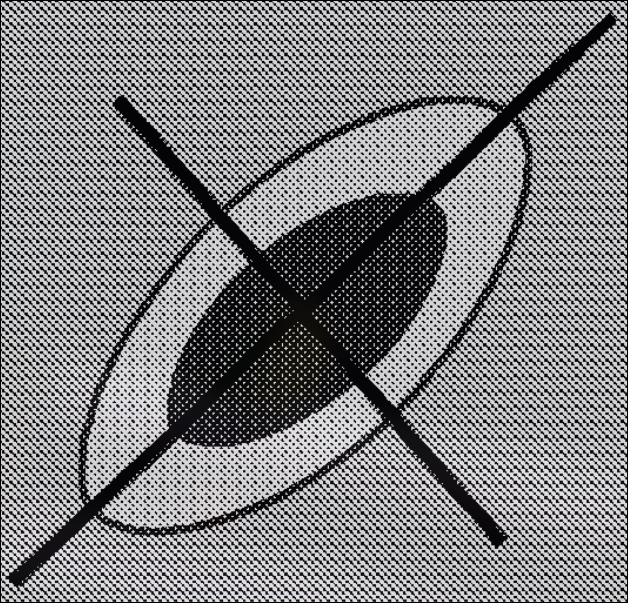{.inline-img width=10% fig-align="center"} ::: ## The conventional view ::: {.incremental} - Drift "shrinks" entries of $\bf G$-matrices {.inline-img width=10% fig-align="center"} - No effect on genetic correlations between traits - (btw, genetic correlations alter $\bf G$-matrix orientation) 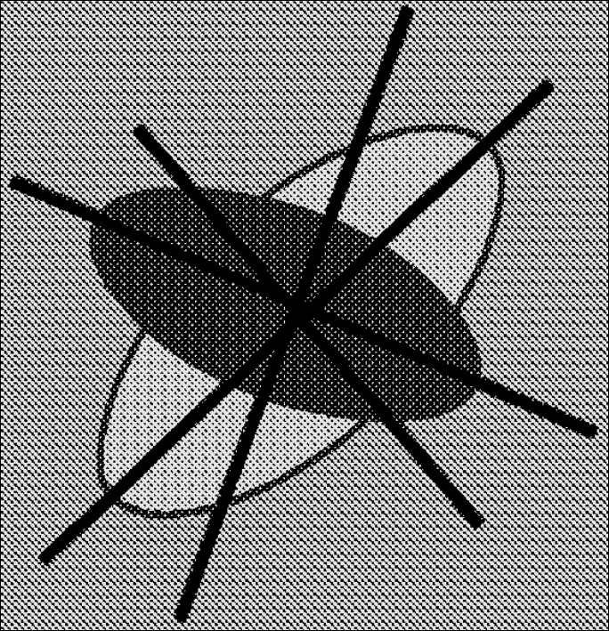{.inline-img width=10% fig-align="center"} - Differences in orientation ~ selection, mutation, migration *(Roff 2000)*   - Used as evidence for selection *(Cano et al. 2004)* ::: ## Empirical pushback and gap in theory :::: {.columns .cols2} ::: {.column width="40%"} 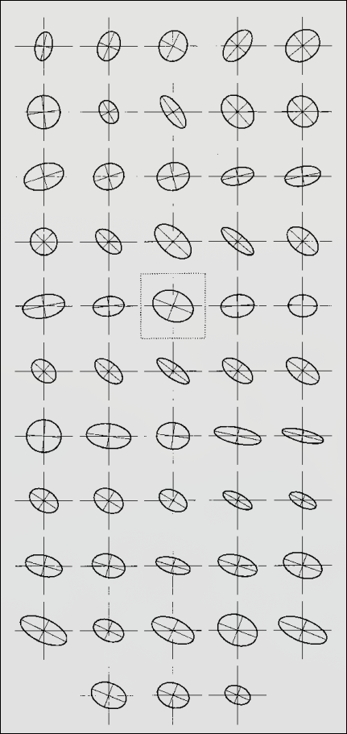{fig-align="center" width="40%"} ::: ::: {.column width="48%"} ::: {.incremental} - Variation around $\mathbb{E}[{\bf G}_t]$ *(Phillips et al, 2001; Steppan et al, 2002)*    - Still lacking stochastic neutral model *(Mallard et al, 2024; Blomberg et al, 2025)* ::: ::: :::: ## Roadmap ::: {.incremental} - Use diffusion-limit to get SDE $\mathrm d{\bf G}=a({\bf G})\mathrm dt+b({\bf G})\mathrm d{\bf B}$ - Also gives abundance $\mathrm dn$, mean trait $\mathrm d\bar{\bf z}$ - Also gives heuristics for calculations - {$\mathrm dn,\mathrm d\bar{\bf z},\mathrm d{\bf G}$} ∪ {heuristics} = eco-evo framework - Apply heuristics to study $\mathrm d{\bf G}$ ::: ## A Diffusion Approximation Approach ::: {.incremental} :::: {.columns .cols2} ::: {.column width="48%"} - **Individual-Based Model:** - Population ${\cal P}_t({\bf z})$ - Gaussian mutation - ${\bf g}'\sim{\mathrm{MVN}}_d({\bf g},{\bf M})$ - $W({\cal P}_t,{\bf z})=$ fitness function ::: ::: {.column width="52%"} - **Diffusion Limit:** - Rescale turnover by factor $k$ - Large abundance - Rescale population ${\cal P}_t^{(k)}({\bf z})\to \nu_t({\bf z})$ - Growth rate: $m(\nu_t,{\bf z})$ - $m(\nu_t,{\bf z})=\lim_k[W^{1/k}({\cal P}_t^{(k)},{\bf z})-1]k$ ::: ::: :::: <iframe src="branching/index.html" width="820" height="350" style="border:0; display:block; margin:0 auto;" title="Branching diffusion"></iframe> ## Why Take a Diffusion Limit? :::: {.columns .cols2} ::: {.column width="53%"} ::: {.incremental} * Analytical tractability * Many models $\rightarrow$ common diffusion limit * Common leading-order structure * Similar predictions across model class * (can say a lot with a little?) * **Not a universally better model** * Depends on scaling * Features disappear in limit ::: ::: ::: {.column width="43%"} 
 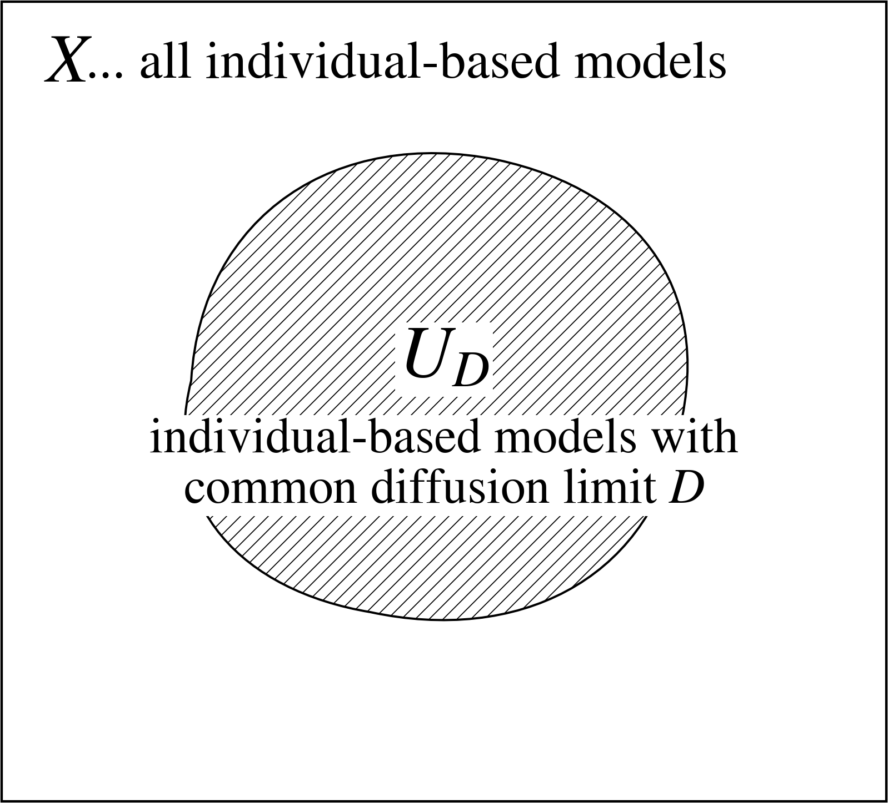 
 ::: :::: ## The Diffusion Limit <iframe src="spde/index.html" width="980" height="560" style="border:0; display:block; margin:0 auto;" title="SPDE trait density"></iframe> ## Moment dynamics 
 ●&nbsp;selection / growth&emsp; ●&nbsp;mutation&emsp; ●&nbsp;drift (noise) 
 
⚠ not closed — needs ${\bf K},{\bf S},\dots$
 ::: {.incremental} :::: {.columns .fragment} ::: {.column width="34%"} grows at mean fitness; demographic noise $\propto\!\sqrt{n}$ ::: ::: {.column width="66%"} $$\mathrm dn={\color{#c2185b}\bar m\,n}\,\mathrm dt+{\color{#5a4cc7}\sqrt{v\,n}\,\mathrm dB_n}$$ ::: :::: :::: {.columns .fragment} ::: {.column width="34%"} selection moves the mean; drift jitters it ::: ::: {.column width="66%"} $$\mathrm d\bar{\bf z}={\color{#c2185b}\mathrm{Cov}(m,{\bf z})}\,\mathrm dt+{\color{#5a4cc7}\sqrt{\tfrac vn{\bf G}}\,\mathrm d{\bf B}_{\bar{\bf z}}}$$ ::: :::: :::: {.columns .fragment} ::: {.column width="34%"} mutation adds, selection reshapes, drift erodes &amp; fluctuates ::: ::: {.column width="66%"} $$ \begin{aligned} \mathrm d{\bf G}=\big[&{\color{#3c8500}{\bf M}}+{\color{#c2185b}\mathrm{Cov}(m,({\bf z}-\bar{\bf z})({\bf z}-\bar{\bf z})^\top)}{\color{#5a4cc7}-\tfrac vn{\bf G}}\big]\mathrm dt\\ &+{\color{#5a4cc7}\sqrt{\tfrac vn({\bf K}-{\bf G}\otimes{\bf G})}:\mathrm d{\bf B}_{\bf G}} \end{aligned} $$ ::: :::: ::: ## Multivariate normal approximation 
ദ്ദി ˉ͈̀꒳ˉ͈́ )✧ closed
 ::: {.incremental} :::: {.columns .fragment} ::: {.column width="38%"} **unchanged** — the MVN assumption never touches abundance ::: ::: {.column width="62%"} $$\mathrm dn={\color{#c2185b}\bar m\,n}\,\mathrm dt+{\color{#5a4cc7}\sqrt{v\,n}\,\mathrm dB_n}$$ ::: :::: :::: {.columns .fragment} ::: {.column width="38%"} selection: covariance becomes a **gradient** of $\bar m$&emsp;, $\mathrm{Cov}(m,{\bf z})\to{\bf G}\nabla_{\bar{\bf z}}\bar m$ ::: ::: {.column width="62%"} $$\mathrm d\bar{\bf z}={\color{#c2185b}{\bf G}\big(\nabla_{\bar{\bf z}}\bar m-\overline{\nabla_{\bar{\bf z}}m}\big)}\,\mathrm dt+{\color{#5a4cc7}\sqrt{\tfrac vn{\bf G}}\,\mathrm d{\bf B}_{\bar{\bf z}}}$$ ::: :::: :::: {.columns .fragment} ::: {.column width="38%"} gradients again , **and the noise closes**: kurtosis $\ {\bf K}\to{\bf G}\overline\otimes{\bf G}+{\bf G}\underline\otimes{\bf G}$ ::: ::: {.column width="62%"} $$ \begin{aligned} \mathrm d{\bf G}=\big[&{\color{#3c8500}{\bf M}}+{\color{#c2185b}2{\bf G}(\nabla_{\bf G}\bar m-\overline{\nabla_{\bf G}m}){\bf G}}{\color{#5a4cc7}-\tfrac vn{\bf G}}\big]\mathrm dt\\ &+{\color{#5a4cc7}\sqrt{\tfrac vn({\bf G}\overline\otimes{\bf G}+{\bf G}\underline\otimes{\bf G})}:\mathrm d{\bf B}_{\bf G}} \end{aligned} $$ ::: :::: ::: ## Multivariate normal approximation 
$\partial_i:=\partial/\partial\bar z_i$ and $\partial_{ij}:=\partial/\partial G_{ij}$.
 ::: {.incremental} :::: {.columns .fragment} ::: {.column width="38%"} **unchanged** — the MVN assumption never touches abundance ::: ::: {.column width="62%"} $$ \mathrm dn = {\color{#c2185b}\bar m\,n}\,\mathrm dt + {\color{#5a4cc7}\sqrt{v\,n}\,\mathrm dB_n} $$ ::: :::: :::: {.columns .fragment} ::: {.column width="38%"} selection covariances become **gradients**: $\operatorname{Cov}(m,g_i)\to \sum_{j=1}^dG_{ij}(\partial_j\bar m-\partial_jm)$ ::: ::: {.column width="62%"} $$ \mathrm d\bar z_i = {\color{#c2185b} \sum_{j=1}^{d} G_{ij} \left( \partial_j\bar m-\partial_jm \right)} \,\mathrm dt + {\color{#5a4cc7} \sqrt{\frac{v}{n}G_{ii}}\, \mathrm dB_{\bar z_i}} $$ ::: :::: :::: {.columns .fragment} ::: {.column width="38%"} gradients again, and **the noise closes**: Gaussian fourth moments reduce the drift covariance to products of entries of $\mathbf G$ ::: ::: {.column width="62%"} $$ \begin{aligned} \mathrm dG_{ij} ={}& \Bigg[ {\color{#3c8500}M_{ij}} + {\color{#c2185b} 2\sum_{k,l=1}^{d} G_{ik} \left( \partial_{kl}\bar m-\partial_{kl}m \right) G_{lj}} - {\color{#5a4cc7}\frac{v}{n}G_{ij}} \Bigg]\mathrm dt \\[2pt] &+ {\color{#5a4cc7} \sqrt{ \frac{v}{n} \left( G_{ii}G_{jj}+G_{ij}^{2} \right) }\, \mathrm dB_{G_{ij}}}, \qquad 1\leq i\leq j\leq d . \end{aligned} $$ ::: :::: ::: ## How to use? (choose $m$ then numerical or analytical approach) ::: {.incremental} :::: {.columns .cols2} ::: {.column width="48%"} **Deterministic/selection:** - $m(\nu,{\bf z})$ very general - Examples: - *Logistic growth* + *stabilizing selection* $m(\nu,{\bf z})=r-\tfrac 1 2 {\bf z}^\top{\bf \Psi}{\bf z}-c\,n$ - *Lotka-Volterra* $m_i=r-\sum_j\alpha_{ij}n_j$ - *Host-Parasite Coevolution*   $m_H({\bf z}_H,{\bf z}_P)=r+\alpha({\bf z}_H,{\bf z_P})$   $m_P({\bf z}_P,{\bf z}_H)=r-\alpha({\bf z}_H,{\bf z_P})$ ::: ::: {.column width="48%"} **Stochasticity/drift:** - *No* stochastic calculus needed - Numerical integration: *github.com/bobweek/multi-mtgl* - Analytical methods: - *Itô's Formula* for $\mathrm df(n,{\bar{\bf z}},{\bf G})$ - *Heuristics* for $\mathrm d B_n,\mathrm d {\bf B}_{\bar{\bf z}},\mathrm d {\bf B}_{\bf G}$ - *Demo* with $\mathrm d\rho$ from $\mathrm d {\bf G}$ ::: :::: ::: ## A new neutral model of $\bf G$-matrix evolution $$\mathrm d{\bf G}={\color{#c2185b} -\tfrac{1}{N_e}{\bf G}\,\mathrm d t} + {\color{#5a4cc7}\sqrt{\tfrac{1}{N_e}({\bf G}\underline\otimes{\bf G}+{\bf G}\overline\otimes{\bf G})}:\mathrm d{\bf B}}$$ ::: {.incremental} - $m(\nu,{\bf z})\equiv0$ - ${\color{#3c8500}\bf M}={\bf 0}$ - $N_e=v/n$ effective population size (assumed constant) - <pink>Deterministic part</pink> ~ shrinks $\bf G$ - Agrees with Lande's $\mathbb E[{\bf G}_t]$ - <violet>Stochastic part</violet> ~ complicated ... - study $\rho_{ij}=G_{ij}/\sqrt{G_{ii}G_{jj}}$ to gain insights ::: ## Obtaining dynamics of genetic correlations ::: {.incremental} - Use Itô's formula on $\rho=f({\bf G})$ ::: {.fragment} $$ \mathrm d\rho = \sum_{ij} \frac{\partial f}{\partial G_{ij}}\, \mathrm dG_{ij} + \frac{1}{2} \sum_{ijkl} \frac{\partial^2 f} {\partial G_{ij}\,\partial G_{kl}}\, \mathrm dG_{ij}\,\mathrm dG_{kl}. $$ ::: - *recall* $\mathrm dG_{ij}={\color{#c2185b}-\tfrac v n G_{ij}}\,\mathrm dt+{\color{#5a4cc7}\sqrt{G_{ij}^2-G_{ii}G_{jj}}\,\mathrm dB_{G_{ij}}}$ - *rewrite* ${\color{#5a4cc7}\sqrt{G_{ij}^2-G_{ii}G_{jj}}\,\mathrm dB_{G_{ij}}}={\color{#5a4cc7}\mathrm d{\cal M}((g_i-\bar g)(g_j-\bar g)-G_{ij})}$ - *because linearity* $a\,\mathrm d{\cal M}({x})+b\,\mathrm d{\cal M}({y})=\mathrm d{\cal M}(a\,{x}+b\,{y})$ - then rewrite back with $\mathrm dB=\mathrm d{\cal M}(a\,{x}+b\,{ y})$ ::: ## Stochastic heuristics for $\mathrm d\mathcal M(x)$ 
classically: $\mathrm dt^2=0,\mathrm dB^2=\mathrm dt,\mathrm dt\,\mathrm dB=0$
 ::: {.incremental} ::: {.fragment} $$x({\bf g}),\,y({\bf g}),\quad \|x\|=\sqrt{v\,n\,\overline{x^2}}, \qquad \langle x,y\rangle=v\,n\,\overline{xy} $$ ::: :::: {.columns} ::: {.column width="48%"} ::: {.fragment} **scale** $$ \mathrm d\mathcal M(x) = \|x\|\, \mathrm d B_{x} $$ convert to Brownian noise ::: ::: ::: {.column width="48%"} ::: {.fragment} **multiply** $$ \mathrm d\mathcal M(x)\, \mathrm d\mathcal M(y) = \langle x,y\rangle\,\mathrm dt $$ compute Itô terms ::: ::: :::: ::: {.fragment} **add** $$ \mathrm d\mathcal M(ax+by) = a\,\mathrm d\mathcal M(x) + b\,\mathrm d\mathcal M(y) $$ combine noise terms ::: ::: ## Martingale-gradient version 
$\partial_i:=\partial/\partial\bar z_i$ and $\partial_{ij}:=\partial/\partial G_{ij}$.
 ::: {.incremental} :::: {.columns .fragment} ::: {.column width="38%"} abundance noise is the martingale evaluated at $1$ ::: ::: {.column width="62%"} $$ \mathrm dn = {\color{#c2185b}\bar m\,n}\,\mathrm dt + {\color{#5a4cc7}\mathrm d\mathcal M(1)} $$ ::: :::: :::: {.columns .fragment} ::: {.column width="38%"} mean trait noise tracks deviations in additive genetic values ::: ::: {.column width="62%"} $$ \mathrm d\bar z_i = {\color{#c2185b} \sum_{j=1}^{d} G_{ij} \left( \partial_j\bar m-\partial_jm \right)} \,\mathrm dt + {\color{#5a4cc7} \frac{1}{n}\, \mathrm d\mathcal M(g_i-\bar g_i)} $$ ::: :::: :::: {.columns .fragment} ::: {.column width="38%"} $\mathbf G$ noise tracks centered products of additive genetic deviations ::: ::: {.column width="62%"} $$ \begin{aligned} \mathrm dG_{ij} ={}& \Bigg[ {\color{#3c8500}M_{ij}} + {\color{#c2185b} 2\sum_{k,l=1}^{d} G_{ik} \left( \partial_{kl}\bar m-\partial_{kl}m \right) G_{lj}} - {\color{#5a4cc7}\frac{v}{n}G_{ij}} \Bigg]\mathrm dt \\[2pt] &+ {\color{#5a4cc7} \frac{1}{n}\, \mathrm d\mathcal M\!\left( (g_i-\bar g_i)(g_j-\bar g_j)-G_{ij} \right)} \end{aligned} $$ ::: :::: ::: ## Genetic correlations tend towards ±1 $$\mathrm d\rho={\color{#c2185b}-\frac{1}{2N_e}\,\rho\,(1-\rho^2)}\,\mathrm dt+{\color{#5a4cc7}\sqrt{\frac{1}{N_e}\,(1-\rho^2)}\,\mathrm dB}$$ :::: {.incremental .fragment} ::: {.columns .cols2} ::: {.column .fragment width="58%"} 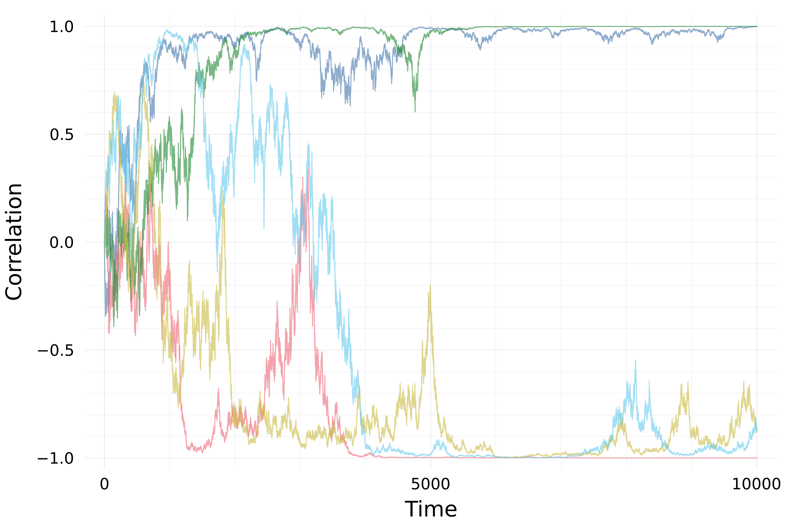{fig-align="center" width=80%} ::: ::: {.column .fragment width="38%"} 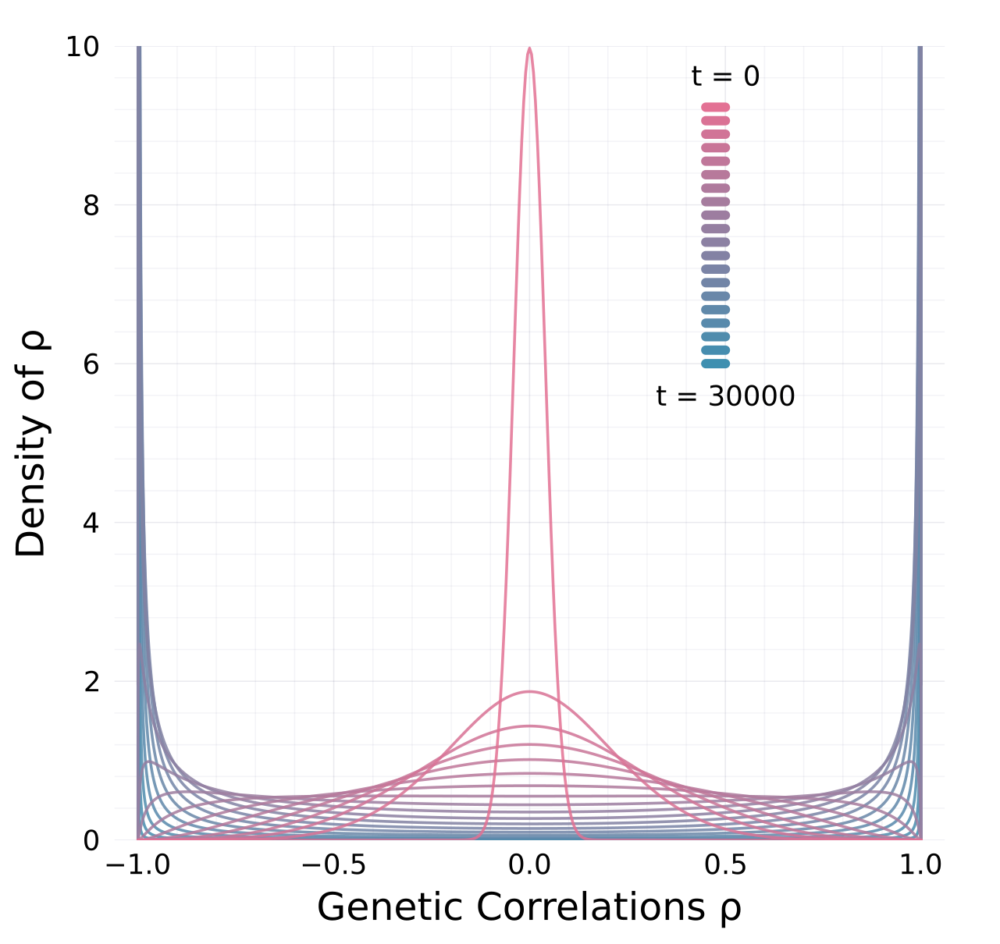{fig-align="center" width=90%} ::: ::: :::: ## Revised view :::: {.columns .cols2} ::: {.column width="58%"} ::: {.incremental} - Drift alters orientation of $\bf G$-matrices - while also eroding variation ${\mathbb E}[{\bf G}_t]$ - Stability of $\bf G$-matrix structure due to - mutation, migration, selection - Essentially complete opposite of previous view *(Roff 2000)* ::: ::: ::: {.column width="38%"} 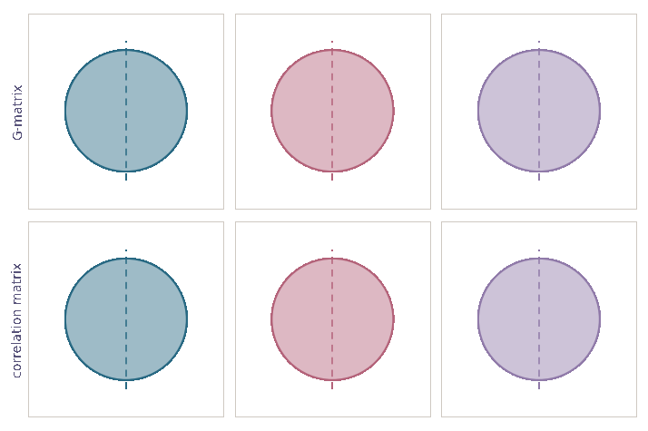{fig-align="center"} ::: :::: ## More in the paper... 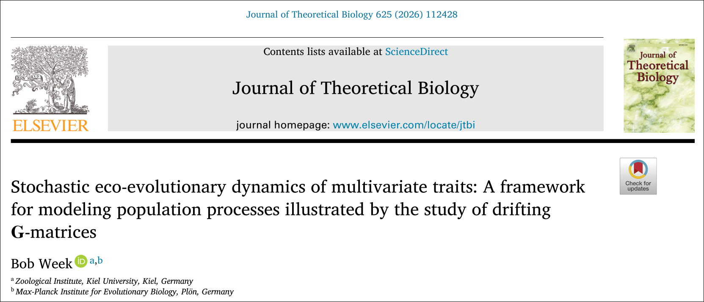 ## Conclusion - Revised view on ${\bf G}$ - Useful set of equations and heuristics ## Thanks & Questions Steve Krone, Peter L. Ralph, Hinrich Schulenburg, Patrick C. Phillips, Arne Traulsen, Jonas Wickman, Brendan Bohannan :::: {.columns .cols4} ::: {.column width="23%"} 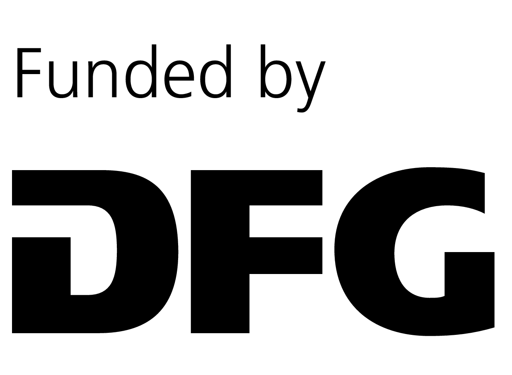 ::: ::: {.column width="23%"}  ::: ::: {.column width="23%"}  ::: ::: {.column width="23%"}  ::: :::: ## What about Recombination? Drift alters $\bf G$-matrix orientation even with recombination :::: {.columns .cols2} ::: {.column width="48%"} {fig-align="center" width="20%"} ::: ::: {.column width="48%"} 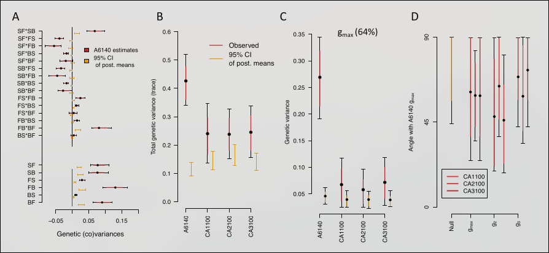{fig-align="center"} ::: :::: ## What about environmental stochasticity? - $m(\nu,{\bf z})=$ random field - pop-gen *(Gillespie 1972, 1973a, ..., 1979)* - $\mathrm d\bar{\bf z}$ *(Lande 2007, 2008)* - Measure-valued *(Mytnik 1996, Mytnik & Xiong 2007)*