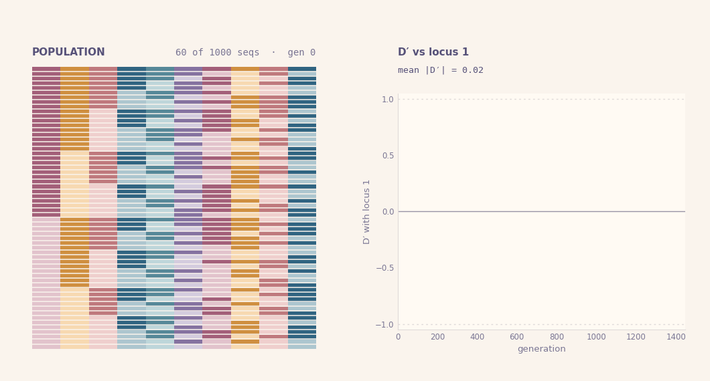
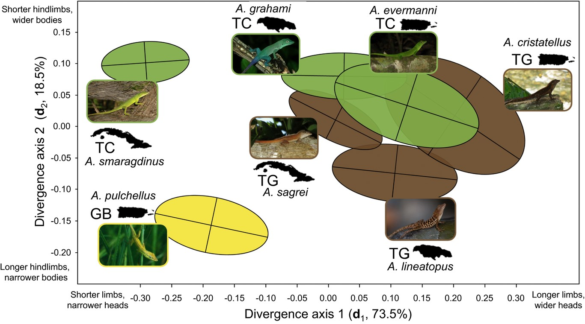

## Demographic stochasticity is super important

- explains:
  - extinction
  - random genetic drift

## Consequences of random genetic drift

{fig-align="center"}

::: {.incremental}

:::: {.columns .cols2}

::: {.column width="58%"}

- Erodes heritable variation
- Increases genetic correlations/linkage
 
:::

::: {.column width="38%"}

- Fundamental principle of evolutionary biology

:::

::::

:::

## What about quantitative characters?

::: {.incremental}
- Multivariate trait vector: ${\bf z}=\left(\begin{smallmatrix} z_1 \\ \vdots \\ z_d \end{smallmatrix}\right)$
- Genetic covariance structure ~ ${\bf G}$-matrix: $\left(\begin{smallmatrix} G_{11} & \cdots & G_{1d} \\ \vdots & \ddots & \vdots \\ G_{d1} & \cdots & G_{dd} \end{smallmatrix}\right)$ {.inline-img width=9%}
  - Genetic correlation: $\rho_{ij}({\bf G})=G_{ij}/\sqrt{G_{ii}\,G_{jj}}$   
  - We should know how $\bf G$ responds to drift!
    - $\mathbb E[{\bf G}_t]={\bf G}_0e^{-t/N_e}$, (Lande, 1979, 1980) {.inline-img width=10% fig-align="center"}
    - $\rho(\mathbb E[{\bf G}_t])=\rho({\bf G}_0)$, constant correlation (different previous slide!)
:::

## The conventional view

::: {.incremental}
- Drift "shrinks" entries of $\bf G$-matrices {.inline-img width=10% fig-align="center"} (Roff 2000)
  - No effect on genetic correlations between traits
  - Differences in orientation ~ selection, mutation, migration  {.inline-img width=10% fig-align="center"}
  - ... but variation around $\mathbb{E}[{\bf G}_t]$ (Phillips et al, 2001; Steppan et al, 2002)   
- ... still lacking stochastic neutral model (Mallard et al, 2024; Blomberg et al, 2025)
:::

<!-- ## Why the contrast between linkage and trait correlations?

- Drift:
  - Increases linkage among loci
  - No average effect on trait correlations
    - Fundamental attribute of trait evolution?
    - Or *artifact* of conventional perspective? -->

<!-- ## Problems with conventional view

::: {.incremental}

- Expectations can be misleading
  - Fair coin 🪙: ℙ(H)=ℙ(T)=1/2
  - So 𝔼(🪙)=H/2+T/2
    - ... but ℙ(H/2+T/2)=0
- Correlation non-linear function of ${\bf G}$: $\rho({\bf G}) = \tfrac{G_{12}}{\sqrt{G_{11} G_{22}}}$
  - $𝔼[ρ({\bf G})] ≠ ρ(𝔼[{\bf G}])$
- Need biologically motivated, mathematically rigorous neutral model

::: -->

## A Diffusion Approximation Approach

::: {.incremental}

:::: {.columns .cols2}

::: {.column width="48%"}

- **Individual-Based Model:**
  - Traits ${\bf z}\in {\mathbb R}^d$, population ${\cal P}_t({\bf z})$
  - Gaussian mutation 
    - ${\bf z}'\sim{\mathrm{MVN}}_d({\bf z},{\bf M})$
    - NOT infitesimal model!!
  - $W({\cal P}_t,{\bf z})=$ fitness function

:::

::: {.column width="52%"}

- **Diffusion Limit:**
  - Rescale turnover by factor $k$
  - Rescale population ${\cal P}_t^{(k)}({\bf z})\to \nu_t({\bf z})$
  - Growth rate $m(\nu_t,{\bf z})=\lim_k F_k(W)$
    - $k[W^{1/k}({\cal P}_t^{(k)},{\bf z})-1]\to m(\nu_t,{\bf z})$

:::

:::

::::

<iframe src="branching/index.html" width="820" height="350"
        style="border:0; display:block; margin:0 auto;"
        title="Branching diffusion"></iframe>

## Why Use Diffusion Approximations?

:::: {.columns .cols2}

::: {.column width="53%"}

::: {.incremental}

- Nice analytical properties
- Many models -> common diffusion limit
  - Previous slide:
    - Birth-death process
    - <-> Poisson offspring count
  - Extracts important features
  - Uncover biological principles

:::

:::

::: {.column width="43%"}

  

:::

::::

## The Diffusion Limit

<iframe src="spde/index.html" width="980" height="560"
        style="border:0; display:block; margin:0 auto;"
        title="SPDE trait density"></iframe>

## Moment Dynamics (not closed)

::: {.incremental}

::: {.fragment}

$\text{mean fitness:}\quad \bar m=\tfrac{1}{n}\int_{\mathbb{R}^d}m(\nu,{\bf z})\,\nu({\bf z})\,\mathrm d{\bf z}$

:::

::: {.fragment}

$$
\text{total abundance:}\quad \mathrm dn={\color{#c2185b}\bar m \, n}\,\mathrm dt + {\color{#5a4cc7}\sqrt{v\,n}\,\mathrm dB_n}
$$

:::

::: {.fragment}

$$
\text{mean trait (}d\text{-dim):}\quad \mathrm d\bar{\bf z}={\color{#c2185b}\textrm{Cov}(m,{\bf z})}\,\mathrm dt + {\color{#5a4cc7}\sqrt{\tfrac v n {\bf P}}\,\mathrm d{\bf B}_{\bar{\bf z}}}
$$

:::

::: {.fragment}

\begin{multline}
\text{trait variance (}d\times d\text{):}\quad \mathrm d{\bf P}=\big[{\color{#3c8500}{\bf M}}+{\color{#c2185b}\textrm{Cov}(m,({\bf z}-\bar{\bf z})({\bf z}-\bar{\bf z})^\top)}{\color{#5a4cc7}-\tfrac v n {\bf P}}\big]\,\mathrm dt \\
+ {\color{#5a4cc7}\sqrt{\tfrac v n ({\bf K}-{\bf P}\otimes{\bf P})}:\mathrm d{\bf B}_{\bf P}}
\end{multline}

:::

::: {.fragment}

$$
\text{skew tensor }(d\times d\times d)\text{:}\quad \mathrm d{\bf S}=\dots, \quad
\text{kurtosis tensor }(d\times d\times d\times d)\text{:}\quad \mathrm d{\bf K}=\dots,\quad \dots$$

:::

:::

## Multivariate Normal Approximation (closed)

::: {.incremental}

::: {.fragment}

$$
\text{total abundance (1-dim):}\quad \mathrm dn={\color{#c2185b}\bar m \, n}\,\mathrm dt + {\color{#5a4cc7}\sqrt{v\,n}\,\mathrm dB_n}
$$

:::

::: {.fragment}

$$
\text{mean trait (}d\text{-dim):}\quad \mathrm d\bar{\bf z}={\color{#c2185b}{\bf P}\big(\nabla_{\bar{\bf z}}\,\bar m-\overline{\nabla_{\bar{\bf z}}\,m}\big)}\,\mathrm dt + {\color{#5a4cc7}\sqrt{\tfrac v n {\bf P}}\,\mathrm d{\bf B}_{\bar{\bf z}}}
$$

:::

::: {.fragment}

\begin{multline}
\text{trait variance (}d\times d\text{):}\quad \mathrm d{\bf P}=\big[{\color{#3c8500}\bf M}+{\color{#c2185b}2\,{\bf P}(\nabla_{\bf P}\,\bar m-\overline{\nabla_{\bf P}\,m})\,{\bf P}}{\color{#5a4cc7}-\tfrac v n {\bf P}}\big]\,\mathrm dt \\
+ {\color{#5a4cc7}\sqrt{\tfrac v n (\mathbf{P}\overline\otimes \mathbf{P}+\mathbf{P}\underline\otimes \mathbf{P})}:\mathrm d{\bf B}_{\bf P}}
\end{multline}

:::

:::

## Multivariate Normal + Decomposed Traits

::: {.incremental}

::: {.fragment}
Traits decompose ${\bf z}={\bf g}+{\bf e}$ with iid ${\mathrm{Cov}}({\bf e})={\bf E}$ so that ${\bf P}={\bf G}+{\bf E}$
:::

::: {.fragment}
$$
\text{total abundance:}\quad \mathrm dn={\color{#c2185b}\bar m \, n}\,\mathrm dt + {\color{#5a4cc7}\sqrt{v\,n}\,\mathrm dB_n}
$$
:::

::: {.fragment}
$$
\text{mean trait (}d\text{-dim):}\quad \mathrm d\bar{\bf z}={\color{#c2185b}{\bf G}\big(\nabla_{\bar{\bf z}}\,\bar m-\overline{\nabla_{\bar{\bf z}}\,m}\big)}\,\mathrm dt + {\color{#5a4cc7}\sqrt{\tfrac v n {\bf G}}\,\mathrm d{\bf B}_{\bar{\bf z}}}
$$
:::

::: {.fragment}
\begin{multline}
\text{genetic variance (}d\times d\text{):}\quad \mathrm d{\bf G}=\big[{\color{#3c8500}{\bf M}}+{\color{#c2185b}2\,{\bf G}(\nabla_{\bf G}\,\bar m-\overline{\nabla_{\bf G}\,m})\,{\bf G}}{\color{#5a4cc7}-\tfrac v n {\bf G}}\big]\,\mathrm dt \\
+ {\color{#5a4cc7}\sqrt{\tfrac v n  (\mathbf{G}\overline\otimes \mathbf{G}+\mathbf{G}\underline\otimes \mathbf{G})}:\mathrm d{\bf B}_{\bf G}}
\end{multline}
:::

- this is a particularly kewt consolidation \*\^-\^\*

:::

## How to use?

::: {.incremental}

:::: {.columns .cols2}

::: {.column width="48%"}

**Deterministic/selection:**

- $m(\nu,{\bf z})$ arbitrary
- Examples:
  - Logistic growth + stabilizing selection
    - $m(\nu,{\bf z})=r-\tfrac 1 2 {\bf z}^\top{\bf \Psi}{\bf z}-c\,n$
  - Lotka-Volterra
    - $m_i=r-\sum_j\alpha_{ij}n_j$
  - Coevolution
    - $m({\bf z}_i,{\bf z}_j)_i=$
  - Rugged ?

:::

::: {.column width="48%"}

**Stochasticity/drift:**

- Numerical integration: *github.com/bobweek/multi-mtgl*
- Analytical approach:
  - Ito's Formula
    - Heuristics

:::

::::

:::

## A new neutral model of $\bf G$-matrix evolution

$$\mathrm d{\bf G}={\color{#c2185b} -\tfrac{1}{N_e}{\bf G}\,\mathrm d t} + {\color{#5a4cc7}\sqrt{\tfrac{1}{N_e}({\bf G}\underline\otimes{\bf G}+{\bf G}\overline\otimes{\bf G})}:\mathrm d{\bf B}}$$

::: {.incremental}

:::: {.columns .cols2}

::: {.column width="68%"}

- $N_e=v/n$ effective population size
- <pink>Deterministic part</pink> ~ shrinks $\bf G$
  - Agrees with Lande's $\mathbb E[{\bf G}_t]$
- <violet>Stochastic part</violet> ~ complicated ...
  - study $\rho_{ij}=G_{ij}/\sqrt{G_{ii}G_{jj}}$ to gain insights
:::

::: {.column width="28%"}

:::

:::

::::

## Obtaining dynamics of genetic correlations
(and dealing with stochastic terms)

- Use ito's formula on $\rho=f({\bf G})$

$$
\mathrm d\rho=(\nabla_{\bf G}f)^\top\mathrm d{\bf G}+\tfrac 1 2 (\mathrm d{\bf G})^\top (\mathrm H_{\bf G}f)(\mathrm d {\bf G})
$$

- 

## Genetic correlations tend towards ±1

::: {.incremental .fragment}

- $d\rho/dt$ from $d{\bf G}/dt$ using chain rule: $\frac {d\rho}{dt}=-\frac{1}{2N_e}\,\rho\,(1-\rho^2)+\sqrt{\frac{1}{N_e}\,(1-\rho^2)}\,\frac {dB}{dt}$

:::

:::: {.columns .cols2}

::: {.column .fragment width="58%"}
{fig-align="center" width=80%}
:::

::: {.column .fragment width="38%"}
{fig-align="center" width=90%}
:::

::::

## Revised view

:::: {.columns .cols2}

::: {.column width="58%"}
::: {.incremental}
- Drift alters orientation of $\bf G$-matrices
  - while also eroding variation
- Stability of $\bf G$-matrix structure due to
  - mutation, migration, selection
- Essentially complete opposite of previous view (Roff 2000)
:::

:::

::: {.column width="38%"}
{fig-align="center"}
:::

::::

## Consequences for understanding evolution

:::: {.columns .cols2}

::: {.column .fragment width="38%"}

McGlothlin et al (2018):

::: {.incremental}

- $\bf G$-matrice of Anolis lizards
- Variation across lineages => evolution
- Overall structure conserved
- Explanations:
  - Plieotropy
  - Stabilizing selection
  - "*Genetic drift is predicted to primarily influence G-matrix size...*"

:::

:::

::: {.column width="58%"}
{fig-align="center"}
:::

::::

::: {.fragment}
- If drift explains small $\bf G$-matrices, why dont those matrices also have altered orientation?
- Adding recombination doesn't solve the problem ... add drosphila slide at end for people who ask this question
:::

## More in the paper...

## Thanks & Questions

Steve Krone, Peter L. Ralph, Hinrich Schulenburg, Patrick C. Phillips, Arne Traulsen, Jonas Wickman, Brendan Bohannan

:::: {.columns .cols4}

::: {.column width="23%"}

:::

::: {.column width="23%"}

:::

::: {.column width="23%"}

:::

::: {.column width="23%"}

:::

::::

<!-- 
- Conventional (old) wisdom:
  - *drift*
    - does not change $\bf G$-matrices on average
    - but does cause some variation across populations 
  - *selection*
    - alters orientation of $\bf G$-matrices
- Rigorous (new) wisdom:
  - *drift*
    - rapidly drives correlations to ±1
    - dramatically alters orientation of $\bf G$-matrices
  - previously taken as 

add rev to comp qg here -->
