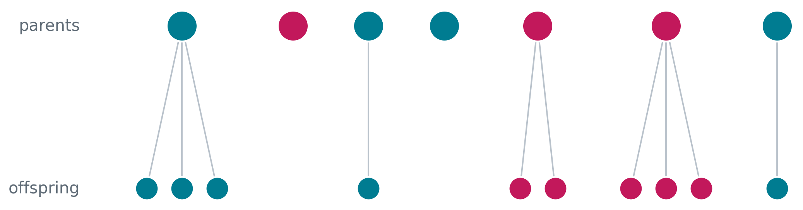

## The neutral null for $\bf G$-matrix orientation :::: {.columns .cols2} ::: {.column width="52%"} ::: {.incremental} A standard expectation: $$ \mathbb E[\mathbf G_t]=\mathbf G_0 e^{-t/N_e} $$ So drift erodes heritable variation. But because every entry shrinks proportionally, $$ \rho\big(\mathbb E[\mathbf G_t]\big)=\rho(\mathbf G_0) $$ ::: ::: ::: {.column width="42%"} {fig-align="center" width="70%"} ::: {.fragment} {fig-align="center" width="70%"} ::: ::: :::: ::: {.fragment} **Question:** does the *typical realized population* preserve $\mathbf G$ orientation, or only the expectation? ::: ## Drift changes individual $\bf G$-matrices :::: {.columns .cols2} ::: {.column width="57%"} {fig-align="center" width="95%"} ::: ::: {.column width="39%"} ::: {.incremental} Classical mean behavior is correct. But individual populations follow paths. For nonlinear summaries such as $$ \rho_{ij}(\mathbf G)=\frac{G_{ij}}{\sqrt{G_{ii}G_{jj}}}, $$ $$ \mathbb E[\rho(\mathbf G_t)]\neq \rho(\mathbb E[\mathbf G_t]). $$ ::: ::: :::: ## The puzzle :::: {.columns .cols2} ::: {.column width="48%"} {fig-align="center" width="95%"} ::: ::: {.column width="48%"} ::: {.incremental} Drift is known to: - erode heritable variation; - generate random associations among loci; - make replicate populations diverge. But quantitative-genetic theory usually describes drift on $\mathbf G$ through an expectation. That leaves no pathwise neutral model for $\mathbf G$ orientation. ::: ::: :::: ## Strategy: derive $\bf G$ dynamics from a population process ::: {.incremental} A diffusion approximation separates robust population-level ingredients from microscopic turnover details. :::: {.columns .cols3} ::: {.column width="30%"} **Individual turnover** births, deaths, mutation, reproductive variance ::: ::: {.column width="30%"} **Measure-valued diffusion** trait distribution evolves stochastically in $\mathbb R^d$ ::: ::: {.column width="30%"} **Moment dynamics** $n$, $\bar{\mathbf z}$, $\mathbf G$, and derived quantities ::: :::: Retained macroscopic ingredients: $$ \pink{m(\nu,\mathbf z)}\quad\text{growth / selection}, \qquad \lime{\mathbf M}\quad\text{mutation covariance}, \qquad \violet{v}\quad\text{reproductive variance}. $$ ::: ## Heuristic picture of the diffusion limit <iframe src="branching/index.html" width="820" height="350" style="border:0; display:block; margin:0 auto;" title="Branching diffusion"></iframe> ::: {.incremental} For one useful scaling, $$ k\left[W^{1/k}(\mathcal P_t^{(k)},\mathbf z)-1\right] \longrightarrow m(\nu_t,\mathbf z). $$ Different individual-based models can share the same limit. The point is not to keep every microscopic detail; it is to identify what survives at the population scale. ::: ## Moment equations are projections of one process ::: {.incremental} The same stochastic population process gives consistent dynamics for abundance, mean traits and covariance. $$ \mathrm dn=\pink{\bar m n}\,\mathrm dt+\violet{\sqrt{vn}\,\mathrm dB_n} $$ $$ \mathrm d\bar{\mathbf z}=\pink{\mathrm{Cov}(m,\mathbf z)}\,\mathrm dt +\violet{\sqrt{\frac vn\mathbf P}\,\mathrm d\mathbf B_{\bar{\mathbf z}}} $$ \begin{multline} \mathrm d\mathbf P=\Big[\lime{\mathbf M}+\pink{\mathrm{Cov}\big(m,(\mathbf z-\bar{\mathbf z})(\mathbf z-\bar{\mathbf z})^\top\big)}\violet{-\frac vn\mathbf P}\Big]\,\mathrm dt \\ +\violet{\sqrt{\frac vn(\mathbf K-\mathbf P\otimes\mathbf P)}:\mathrm d\mathbf B_{\mathbf P}}. \end{multline} This hierarchy is not closed in general. ::: ## Gaussian closure: usable multivariate quantitative genetics ::: {.incremental} Assume additive genetic values are multivariate normal and traits decompose as $$ \mathbf z=\mathbf g+\mathbf e, \qquad \mathrm{Cov}(\mathbf z)=\mathbf G+\mathbf E. $$ Then the $\mathbf G$ dynamics close as \begin{multline} \mathrm d\mathbf G=igg[\lime{\mathbf M} +\pink{2\mathbf G(\nabla_{\mathbf G}\bar m-\overline{\nabla_{\mathbf G}m})\mathbf G} \violet{-\frac vn\mathbf G}\bigg]\,\mathrm dt \\ +\violet{\sqrt{\frac vn(\mathbf G\overline\otimes\mathbf G+ \mathbf G\underline\otimes\mathbf G)}:\mathrm d\mathbf B_{\mathbf G}}. \end{multline} This is the part I need for a stochastic neutral model of $\mathbf G$. ::: ## Neutral $\bf G$-matrix dynamics under drift $$ \mathrm d\mathbf G=\violet{-\frac{1}{N_e}\mathbf G\,\mathrm dt} + \violet{\sqrt{\frac{1}{N_e} (\mathbf G\underline\otimes\mathbf G+\mathbf G\overline\otimes\mathbf G)}:\mathrm d\mathbf B} $$ ::: {.incremental} where $$ \frac{1}{N_e}=\frac vn, \qquad N_e=\frac nv. $$ Assumptions for this neutral baseline: - $m(\nu,\mathbf z)\equiv0$; - $\mathbf M=\mathbf 0$; - constant $n$ and $v$; - no explicit recombination, selection or new mutation. ::: ## From $\mathbf G$ to genetic correlations ::: {.incremental} Apply Itô's formula to $$ \rho=f(\mathbf G)=\frac{G_{ij}}{\sqrt{G_{ii}G_{jj}}}. $$ The component form is $$ \mathrm dG_{ij}= -\frac vnG_{ij}\,\mathrm dt +\sqrt{\frac vn\left(G_{ii}G_{jj}+G_{ij}^2\right)}\,\mathrm dB_{G_{ij}}. $$ The Brownian terms covary. The martingale version keeps those covariances correct while combining stochastic terms: $$ a\,\mathrm d\mathcal M(x)+b\,\mathrm d\mathcal M(y) =\mathrm d\mathcal M(ax+by). $$ ::: ## Genetic correlations tend towards $\pm1$ $$ \mathrm d\rho= \pink{-\frac{1}{2N_e}\rho(1-\rho^2)}\,\mathrm dt + \violet{\sqrt{\frac{1}{N_e}(1-\rho^2)}\,\mathrm dB}. $$ :::: {.columns .cols2} ::: {.column width="58%"} {fig-align="center" width="80%"} ::: ::: {.column width="38%"} {fig-align="center" width="90%"} ::: :::: ::: {.fragment} Under drift alone in this isolated neutral baseline, realized populations concentrate near extreme genetic correlations. ::: ## Why the drift term does not contradict this ::: {.incremental} The Itô drift term points back toward zero: $$ -\frac{1}{2N_e}\rho(1-\rho^2). $$ But the diffusion coefficient vanishes at the boundaries: $$ \sqrt{\frac{1}{N_e}(1-\rho^2)}. $$ So the process spends increasing time near $\rho=\pm1$. Equivalently, with $u=\operatorname{arctanh}(\rho)$, $$ \mathrm du=\sqrt{\frac{1}{N_e}}\,\frac{1}{\sqrt{1-\rho^2}}\,\mathrm dB, $$ which makes boundary-seeking behavior easier to see. ::: ## Same expectation, different pathwise reality :::: {.columns .cols2} ::: {.column width="56%"} ::: {.incremental} Classical expectation: $$ \mathbb E[\mathbf G_t]=\mathbf G_0e^{-t/N_e} $$ Realized neutral paths: - erode heritable variation; - alter $\mathbf G$ orientation; - push genetic correlations toward extremes. ::: ::: ::: {.column width="40%"} {fig-align="center" width="92%"} ::: :::: ::: {.fragment} The previous null is not wrong. It is an expectation-level null, not a pathwise null for orientation. ::: ## Empirical motivation: orientation can scatter under drift :::: {.columns .cols2} ::: {.column width="48%"} {fig-align="center" width="70%"} ::: ::: {.column width="48%"} {fig-align="center" width="92%"} ::: :::: ::: {.fragment} Explicit recombining extensions are still needed. But these data reinforce the need for a stochastic neutral orientation baseline. ::: ## What the framework buys ::: {.incremental} Not just "moments are useful." The useful point is that $n$, $\bar{\mathbf z}$ and $\mathbf G$ are derived from one stochastic population process, so their stochastic terms and cross-covariances are consistent. That makes it possible to derive new stochastic dynamics for quantities such as $$ \rho(\mathbf G),\qquad \bar m(n,\bar{\mathbf z},\mathbf G),\qquad \alpha(\bar{\mathbf z}_1,\bar{\mathbf z}_2), $$ rather than specifying noise terms ad hoc. ::: ## Takeaways ::: {.incremental} 1. Drift contracts $\mathbf G$ on average, but individual neutral paths can strongly alter orientation. 2. Genetic correlations tend toward $\pm1$ in the isolated drift-only baseline. 3. A stochastic moment framework gives a reusable way to derive pathwise population-level models from underlying turnover. ::: ## More in the paper {fig-align="center" width="58%"} ::: {.fragment} Numerical implementations: `github.com/bobweek/multi-mtgl` ::: ## Thanks & Questions Steve Krone, Peter L. Ralph, Hinrich Schulenburg, Patrick C. Phillips, Arne Traulsen, Jonas Wickman, Brendan Bohannan :::: {.columns .cols4} ::: {.column width="23%"}  ::: ::: {.column width="23%"}  ::: ::: {.column width="23%"}  ::: ::: {.column width="23%"}  ::: :::: # Backup ## Backup: how to choose $m$ ::: {.incremental} The framework is useful when a biological problem can be described through growth rates or fitness functions. :::: {.columns .cols2} ::: {.column width="48%"} **Ecological examples** - Logistic growth + stabilizing selection $$ m(\nu,\mathbf z)=r-\tfrac12\mathbf z^\top\mathbf\Psi\mathbf z-cn $$ - Lotka--Volterra interactions $$ m_i=r_i-\sum_j\alpha_{ij}n_j $$ ::: ::: {.column width="48%"} **Evolutionary examples** - coevolution; - evolutionary rescue; - host--parasite matching; - frequency-dependent interactions; - density-dependent eco-evolutionary feedbacks. ::: :::: ::: ## Backup: analytical and numerical use ::: {.incremental} Numerical use: - use the Brownian-motion form; - integrate with Euler--Maruyama or SDE solvers; - see `github.com/bobweek/multi-mtgl`. Analytical use: - use Itô's formula for $\mathrm df(n,\bar{\mathbf z},\mathbf G)$; - use martingale rules to combine correlated stochastic terms; - avoid inventing independent noise processes where the population process says they covary. ::: ## Backup: full Gaussian closure ::: {.incremental} \begin{align} \mathrm dn &= \bar m n\,\mathrm dt+\sqrt{vn}\,\mathrm dB_n,\\ \mathrm d\bar{\mathbf z} &= \mathbf G(\nabla_{\bar{\mathbf z}}\bar m-\overline{\nabla_{\bar{\mathbf z}}m})\,\mathrm dt +\sqrt{\frac vn\mathbf G}\,\mathrm d\mathbf B_{\bar{\mathbf z}},\\ \mathrm d\mathbf G &= \left[\mathbf M+2\mathbf G(\nabla_{\mathbf G}\bar m-\overline{\nabla_{\mathbf G}m})\mathbf G-\frac vn\mathbf G\right]\mathrm dt\\ &\qquad+\sqrt{\frac vn(\mathbf G\overline\otimes\mathbf G+\mathbf G\underline\otimes\mathbf G)}:\mathrm d\mathbf B_{\mathbf G}. \end{align} ::: ## Backup: formal foundation ::: {.incremental} The density animation is only a visualization. The formal object is a measure-valued population process characterized by a martingale problem. For a test function $x$, $$ \mathrm dN_t(x)=N_t(Lx)\,\mathrm dt+\mathrm d\mathcal M_t(x), $$ with quadratic covariation $$ \mathrm d\mathcal M_t(x)\,\mathrm d\mathcal M_t(y) = v\,N_t(xy)\,\mathrm dt. $$ This is the source of the stochastic covariance structure in the moment equations. ::: ## Backup: reproductive variance :::: {.columns .cols2} ::: {.column width="78%"} {fig-align="center" width="900"} ::: ::: {.column width="18%"} $v=$ reproductive variance ::: :::: ::: {.fragment} Higher $v$ means stronger demographic stochasticity and stronger random genetic drift at fixed $n$. ::: ## Backup: fixation intuition :::: {.columns .cols2} ::: {.column width="18%"} $v>0\implies$ random genetic drift ::: ::: {.column width="78%"} {fig-align="center" width="820"} ::: ::::