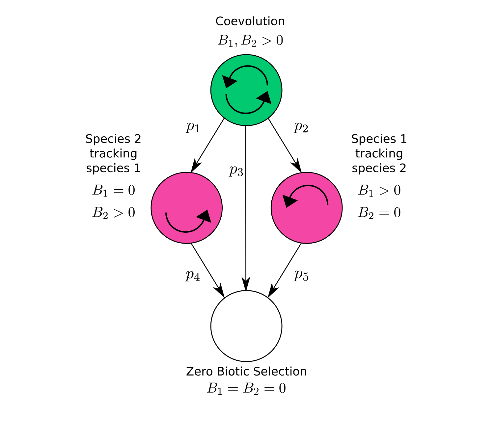

---
output:
  html_document:
    css: style.css
    theme: cosmo
    toc: yes
    toc_float: yes
title: "Proposed thesis: The coevolution of mutualistic communities"
author: "Bob Week"
csl: evolution.csl
bibliography: ref.bib
---

```{r setup, include=FALSE}
knitr::opts_chunk$set(echo = TRUE)
```

\newcommand{\W}{\mathcal{W}}
\newcommand{\R}{\mathbb{R}}
\newcommand{\C}{\mathbb{C}}
\newcommand{\Z}{\mathbb{Z}}
\newcommand{\para}[1]{\left( #1 \right)}
\newcommand{\sqbr}[1]{\left[ #1 \right]}
\newcommand{\E}{\mathbb{E}}
\newcommand{\Cov}{\mathrm{Cov}}
\newcommand{\Var}{\mathrm{Var}}

<!--
## Summary

The coevolutionary process has been speculated to have played a significant role throughout the history of life ever since the time of Darwin. Previous studies have used coevolution to provide putative explanations for the evolution of sexual reproduction, the structuring of ecological communities, the extreme exaggeration observed in many physical traits and for the diversity of life.

This
-->

## Introduction to proposed work

Coevolution has long been thought to drive the exaggeration of traits [@darwin1859origin;@ehrlich1964butterflies], promote major evolutionary transitions such as the evolution of sexual reproduction [@hamilton1980sex;@jaenike1978hypothesis;@lively1987evidence;@gandon2007evolution], and influence epidemiological dynamics [@anderson1982coevolution;@lion2015evolution;@lively2016coevolutionary]. Despite coevolution's long suspected importance, however, our understandings of both the mechanisms involved and the patterns produced by this process are still in their infancy (what to cite?). As part of developing a clear understanding of the role that coevolution plays in shaping the diversity of life we must account for the details of the mechanisms driving the coevolutionary process, quantify its strength in nature, and determine its consequences for ecological communities. 

Previous theoretical studies within the intersection of community ecology and coevolution have focused on results pertaining to a small number of interacting species (cite roughgarden, abrams, holt and mcpeek for theory, strauss, benkman, berenbaum, zergall for empirical work). The common approach in each of these studies is to derive a model of mean trait evolution alongside a model of demographic dynamics for each species involved. Hence, if there are $N$ species under consideration, there will be $2N$ dynamical, often nonlinear, equations used to model the system. This approach has provided some analytical results for a few species, but rapidly becomes intractable with additional species. However, many of the patterns observed in ecological communities span dozens, even hundreds of species [manning and goldblatt, hubbel]. A recent development in coevolutionary theory to overcome this difficulty has taken the so-called mean field approach with respect to the identity of species (cite paper that's in review and scott's 2013 paper and a book or article on the mean-field approach). This approach allows the reduction of a high-dimensional problem involving equations describing the evolution of each species within a community to a low-dimensional one that focuses on the community as a whole. With this approach we can derive analytical results pertaining to the statistical nature of a community as a whole, but without explicit conclusions for any particular member of the community. Hence, if we are willing to blur our vision, the stage has been set to develop a mathematically rigorous theory of coevolutionary community ecology. The primary goal of the proposed work is to contribute to this development by extending previous work on the coevolution of communities to the context of mutualistic networks.

However, before such a contribution can be made there are two major steps to be taken. First, a more biologically realistic treatment of the mechanisms mediating the outcomes of ecological interactions needs to be incorporated into coevolutionary theory. Variation in this mechanism alone may explain a significant amount of functional diversity seen in nature. Second, a metric for the strength of coevolution within a community is required to quantify the role of coevolution in the community. A way to measure the strength of coevolution between a pair of species will be needed in order to derive this community-wide metric from first principles. Hence, a novel metric of pairwise-coevolution and a method to infer it will be introduced. Accomplishing these first two steps will brandish a framework ripe for rigorous investigations of the relationship between coevolution and ecological communities. 
To tether this work to the empirical world, each step is motivated by the details of specific pollination networks. The primary example used throughout is the interaction between a long-tongued fly Moegistorhynchus longirostris and the flower it pollinates, Lapeirousia anceps, occuring in the coastal lowlands of South Africa [@pauw2009flies] (also, manning). Other fly-flower mutualisms from across the globe will be explored for cross-system comparisons. 

<!-- However, the end goal is to find a well-studied mutualistic network that is large and taxonomically rich from which methods can be developed to tie theory to data. -->

The three primary questions driving this work are:

  1. Why do some mutualistic pairs produce highly exaggerated traits while others do not?
  2. What is the strength of pairwise coevolution in the wild?
  3. What is the role of coevolution in structuring mutualistic communities?

These questions are complemented by the following three overarching goals:

  1. To develop a model that explicitly accounts for the mechanism mediating mutualistic interactions.
  2. To develop a method for inferring the strength of coevolution between a pair of species.
  3. To extend the mean field approach to the context of mutualistic communities.


## Q1: Why do some mutualisms produce highly exaggerated traits while others do not?

#### (Introduction to the offset-matching model of coevolution)

Mutualistic interactions provide an abundant supply of putative coevolutionary arms races. The most popular of these being the potentially coevolved orchid Angraecum sesquipedale and the moth that pollinates it Xanthopan morganii praedicta. The extreme length of this orchids nectar tube had captured the attention of Charles Darwin [-@darwinvarious]. Darwin formulated the hypothesis that this exaggerated trait may be the result of the reciprocal evolutionary responses between this orchid and whatever had been pollinating it (unknown to Darwin at the time) over many generations. To come to this hypothesis Darwin had been carefully thinking about the mechanism mediating the outcome of this interaction. He speculated that the orchid would be better off having a nectar tube that is slightly longer than the proboscis of the pollinator, forcing the pollinator to further penetrate the flower in order to obtain its nectar reward. Darwin speculated that this would cause the body of the pollinator to rub against the reproductive organs of the flower and thereby increase the probability of pollination. Hence, we can expect selection induced by this interaction to select for slightly longer tube lengths. Likewise, with respect to the fitness of the pollinator, Darwin thought that by having a proboscis slightly longer than the tube length of the flower, the pollinator would be able to extract more resources from each flower it visits. Thus, selection from this interaction would be reciprocally selecting for individuals from both populations with slightly longer traits. Assuming that these traits maintain ample genetic variation and that the primary source of selection on these traits is induced by their interaction, then, ignoring other processes such as migration and drift, the logical result is a never ending arms race towards more and more exaggerated, yet closely matched, traits.

Given the logic of Darwins argument, we might expect any pollination-based mutualism mediated by a mechanism analogous to the one described above to consistently produce highly exaggerated traits. However, we instead see a wide variety in the degree of exaggeration among traits mediating such interactions [@anderson2010predictable]. What can account for such variance? Clearly there is an endless list of potential explanations, but if we focus our attention on explanations pitched entirely in terms of the structure of the interactions between pairs of species, we can begin to develop a clear understanding of the role that coevolution plays in the maintenance of biodiversity.

Do I need to incorporate more of the anderson paper?

Since different species are often placed under different physiological constraints and environmental conditions, it seems obvious that this variation should exists across species. However, even within species, a striking amount of variation in the outcomes of these processes have been observed. Take, for example, the interaction between the fly Moegistorhynchus longirostris and the flower it pollinates, Lapeirousia anceps. The mechanism mediating this interaction is precisely the same as that described above for A. sesquipedale and X. morganii. The mean traits of the fly and flower species covary spatially with a correlation coefficient of 0.78, seeming to confirm the prediction made by Darwin that these traits should be closely matched. Yet, across eight populations the average length of the fly's proboscis ranges from 43 mm to 86 mm and the average nectar tube of the flower across the same populations from 41 mm to 77 mm. Then, given that each population is undergoing the same interaction, why is there such stark phenotypic variability across these species' distributions? To answer this question I propose to use a novel quantitive genetic model of coevolution derived from considering the mechanism mediating pollination interactions.

### Outline of the approach:

Previous work on the coevolutionary theory of quantitative traits have focused on two primary mechanisms; trait matching and trait differences. In the case of trait matching, it is assumed that the optimal phenotype of each species is the mean phenotype of the complementary species. This model results in very well behaved linear dynamics described by
$$\Delta\bar z_i=G_iB_i(\bar z_j-\bar z_i).$$
Here, $G_i$ denotes the additive genetic variance of the trait $z_i$, the small non-negative parameter $1\gg B_i\geq0$ is the strength of biotic selection induced by species $j$ onto species $i$ and $\bar z_i,\bar z_j$ represent the mean traits in species $i$ and $j$ respectively. This model predicts the mean traits for each species to converge to a common value that lies somewhere between their initial phenotypes. Hence, no escalation can occur in this model. 

In contrast, @nuismer2010correlation developed a model based on trait differences that leads to pure escalation dynamics. The resulting dynamics of this model are
$$\Delta\bar z_i=G_i\sqrt{B_i}$$
Under this model the mean traits of each species will forever increase at a constant rate independently of one another. Though this model predicts an arms race, it misses a crucial ingredient described by Darwin, that the traits in each species need only be slightly longer than the traits of the complementary species to maximize fitness. 

By incorporating this notion of an optimal offset into the trait matching model, I will coalesce the two distinct sets of dynamics just described within a unifying framework that I call the offset-matching model. This generalized model of coevolution takes the form
$$\Delta\bar z_i=G_iB_i\delta_i+G_iB_i(\bar z_j-\bar z_i)$$
where the additional term $\delta_i$ represents the offset between the traits of species $i$ and $j$ that maximizes the fitness benefits of species $i$ with repsect to their interaction. By setting $\delta_i=0$ for both species we obtain the classic trait matching model. Since $B_i$ is small it can be shown that by setting $\delta_i=1/\sqrt{B_i}$ the offset-matching model is approximated by the pure escalation model when $|\bar z_j-\bar z_i|$ is small.

Using this model of offset-matching we can explain both the escalation and spatial covariation observed in nature. I plan to use the offset-matching model, focusing on mechanism of the interaction as manifested by the offset parameter $\delta$, as a platform to understand why there is such variation in the outcomes of these processes both across the spatial distribution of coevolving pairs as well as across different systems of coevolving pairs. Assuming a constant strength of biotic selection across populations within a pair of interacting species, two explanations for the variability observed include the stochastic effects of drift and spatial variability in the offset term. These two explanations are not mutually exclusive and each taken on their own may require biologically unrealistic parameters. Hence, it is likely that a combination of random drift and spatial variability in mechanism will be able to explain the patterns observed within a biologically relevent subset of parameter space.

Though the quantitative genetic approach has the strength of providing analytic results, its weakness lies in the large amount of assumptions required to obtain such results. To counter this, I plan to test the depency of my conclusions on the assumptions made by developing individual-based simulations that allow me to numerically derive results for generalized models. By comparing analytical results to simulations, I can quantify the extent to which particular assumptions prevent accurate descriptions of biological processes. Specifically, statistical tests, such as the t-test, can be used to calculate whether or not simulated results significantly differed from those predicted by quantitative genetic theory.

## Q2: What is the strength of coevolution in the wild?

In spite of the much anticipated importance of the coevolutionary process [@thompson1994coevolutionary], we know almost nothing about its the strength and prevalence in the wild. This lack of knowledge is largely due to the absence of generally applicable statistical approaches that yield quantitative estimates for the strength and significance of coevolution. To fill this critical gap I propose a novel statistical method of inference that derives maximum likelihood estimates for the strength of pairwise coevolution in natural systems by coupling the offset-matching model of coevolution to widely available phenotypic data. I will apply this method to two well-studied interactions; one being a highly specific antagonism involving the Japanese camellia fruit and its predatory weevil and the other being the mutualism previously discussed between the long-tongued fly M. longirostris and the flower it pollinates L. anceps. Broad application of this approach has the potential to answer long-standing evolutionary debates such as the importance species interactions play in the evolution of sexual reproduction [@hamilton1980sex].

Our current understanding of coevolution's importance rests upon methods that fall into two general classes: those that are broadly applicable but yield only qualitative evidence for coevolution and those that produce quantitative estimates for the strength of coevolution but can be applied only in a narrow range of systems. For example, one popular approach for inferring coevolution relies on measuring the spatial correlation between traits of interacting species and using significant interspecific correlations as evidence of a coevolutionary process [@berenbaum1986constraints;@benkman2003reciprocal;@hanifin2008phenotypic;@toju2008fine;@pauw2009flies]. Strengths of this approach include the relative ease of collecting the relevant data and its broad applicability to a wide range of species interactions. The critical weakness of this approach, however, is that significant interspecific correlations are neither necessary nor sufficient for demonstrating coevolution  [@nuismer2010correlation;@janzen1980coevolution] and can never yield more than qualitative evidence for coevolution. In contrast, quantitative approaches for estimating the strength of coevolution, such as selective source analysis, require the collection of extensive trait and fitness data from interacting species and thus have proven difficult to employ in all but a few specialized systems [@ridenhour2005identification;@brodie2003reciprocal;@sletvold2010pollinator;@toju2005imbalance]. As a consequence of these trade-offs in existing approaches, rigorous, quantitative estimates of the strength of coevolution in natural populations are extremely scarce. 

### Outline of the approach:

A promising alternative to existing approaches is the development of a likelihood-based framework that uses routinely collected phenotypic data to estimate key parameters of the offset-matching model of coevolution and to test the hypothesis of coevolution. Specifically, the offset-matching model can be easily extended to predict the spatial distribution of population-level mean traits for a pair of interacting species that evolve in response to random genetic drift, abiotic selection, and coevolution [@nuismer2010correlation]. Crucially, this extension predicts that the distribution of trait means in the interacting species across a metapopulation will approach a bivariate normal distribution entirely described by five statistical moments: the metapopulation-level average of the population-level average key trait in each species among populations ($\mu_1$ and $\mu_2$), the variance of the population-level mean trait in each species among populations ($V_1$ and $V_2$), and the spatial association (covariance, $C$) between the key traits in each species. The key model parameters that quantify the strength of biotic selection acting on the two species are $B_1$ and $B_2$. Any selective agents acting independently of the interaction are captured collectively by the strengths of abiotic selection on each species; $A_1$ and $A_2$. All four of these model parameters are required to be non-negative and small ($\ll1$). Denoting the optimal phenotype with respect to abiotic selection by $\theta_i$ and the effective population size by $n_i$ for species $i$, classical quantitative genetic assumptions lead to the following recursion equations for the statistical moments describing the metapopulation:
$$\mu_i'=\mu_i+G_i\sqbr{B_i\delta_i+B_i(\mu_j-\mu_i)+A_i(\theta_i-\mu_i)}$$
$$V_i'=(1-2A_iG_i)V_i+2B_jG_j(C-V_i)+G_i/n_i$$
$$C'=(1-A_1G_1-A_2G_2)C+B_2G_2(V_1-C)+B_1G_1(V_2-C).$$

Because the models predict a bivariate normal distribution of traits, calculating the likelihood of observing any particular set of trait values in a pair of interacting species is straightforward (SI). Maximizing the resulting likelihood with respect to the strengths of biotic and abiotic selection acting on the two species yields a quantitative estimate for the strength of coevolution under the assumption that the remaining model parameters have been accurately estimated (SI).

In addition to providing quantitative estimates for the strength of biotic selection, our method can be used to rigorously test for the presence of coevolution. Specifically, for a coevolutionary hypothesis to be supported, reciprocal selection must be demonstrated [@janzen1980coevolution;@thompson1994coevolutionary]. In our maximum likelihood framework, this long-standing and widely accepted definition of coevolution corresponds to demonstrating that the pair of parameters in our model that quantify the strength of biotic selection imposed on each species by the other are significantly greater than zero. By performing likelihood ratio tests, support for the coevolutionary hypothesis can be compared relative to support for the non-coevolutionary null hypotheses of unilateral evolution where $B_1=0$ or $B_2=0$, or evolution entirely independent of species interactions where $B_1=0$ and $B_2=0$ (Figure \ref{modelNetwork}). Due to the nested structure of these models, we can directly compare the likelihood of coevolution against the likelihoods of these null models by approximating p-values. Figure \ref{modelNetwork} shows that both $p_1$ and $p_2$ need to be less than the significance threshold $\alpha$ to support a coevolutionary hypothesis.

 

<!--

```{r, include=F}
library(imager)
library(ggplot2)
image <- load.image('network.jpg')
df <- image %>% as.data.frame
p <- ggplot(df,aes(x,y))+geom_raster(aes(fill=value))# + theme(legend.position = "none")
#plot(image)
```

```{r}
p
```

 -->

### Current Results:

Applying this approach to two well-studied putative examples of coevolution, one being the pollination mutualism between M. longirostris and L. anceps and the other the antagonism between the fruit Camellia japonica and its weevil predator, Curculio camellia. I found strong support for pairwise coevolution in the antagonism, but no support in the mutualism. 

obviously this section is incomplete

## Q3: What is the role of coevolution in structuring mutualistic communities?

There are several ways to describe ecological communities [morin]. One is taxonomic where the identities and abundances of species tend to be the primary focus. In this case the community can be broken down into sets of taxonomically related species called taxocenes. Another is functional where species are categorized by the ecological processes they engage in. These functional groups can be thought as guilds, sets of species that partake in a similar use of resources, when (but not only when) the ecological processes that define the functional groups arise from inter-guild interactions centered around one guild attempting to procure resources from another. With such an approach not only are the abundances of each species important for understanding the structure and dynamics of the community, but also the traits mediating the interactions and how both the traits and interactions evolve.

Here the focus is on the latter description. Since a particular species may use different traits for each of the other species it interacts with, modelling the evolution of traits in a general community involving a wide variety of interaction types would require the development of multivariate models of trait evolution for each species across a mind-numbing quantity of interactions, giving rise to a highly complex network structure. It is undoubtable that if such a framework were successfully constructed in a biologically realistic yet mathematically tractable manner, it would provide not only deep insight into the manifold relations between coevolution and community ecology but also an improved ability to predict the response of ecological communities to changing climates and the movement of species. However, before diving into such a grandiose and difficult task, there are obvious simplifying assumptions to be made that result in models which are more humble and tractable but still contribute to the development of this grand vision. There are three basic assumptions I work with: 1) Interactions between any two members of interacting guilds are mediated by the same traits. This reduces the multivariate models required above to univariate ones. 2) The distribution of species abundances across the community remains fixed. This assumption can be taken a step further by assuming this distribution is uniform and to ignore species abundances altogether. 3) I assume that each species within a guild is distributed indepedently and identically with respect to both trait value and distribution. This assumption transitions the models used from sets of equations describing the evolution and demographic dynamics of each species explicitly to a set of equation describing the dynamics of the distribution of traits and abundances of each guild. It is this last assumption that turns this body of work towards a mean-field approach. Starting with this set of assumptions, I will develop simple models of coevolving communities and use them to answer the following questions:

  1. Why would some communities have consistently exaggerated traits, others have consistently modest traits and yet other communities have a wide range of trait values?
  2. Why do some communities exhibit such stark modularity while others seem highly nested?

Unfortunately, the patterns alluded to in the first question have not been accumulated in any data-set to my knowledge. Instead we are left with representative species from various communities to get a sense of these patterns. 

This work takes the perspective that these two questions are intimately interwoven with each other. The coevolutionary process both effects and is affected by the network structure of the community as well as the distribution of functional traits across the community. As the network structure imposes dynamics on the traits mediating interactions, these changing traits affect the mode of interactions between species and therefore reciprocally impose dynamics on the network structure of the community. Using simple mathematical models to unravel this feedback loop, I can generate a set of specific and testable hypotheses pertaining to the relationship between the coevolutionary process and the structure of ecological communities. 

<!--
This project, largely exploratory in nature, will provide a roadmap showing where future efforts will be best placed both for the collection of data relevant to testing hypotheses and for the development of new statistical methods for obtaining a crisp understanding of how coevolution molds the natural world.
-->

### Outline of the approach:

Again, the focus will be on pollination communities. Therefore, the community will be split into two guilds, one consisting of the flowers and the other consisting of the pollinators. Fittingly, there is a long-standing debate in the pollination literature on whether or not pollination as a process tends to produce higher degrees of specialization or instead more generalized interactions (pat willmer). To quantify the degree of specialization/generalization I will consider the interaction preference of an individual with respect to functional trait values (as opposed to taxonomic identity). This interaction preference can be represented by a statistical distribution across all possible trait values. Given that all trait values are equally abundant, we can model the particular value the individual chooses to interact with via a random variable captured by the previously mentioned statistical distribution. For simplicity, I start by assuming this distribution is normal with mean $\kappa$ and variance $\gamma^2$. Then $\gamma>0$ can be understood as the degree of generalization of this individual. Hence, the distribution of $\gamma$ across the community provides a way to describe the network structure of the community that is similar to the information provided by the degree distribution. If the average $\gamma$ is small and has low variance, we can anticipate the community to be highly modular. In contrast, if the average $\gamma$ is large and has low variance, then we can anticipate the community to be highly nested. To model the evolution of $\gamma$ we can treat it as a continuous trait. Assuming $\gamma$ follows a log-normal distribution within the population of any particular species, the transformed variable $\ln\gamma$ will be normally distributed. This allows us to develop a model of the evolution of $\overline{\ln\gamma}$, the mean-log degree of generalization for a given species, using the breeders equation. Extending this model to one that describes the evolution of the distribution of $\overline{\ln\gamma}$ across the entire community will pave the way to theoretical answers for question 2 above.

For question 1, the focus is on functional trait evolution. Returning to the example of long-tongued flies and long-tubed flowers, the functional traits are the length of the tongues in the flies and the length of the tubes in the flowers. The coevolution of these traits has already been captured with the offset-matching model. However, that model contains the assumption of random encounters. If we are to incorporate interaction preferences then the model will need to be rederived in a way that incorporates non-random encounters. Denoting $z$ the value of the functional trait (proboscis or tube length, for example), the resulting model will be describing the evolution of the bivariate mean trait $(\bar z, \overline{\ln\gamma})$. For the sake of parsimony I assume these two traits to be genetically independent of one another.

### Math

Assuming individuals with trait $x$ have the interaction distribution (or distribution of preference)

$$\iota(x,z)=\frac{1}{\sqrt{2\pi o^2}}\exp\para{-\frac{(\kappa-z)^2}{2o^2}}$$

we have a normally distributed random variable $Z\sim\mathcal{N}(\kappa,o^2)$ that models the value of the trait with which this individual prefers to interact. We can assume each individual interacts with a random number of iid individuals. The fitness outcome for each interaction can be captured with 

$$W_B(x,z)=\frac{C}{\sqrt{2\pi\beta^2}}\exp\para{-\frac{(x-z-\delta)^2}{2\beta^2}}.$$

We can take this a step further and assume the $\kappa$, $\delta$, $o$, $\beta^2$, and $C$ are random variables to capture the effects of individual variability. However, assuming $\kappa$ and $\delta$ to be normally distributed around $\bar\kappa$ and $\bar\delta$ will not change the forms of the resulting expressions for the interaction distribution and the fitness function. They will just have increased variance. So I'll assume the $\kappa$ and $\delta$ are constant. Of course, relaxing these assumptions will allow us to investigate the evolution of the interaction distribution and fitness function. But for simplicity I will at first ignore these tantalizing venues.

Each interaction has an effect on the fitness of an individual. For an individual with phenotype $x$ that interacts with $K$ individuals with phenotypes $z_1,z_2,\dots,z_K$, we can define fitness for $x$ to be

$$W(x|z_1,\dots,z_K)\equiv\prod_{i=1}^{K}W(x|z_i).$$

If $K=0$ then the product is empty and by convention takes the value 1. This makes perfect sense when realizing that multiplying any number by 1 has no effect. We can now plug in the form of fitness suggested above to get

$$W(x|z_1,\dots,z_K)=\para{\frac{C}{\sqrt{2\pi\beta^2}}}^K\exp\para{-\sum_{i=1}^{K}\frac{(z_i+\delta-x)^2}{2\beta^2}}.$$

Before we move further to calculate the mean fitness for an individual with trait $x$, let's work out including the interaction distribution for one interaction. Above we have the traits $z_1,\dots,z_K$ written as a given. However, the value those traits take will depend on their distribution as well as the distribution of preference for the individual with trait $x$. Taking guidance from universal Darwinism and the Bayesian update algorithm in particular, we can find the distribution of $Z_x$, the random variable capturing the trait value encountered by an individual with trait $x$ after incorporating both the distribution of the trait in the community and interaction distribution of the trait $x$. This new distribution, denoted $\tilde\phi$, is calculated as

$$\tilde\phi(z)=\frac{\iota(x,z)\phi(z)}{\int\iota(x,y)\phi(y)dy}=\star.$$

Assuming

$$\phi(z)=\frac{1}{\sqrt{2\pi\sigma^2}}\exp\para{-\frac{(\bar z-z)^2}{2\sigma^2}},$$

then

$$\star=\frac{1}{\sqrt{2\pi\tilde\sigma^2}}\exp\para{-\frac{(z-\tilde z)^2}{2\tilde\sigma^2}}$$

with

$$\tilde z=\frac{o^2\bar z+\sigma^2\kappa}{o^2+\sigma^2}, \ \sigma^2=\frac{o^2\sigma^2}{o^2+\sigma^2}.$$


Given $\eta$ total individuals in the community, we can suppose $K\sim\mathrm{Bin}(\eta,p)$, with $p$ representing the proportion of the individuals in the community interacted with. We can calculate the expected fitness for an individual with phenotype $x$ given that it interacts with $K$ individuals as

$$W(x|K)=\int_\R\cdots\int_\R W_1(x|z_1,\dots,z_K)\tilde\phi(z_1)\cdots\tilde\phi(z_K)dz_1\cdots dz_K$$

$$=\para{\int_\R W(x|z)\tilde\phi(z)dz}^K=\para{\frac{C}{\sqrt{2\pi(\beta^2+\tilde\sigma^2)}}}^K\exp\para{-K\frac{(\tilde z+\delta-x)^2}{2(\beta^2+\tilde\sigma^2)}}.$$

Finally, to get the total expected fitness $W(x)$, we average over all possible values of $K$. However, since each component of fitness multiplies together to produce the total fitness, we shouldn't take an arithmetic average, we should take a geometric average. Doing so provides the following result

$$W(x)=\prod_{i=0}^\eta W(x|K=i)^{P(K=i)}=\para{\frac{C}{\sqrt{2\pi(\beta^2+\tilde\sigma^2)}}}^{p\eta}\exp\para{-p\eta\frac{(\tilde z+\delta-x)^2}{2(\beta^2+\tilde\sigma^2)}}$$


Then the mean fitness across individuals within the community (that is, ignoring the taxanomic structure of the community) is

$$\mathfrak{W}\equiv\int W(x)\phi(x)dx$$

$$=\para{\frac{C}{\sqrt{2\pi(\beta^2+\tilde\sigma^2)}}}^{p\eta}\sqrt{\frac{2\pi\frac{\beta^2+\tilde\sigma^2}{p\eta}}{2\pi\para{\frac{\beta^2+\tilde\sigma^2}{p\eta}+\sigma^2}}}\exp\para{-\frac{(\tilde z+\delta-\bar z)^2}{2\para{\frac{\beta^2+\tilde\sigma^2}{p\eta}+\sigma^2}}}$$

Similarly

$$\mathfrak{L}(W)\equiv\int\ln W(x)\phi(x)dx=p\eta\ln\para{\frac{C}{\sqrt{2\pi(\beta^2+\tilde\sigma^2)}}}
-p\eta\frac{(\tilde z+\delta+\bar z)^2+\sigma^2}{2(\beta^2+\tilde\sigma^2)}.$$

Assuming perfect heritability and clonal reproduction,

$$\frac{d\bar z}{dt}=p\eta\frac{\sigma^2}{\beta^2+\tilde\sigma^2}(\tilde z+\delta-\bar z)\para{1-\frac{o^2}{o^2+\sigma^2}}$$

$$=p\eta\frac{\sigma^2}{\beta^2+\tilde\sigma^2}\frac{\sigma^2}{o^2+\sigma^2}(\tilde z+\delta-\bar z)$$

$$=p\eta\frac{\sigma^2}{\beta^2+\tilde\sigma^2}\frac{\sigma^2}{o^2+\sigma^2}\para{\delta+\frac{\sigma^2}{o^2+\sigma^2}(\kappa-\bar z)}$$

If we assume $\beta^2,o^2\gg1$ so that $\beta^2+\sigma^2\approx\beta^2$ and $o^2+\sigma^2\approx o^2$, then

$$\frac{d\bar z}{dt}\approx p\eta\frac{\sigma^4}{\beta^2o^2}\para{\delta+\frac{\sigma^2}{o^2}(\kappa-\bar z)}$$

This assumption implies selection and preference are both weak. Ignoring the evolution of $\sigma^2$ we can define the strength of biotic selection as

$$B\equiv\frac{\sigma^2}{\beta^2}\geq0$$

and specialization as

$$\psi\equiv\frac{\sigma^2}{o^2}\geq0.$$

The above dynamics of the mean trait then simplify to

$$\frac{d\bar z}{dt}\approx p\eta\psi B\para{\delta+\psi(\kappa-\bar z)}.$$

This model can provide insight into why the mean trait of entire communities differ from one location to another. At equilibrium we have

$$\bar z^*=\frac{\delta}{\psi}+\kappa.$$

Then if $\bar z$ differs from one place to another, assuming all of the above, these differences would have to be accounted for by differences in the specialization ($\psi$), the optimal offset ($\delta$) and the preferred phenotype ($\kappa$).

This model also sets the stage for investigating the evolution of $\psi$, $\kappa$ and $\delta$ and also for incorporating demographic dynamics through $\eta$ and the evolution of $p$ which represents the proportion of individuals interacted with.

this section needs to be expanded to introduce the math.

  * If pollinators visit many species of flowers, they will likely be less efficient pollinators.
  * This suggests that flowers that only interact with highly general pollinators will not be well pollinated and have lower population sizes.
  * The remaining plants will have more specialized pollinators.
  * This suggests modularity is an inevitable consequence in pollination networks.

big debate: "to what extent pollination is a generalist process and to what extent it is a specialist one."

  * argument for specialization: generalist pollinators will be less effective
  * argument for generalization: generalist plants will have more visitors
  * this is another manifestation of the competition between a structuring force and a diffusion force

### Outline of the approach:

## Side projects

  * With Scott
      * Coevolution slows the dissassembly of communities 
      * Coevolution of reaction norms
      * Duration of coevolutionary associations
      * Non-random encounters
  * Community phylogenetics with Megan
  * Evolving diversification rates with Austin
  * Demographic dynamics of coevolving communities
      * Invasion dynamics
      * $\alpha/\beta$-diversity
      * Speciation
      * Community assembly

## References