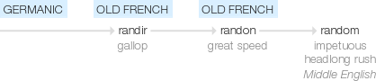

### Opening questions

  - What is randomness?
  - Is randomness the same as stochasticity?
  - Can real events be truly random?
  - Should drift be thought of as a causal agent?
  - What is the difference between drift and stochastic selection?
  - How do we "best" capture uncertainty?
  
### Introduction

In terms of population genetics, genetic drift is defined as the random sampling of alleles during reproduction. This interpretation is most concisely formalized in the Wright-Fisher model. In terms of quantitative genetics, genetic drift refers to the random sampling of breeding values during reproduction. This interpretation has been formalized by Lande (1976), but may date back to earlier models. However, regardless of whether alleles or breeding values are being sampled, the heart of genetic drift is randomness. Thus, for us to understand drift, we must understand randomness.

### The origins of the word "random"

According to [this](https://www.etymonline.com/word/random) entry in the online etymology dictionary, the phrase "at random" was used in the 1560's to refer to haphazard or careless behaviour. Before this, it appears the roots of the word are associated with running fast, being in a rush and disorder. However, it wasn't until the 1650's that the word began to reflect its modern usage in science, "having no definite aim or purpose".

Interestingly, it appears the usage of the word random evolved in parallel (or perhaps coevolved) with the development of probability. According to [wikipedia](https://en.wikipedia.org/wiki/History_of_probability), the mathematical treatment of probability theory began with [Cardano](https://en.wikipedia.org/wiki/Gerolamo_Cardano) in the 16th century, though their work was not published until the 17th century. Around the time of this publication [Pascal](https://en.wikipedia.org/wiki/Blaise_Pascal) and [Fermat](https://en.wikipedia.org/wiki/Pierre_de_Fermat) continued to develop this theory, leading to a comprehensive treatment published by [Huygens](https://en.wikipedia.org/wiki/Christiaan_Huygens) in 1657. 

#### Randomness vs chaos

I find it worthwhile to briefly point out the distinction between random and chaotic behaviour. The two often get confused due to their implications on our ability to predict a system. The key is that chaos is a deterministic phenomena, while, obviously, randomness is not. Essentially, a system is chaotic when any two __distinct__ initial conditions that begin arbitrarily close tend to diverge over time. In simple dynamical systems, we can compute formulae that provide exact solutions of our model. However, chaotic systems do not permit such solutions. Thus, we must resort to numerical methods to determine their solutions. Then, even if we obtained a model that perfectly described reality, if this model possessed chaotic behaviour, we would never be able to predict the future with exact precision because the computers we use to numerically solve our model are finite and thus we can never input the starting point with perfect accuracy. In contrast, if our model were random, even if we had an infinite computer that allowed us to input the starting point with perfect accuracy, we would still fail to predict the future exactly.

### Random vs stochastic

The word stochastic [appears to be much older](https://www.etymonline.com/word/stochastic) than random having roots in the Greek word _stokhos_ which means "to guess" or "to aim". According to [wikipedia](https://en.wikipedia.org/wiki/Stochastic), the earliest known use of the phrase _stochastik_ in the sense of random was in 1917 by a German author. Apparently the first time the word _stochastic_ was used to mean random in the English language did not occur until 1934 with the publication of a paper by [Joseph Doob](https://en.wikipedia.org/wiki/Joseph_L._Doob), one of the pioneers of the theory of stochastic processes.

Although the current usages of the words "random" and "stochastic" are interchangeable, their historical meanings are not. The word "random" is more true to the idea of something being indeterminate or non-causal whereas ancestors of the word "stochastic" have been closer associated with uncertainty due to a lack of information or a lack of reasoning. If we take this a step further, we can insert a little crowbar between random processes and stochastic processes where the former models a system as if it were innately random while the latter models our uncertainty of a deterministic system.

#### Relationship to frequentist vs Bayesian perspectives

This difference between randomness and stochasticity is analogous to the core difference between frequentist and Bayesian [interpretations of probability](https://en.wikipedia.org/wiki/Probability_interpretations). By definition, a frequentist interpretation of probability states that the probability of an event is equal to the frequency of its occurrence in the limit of a large number of trials. Since trials are repetitions of the same "experiment", the outcome of each trial is actually random. On the other hand, Bayesians interpret probabilities as "measures of belief" where each potential outcome of an event is assigned a probability based on our expectations/uncertainty. Since this does not require the outcome of the event to be truly random, the Bayesian interpretation of probability is more in line with the implications of the ancestors of the word "stochastic".

### The Bobbelian point of view

Here’s my take on drift: In the real world, species do not evolve "at random". Their evolutionary trajectories are determined by a causal chain of events. Every single detail is determined, but there are many details. Far more than the vast number of molecular events involved with reproduction or the physical details of meteorological events that may dictate selection. Because biological reality is so immensely rich with details, we can never hope to capture the minutiae that is the true culprit of the patterns we observe. Instead, we abstract these many details, pulling out from the froth of reality a tractable conceptualization: selection, gene-flow, mutation and drift. Thus, drift is not “true” randomness. Drift is uncertainty.

Of course some quantum physicist may beg to differ based on the random nature of quantum events (ie, the Copenhagen interpretation of quantum mechanics), but even this has a deterministic alternative (the so-called pilot-wave theory). In fact, I would take this a step further and question the use, or even the scientific validity, of assuming the world can exhibit true randomness. If we accept that the world can exhibit true randomness, then we also accept the existence of events, and the patterns they leave, that can never be explained or understood. This restriction would not be due to our inability to measure everything in existence nor due to our constraints on cognition. If an event were undetermined, then, by definition, there is nothing we can do to determine the effect or, in the reverse direction, the cause. However, as scientists it is our job to develop an understanding of reality and hence to find explanations of patterns and events along with methods of prediction that do not appeal to the idea that the world is truly random.

So then, can drift be said to explain any of the patterns we see? I would argue no since, by definition, drift represents the lack of an explanation. Under this interpretation, it is a great misnomer to say that drift drives alleles to randomly fixate and thus is a force that __causes__ variation in populations to decrease. This argument reflects similarly on mutation, which, under this perspective, should not be thought of as a causal force producing novel genetic variants in a population, but a method to sweep under the rug the various deterministic details involved with the generation of these variants.

#### Theories of neutrality

What ramifications does this have on neutral theories of evolution and ecology? Starting with evolution, it appears that Kimura literally meant that the majority of evolutionary changes are __caused__ by drift. Under the perspective I have offered, Kimura's conclusion translates to "the majority of evolutionary changes have no explanation", which is obviously of little use to us. However, this does not mean that the neutral theory of molecular evolution should be hastily abandoned. Instead, we should re-interpret this theory as implying the failure to reject neutrality is just the failure to produce an explanation. The same argument holds for the neutral theory of island biogeography where it is assumed that demographic dynamics occur at random (ecological drift). Such theories are perhaps the most important objects in science for they set the bar for what can be expected from that which we are uncertain about. As science progresses, these theories will undoubtedly change in order to more accurately (and honestly) capture uncertainty. But how does one go about computing the accuracy of a model or theory in its ability to capture uncertainty?

#### The use of entropy

Consider the classic coin-toss experiment. We flip a coin $N$ times, write down the number of heads and the number of tails, and then use this information to compute the probability of exhibiting an event or set of events. To model this problem, we can assign measures of belief to the outcome of flipping the coin. Since we are assuming there only two possible outcomes, heads or tails, we can assign each a probability. Specifically denote $p$ the probability for heads and $1-p$ for tails. Given that we have zero information on the weighting of the coin and will be ignoring any cognitive biases we may have (such as approximate evenness of weight), what is the most neutral hypothesis we can come up with? That is, what value of $p$ maximizes our uncertainty for the outcomes of a coin-toss? Well, if $p>\frac{1}{2}$ we can expect to find more heads than tails. Likewise, if $p<\frac{1}{2}$ we can expect to find more tails than heads. Hence, both of these options are non-neutral since they imply we can have some confidence in guessing the outcome of the coin. Thus, by this reasoning, we can conclude that $p=\frac{1}{2}$ is __the best__ choice for a neutral hypothesis. 

There is a more formal way of showing this which comes from the use of entropy. The concept of entropy was originally developed by physicists to produce some measure of "order" in a system. In this case order is referring to heterogeneous structure. Thus, a petri dish with chemicals homogeneously dispersed across it is in a state of disorder and high entropy. If a particular type of chemical were to aggregate, leaving a heterogeneous distribution, the petri dish would be said to be in a state of order and low entropy. The second law of thermodynamics states that a closed system will evolve towards a state of maximum entropy (maximum homogeneity). Hence the heat death of the universe hypothesis. 

It turns out the same concept is useful for measuring uncertainty about a random variable. The calculations used to quantify the entropy of physical systems can be directly applied to the distributions of random variables. Hence, we can calculate the uncertainty of a random variable by calculating the entropy of its distribution. Reversing this, if we have a random variable and want to assign a distribution to it that captures our lack of information about the value of this random variable, we would pick the distribution that maximizes entropy. Applying this formula to the coin-toss example we would find $p=\frac{1}{2}$, in agreement with the argument above. The use of entropy in this way is very powerful and is called [_the principle of maximum entropy_](https://en.wikipedia.org/wiki/Principle_of_maximum_entropy). This principle is the key insight John Harte used for the development of their maximum entropy theory of ecology. As another example, if we know a random variable can potentially take any value on the real number line and has a finite mean and a finite variance, the principle of maximum entropy dictates our neutral distribution for this random variable should be normal. If, instead, we knew the random variable took positive values only, the principle implies the exponential distribution should be used as the neutral model. The ubiquity of the exponential and the normal distributions across all sciences then has an explanation. The rich mathematical convenience of these distributions, however, appears to be a fortunate stroke of serendipity, almost divinely so.
